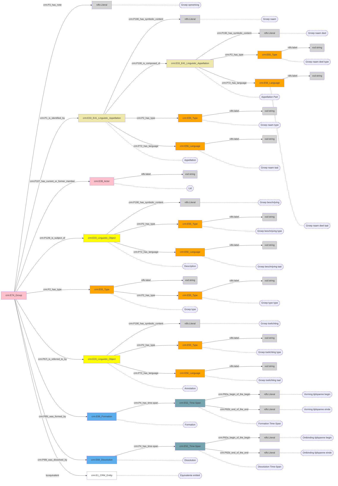

```mermaid
graph LR
1456bf2e-e37f-11ed-a1e6-00163e71351b["crm:E74_Group"]-->|"crm:P3_has_note"|59ec6912-e37f-11ed-a1e6-00163e71351b(rdfs:Literal)
19ab4e7a-ee62-11ed-9232-00163e71351b["crm:E33_Linguistic_Object"]-->|"crm:P190_has_symbolic_content"|19ab555a-ee62-11ed-9232-00163e71351b(rdfs:Literal)
19ab5776-ee62-11ed-9232-00163e71351b["crm:E55_Type"]-->|"rdfs:label"|19ab567c-ee62-11ed-9232-00163e71351b(xsd:string)
19ab5938-ee62-11ed-9232-00163e71351b["crm:E56_Language"]-->|"rdfs:label"|19ab585c-ee62-11ed-9232-00163e71351b(xsd:string)
41ca7056-ee3b-11ed-9655-00163e71351b["crm:E33_Linguistic_Object"]-->|"crm:P190_has_symbolic_content"|41ca7812-ee3b-11ed-9655-00163e71351b(rdfs:Literal)
41ca74f2-ee3b-11ed-9655-00163e71351b["crm:E55_Type"]-->|"rdfs:label"|41ca7aba-ee3b-11ed-9655-00163e71351b(xsd:string)
41ca76a0-ee3b-11ed-9655-00163e71351b["crm:E56_Language"]-->|"rdfs:label"|41ca7966-ee3b-11ed-9655-00163e71351b(xsd:string)
45a2ea12-e37f-11ed-9064-00163e71351b["crm:E33_E41_Linguistic_Appellation"]-->|"crm:P190_has_symbolic_content"|45a2f494-e37f-11ed-9064-00163e71351b(rdfs:Literal)
45a2f07a-e37f-11ed-9064-00163e71351b["crm:E56_Language"]-->|"rdfs:label"|45a2f1ec-e37f-11ed-9064-00163e71351b(xsd:string)
45a2f5de-e37f-11ed-9064-00163e71351b["crm:E56_Language"]-->|"rdfs:label"|45a2f994-e37f-11ed-9064-00163e71351b(xsd:string)
45a2f71e-e37f-11ed-9064-00163e71351b["crm:E55_Type"]-->|"rdfs:label"|45a2f85e-e37f-11ed-9064-00163e71351b(xsd:string)
45a2fade-e37f-11ed-9064-00163e71351b["crm:E33_E41_Linguistic_Appellation"]-->|"crm:P190_has_symbolic_content"|45a2f340-e37f-11ed-9064-00163e71351b(rdfs:Literal)
45a2fc28-e37f-11ed-9064-00163e71351b["crm:E55_Type"]-->|"rdfs:label"|45a2eee0-e37f-11ed-9064-00163e71351b(xsd:string)
5b3b6876-e407-11ed-a1e6-00163e71351b["crm:E52_Time-Span"]-->|"crm:P82a_begin_of_the_begin"|7b2434d8-e407-11ed-9655-00163e71351b(rdfs:Literal)
5b3b6876-e407-11ed-a1e6-00163e71351b["crm:E52_Time-Span"]-->|"crm:P82b_end_of_the_end"|6a5a2ee6-e407-11ed-a1e6-00163e71351b(rdfs:Literal)
606baece-e37f-11ed-a1e6-00163e71351b["crm:E39_Actor"]-->|"rdfs:label"|7c47ce20-e406-11ed-a1e6-00163e71351b(xsd:string)
cc86d7fa-e37f-11ed-9655-00163e71351b["crm:E55_Type"]-->|"rdfs:label"|cc86dfa2-e37f-11ed-9655-00163e71351b(xsd:string)
cc86dc96-e37f-11ed-9655-00163e71351b["crm:E55_Type"]-->|"rdfs:label"|cc86de3a-e37f-11ed-9655-00163e71351b(xsd:string)
e0bfc39e-e406-11ed-9064-00163e71351b["crm:E52_Time-Span"]-->|"crm:P82a_begin_of_the_begin"|f39c9af0-e406-11ed-9232-00163e71351b(rdfs:Literal)
e0bfc39e-e406-11ed-9064-00163e71351b["crm:E52_Time-Span"]-->|"crm:P82b_end_of_the_end"|0cee5034-e407-11ed-9655-00163e71351b(rdfs:Literal)
1456bf2e-e37f-11ed-a1e6-00163e71351b["crm:E74_Group"]-->|"crm:P1_is_identified_by"|45a2ea12-e37f-11ed-9064-00163e71351b["crm:E33_E41_Linguistic_Appellation"]
1456bf2e-e37f-11ed-a1e6-00163e71351b["crm:E74_Group"]-->|"crm:P107_has_current_or_former_member"|606baece-e37f-11ed-a1e6-00163e71351b["crm:E39_Actor"]
1456bf2e-e37f-11ed-a1e6-00163e71351b["crm:E74_Group"]-->|"crm:P129i_is_subject_of"|19ab4e7a-ee62-11ed-9232-00163e71351b["crm:E33_Linguistic_Object"]
1456bf2e-e37f-11ed-a1e6-00163e71351b["crm:E74_Group"]-->|"crm:P2_has_type"|cc86d7fa-e37f-11ed-9655-00163e71351b["crm:E55_Type"]
1456bf2e-e37f-11ed-a1e6-00163e71351b["crm:E74_Group"]-->|"crm:P67i_is_referred_to_by"|41ca7056-ee3b-11ed-9655-00163e71351b["crm:E33_Linguistic_Object"]
1456bf2e-e37f-11ed-a1e6-00163e71351b["crm:E74_Group"]-->|"crm:P95i_was_formed_by"|2211ad04-e37f-11ed-9655-00163e71351b["crm:E66_Formation"]
1456bf2e-e37f-11ed-a1e6-00163e71351b["crm:E74_Group"]-->|"crm:P99i_was_dissolved_by"|378ee0b6-e37f-11ed-9655-00163e71351b["crm:E68_Dissolution"]
1456bf2e-e37f-11ed-a1e6-00163e71351b["crm:E74_Group"]-->|"la:equivalent"|f6d70486-e405-11ed-9064-00163e71351b["crm:E1_CRM_Entity"]
19ab4e7a-ee62-11ed-9232-00163e71351b["crm:E33_Linguistic_Object"]-->|"crm:P2_has_type"|19ab5776-ee62-11ed-9232-00163e71351b["crm:E55_Type"]
19ab4e7a-ee62-11ed-9232-00163e71351b["crm:E33_Linguistic_Object"]-->|"crm:P72_has_language"|19ab5938-ee62-11ed-9232-00163e71351b["crm:E56_Language"]
2211ad04-e37f-11ed-9655-00163e71351b["crm:E66_Formation"]-->|"crm:P4_has_time-span"|5b3b6876-e407-11ed-a1e6-00163e71351b["crm:E52_Time-Span"]
378ee0b6-e37f-11ed-9655-00163e71351b["crm:E68_Dissolution"]-->|"crm:P4_has_time-span"|e0bfc39e-e406-11ed-9064-00163e71351b["crm:E52_Time-Span"]
41ca7056-ee3b-11ed-9655-00163e71351b["crm:E33_Linguistic_Object"]-->|"crm:P2_has_type"|41ca74f2-ee3b-11ed-9655-00163e71351b["crm:E55_Type"]
41ca7056-ee3b-11ed-9655-00163e71351b["crm:E33_Linguistic_Object"]-->|"crm:P72_has_language"|41ca76a0-ee3b-11ed-9655-00163e71351b["crm:E56_Language"]
45a2ea12-e37f-11ed-9064-00163e71351b["crm:E33_E41_Linguistic_Appellation"]-->|"crm:P106_is_composed_of"|45a2fade-e37f-11ed-9064-00163e71351b["crm:E33_E41_Linguistic_Appellation"]
45a2ea12-e37f-11ed-9064-00163e71351b["crm:E33_E41_Linguistic_Appellation"]-->|"crm:P2_has_type"|45a2f71e-e37f-11ed-9064-00163e71351b["crm:E55_Type"]
45a2ea12-e37f-11ed-9064-00163e71351b["crm:E33_E41_Linguistic_Appellation"]-->|"crm:P72_has_language"|45a2f5de-e37f-11ed-9064-00163e71351b["crm:E56_Language"]
45a2fade-e37f-11ed-9064-00163e71351b["crm:E33_E41_Linguistic_Appellation"]-->|"crm:P2_has_type"|45a2fc28-e37f-11ed-9064-00163e71351b["crm:E55_Type"]
45a2fade-e37f-11ed-9064-00163e71351b["crm:E33_E41_Linguistic_Appellation"]-->|"crm:P72_has_language"|45a2f07a-e37f-11ed-9064-00163e71351b["crm:E56_Language"]
cc86d7fa-e37f-11ed-9655-00163e71351b["crm:E55_Type"]-->|"crm:P2_has_type"|cc86dc96-e37f-11ed-9655-00163e71351b["crm:E55_Type"]
style 45a2ea12-e37f-11ed-9064-00163e71351b_s stroke-dasharray: 5
style 606baece-e37f-11ed-a1e6-00163e71351b_s stroke-dasharray: 5
style 19ab4e7a-ee62-11ed-9232-00163e71351b_s stroke-dasharray: 5
style cc86d7fa-e37f-11ed-9655-00163e71351b_s stroke-dasharray: 5
style 59ec6912-e37f-11ed-a1e6-00163e71351b_s stroke-dasharray: 5
style 41ca7056-ee3b-11ed-9655-00163e71351b_s stroke-dasharray: 5
style 2211ad04-e37f-11ed-9655-00163e71351b_s stroke-dasharray: 5
style 378ee0b6-e37f-11ed-9655-00163e71351b_s stroke-dasharray: 5
style f6d70486-e405-11ed-9064-00163e71351b_s stroke-dasharray: 5
style 19ab555a-ee62-11ed-9232-00163e71351b_s stroke-dasharray: 5
style 19ab5776-ee62-11ed-9232-00163e71351b_s stroke-dasharray: 5
style 19ab5938-ee62-11ed-9232-00163e71351b_s stroke-dasharray: 5
style 5b3b6876-e407-11ed-a1e6-00163e71351b_s stroke-dasharray: 5
style e0bfc39e-e406-11ed-9064-00163e71351b_s stroke-dasharray: 5
style 41ca7812-ee3b-11ed-9655-00163e71351b_s stroke-dasharray: 5
style 41ca74f2-ee3b-11ed-9655-00163e71351b_s stroke-dasharray: 5
style 41ca76a0-ee3b-11ed-9655-00163e71351b_s stroke-dasharray: 5
style 45a2fade-e37f-11ed-9064-00163e71351b_s stroke-dasharray: 5
style 45a2f494-e37f-11ed-9064-00163e71351b_s stroke-dasharray: 5
style 45a2f71e-e37f-11ed-9064-00163e71351b_s stroke-dasharray: 5
style 45a2f5de-e37f-11ed-9064-00163e71351b_s stroke-dasharray: 5
style 45a2f340-e37f-11ed-9064-00163e71351b_s stroke-dasharray: 5
style 45a2fc28-e37f-11ed-9064-00163e71351b_s stroke-dasharray: 5
style 45a2f07a-e37f-11ed-9064-00163e71351b_s stroke-dasharray: 5
style 7b2434d8-e407-11ed-9655-00163e71351b_s stroke-dasharray: 5
style 6a5a2ee6-e407-11ed-a1e6-00163e71351b_s stroke-dasharray: 5
style cc86dc96-e37f-11ed-9655-00163e71351b_s stroke-dasharray: 5
style f39c9af0-e406-11ed-9232-00163e71351b_s stroke-dasharray: 5
style 0cee5034-e407-11ed-9655-00163e71351b_s stroke-dasharray: 5
45a2ea12-e37f-11ed-9064-00163e71351b["crm:E33_E41_Linguistic_Appellation"]-.-45a2ea12-e37f-11ed-9064-00163e71351b_s(["Appellation"])
606baece-e37f-11ed-a1e6-00163e71351b["crm:E39_Actor"]-.-606baece-e37f-11ed-a1e6-00163e71351b_s(["Lid"])
19ab4e7a-ee62-11ed-9232-00163e71351b["crm:E33_Linguistic_Object"]-.-19ab4e7a-ee62-11ed-9232-00163e71351b_s(["Description"])
cc86d7fa-e37f-11ed-9655-00163e71351b["crm:E55_Type"]-.-cc86d7fa-e37f-11ed-9655-00163e71351b_s(["Groep type"])
59ec6912-e37f-11ed-a1e6-00163e71351b["rdfs:Literal"]-.-59ec6912-e37f-11ed-a1e6-00163e71351b_s(["Groep opmerking"])
41ca7056-ee3b-11ed-9655-00163e71351b["crm:E33_Linguistic_Object"]-.-41ca7056-ee3b-11ed-9655-00163e71351b_s(["Annotation"])
2211ad04-e37f-11ed-9655-00163e71351b["crm:E66_Formation"]-.-2211ad04-e37f-11ed-9655-00163e71351b_s(["Formation"])
378ee0b6-e37f-11ed-9655-00163e71351b["crm:E68_Dissolution"]-.-378ee0b6-e37f-11ed-9655-00163e71351b_s(["Dissolution"])
f6d70486-e405-11ed-9064-00163e71351b["crm:E1_CRM_Entity"]-.-f6d70486-e405-11ed-9064-00163e71351b_s(["Equivalente entiteit"])
19ab555a-ee62-11ed-9232-00163e71351b["rdfs:Literal"]-.-19ab555a-ee62-11ed-9232-00163e71351b_s(["Groep beschrijving"])
19ab5776-ee62-11ed-9232-00163e71351b["crm:E55_Type"]-.-19ab5776-ee62-11ed-9232-00163e71351b_s(["Groep beschrijving type"])
19ab5938-ee62-11ed-9232-00163e71351b["crm:E56_Language"]-.-19ab5938-ee62-11ed-9232-00163e71351b_s(["Groep beschrijving taal"])
5b3b6876-e407-11ed-a1e6-00163e71351b["crm:E52_Time-Span"]-.-5b3b6876-e407-11ed-a1e6-00163e71351b_s(["Formation Time-Span"])
e0bfc39e-e406-11ed-9064-00163e71351b["crm:E52_Time-Span"]-.-e0bfc39e-e406-11ed-9064-00163e71351b_s(["Dissolution Time-Span"])
41ca7812-ee3b-11ed-9655-00163e71351b["rdfs:Literal"]-.-41ca7812-ee3b-11ed-9655-00163e71351b_s(["Groep toelichting"])
41ca74f2-ee3b-11ed-9655-00163e71351b["crm:E55_Type"]-.-41ca74f2-ee3b-11ed-9655-00163e71351b_s(["Groep toelichting type"])
41ca76a0-ee3b-11ed-9655-00163e71351b["crm:E56_Language"]-.-41ca76a0-ee3b-11ed-9655-00163e71351b_s(["Groep toelichting taal"])
45a2fade-e37f-11ed-9064-00163e71351b["crm:E33_E41_Linguistic_Appellation"]-.-45a2fade-e37f-11ed-9064-00163e71351b_s(["Appellation Part"])
45a2f494-e37f-11ed-9064-00163e71351b["rdfs:Literal"]-.-45a2f494-e37f-11ed-9064-00163e71351b_s(["Groep naam"])
45a2f71e-e37f-11ed-9064-00163e71351b["crm:E55_Type"]-.-45a2f71e-e37f-11ed-9064-00163e71351b_s(["Groep naam type"])
45a2f5de-e37f-11ed-9064-00163e71351b["crm:E56_Language"]-.-45a2f5de-e37f-11ed-9064-00163e71351b_s(["Groep naam taal"])
45a2f340-e37f-11ed-9064-00163e71351b["rdfs:Literal"]-.-45a2f340-e37f-11ed-9064-00163e71351b_s(["Groep naam deel"])
45a2fc28-e37f-11ed-9064-00163e71351b["crm:E55_Type"]-.-45a2fc28-e37f-11ed-9064-00163e71351b_s(["Groep naam deel type"])
45a2f07a-e37f-11ed-9064-00163e71351b["crm:E56_Language"]-.-45a2f07a-e37f-11ed-9064-00163e71351b_s(["Groep naam deel taal"])
7b2434d8-e407-11ed-9655-00163e71351b["rdfs:Literal"]-.-7b2434d8-e407-11ed-9655-00163e71351b_s(["Vorming tijdspanne begin"])
6a5a2ee6-e407-11ed-a1e6-00163e71351b["rdfs:Literal"]-.-6a5a2ee6-e407-11ed-a1e6-00163e71351b_s(["Vorming tijdspanne einde"])
cc86dc96-e37f-11ed-9655-00163e71351b["crm:E55_Type"]-.-cc86dc96-e37f-11ed-9655-00163e71351b_s(["Groep type type"])
f39c9af0-e406-11ed-9232-00163e71351b["rdfs:Literal"]-.-f39c9af0-e406-11ed-9232-00163e71351b_s(["Ontbinding tijdspanne begin"])
0cee5034-e407-11ed-9655-00163e71351b["rdfs:Literal"]-.-0cee5034-e407-11ed-9655-00163e71351b_s(["Ontbinding tijdspanne einde"])
style 0cee5034-e407-11ed-9655-00163e71351b fill:#D3D3D3
style 1456bf2e-e37f-11ed-a1e6-00163e71351b fill:#ffc0cb
style 19ab4e7a-ee62-11ed-9232-00163e71351b fill:#ffff00
style 19ab555a-ee62-11ed-9232-00163e71351b fill:#D3D3D3
style 19ab567c-ee62-11ed-9232-00163e71351b fill:#D3D3D3
style 19ab5776-ee62-11ed-9232-00163e71351b fill:#ffa500
style 19ab585c-ee62-11ed-9232-00163e71351b fill:#D3D3D3
style 19ab5938-ee62-11ed-9232-00163e71351b fill:#ffa500
style 2211ad04-e37f-11ed-9655-00163e71351b fill:#5DAEEC
style 378ee0b6-e37f-11ed-9655-00163e71351b fill:#5DAEEC
style 41ca7056-ee3b-11ed-9655-00163e71351b fill:#ffff00
style 41ca74f2-ee3b-11ed-9655-00163e71351b fill:#ffa500
style 41ca76a0-ee3b-11ed-9655-00163e71351b fill:#ffa500
style 41ca7812-ee3b-11ed-9655-00163e71351b fill:#D3D3D3
style 41ca7966-ee3b-11ed-9655-00163e71351b fill:#D3D3D3
style 41ca7aba-ee3b-11ed-9655-00163e71351b fill:#D3D3D3
style 45a2ea12-e37f-11ed-9064-00163e71351b fill:#EEE8AA
style 45a2eee0-e37f-11ed-9064-00163e71351b fill:#D3D3D3
style 45a2f07a-e37f-11ed-9064-00163e71351b fill:#ffa500
style 45a2f1ec-e37f-11ed-9064-00163e71351b fill:#D3D3D3
style 45a2f340-e37f-11ed-9064-00163e71351b fill:#D3D3D3
style 45a2f494-e37f-11ed-9064-00163e71351b fill:#D3D3D3
style 45a2f5de-e37f-11ed-9064-00163e71351b fill:#ffa500
style 45a2f71e-e37f-11ed-9064-00163e71351b fill:#ffa500
style 45a2f85e-e37f-11ed-9064-00163e71351b fill:#D3D3D3
style 45a2f994-e37f-11ed-9064-00163e71351b fill:#D3D3D3
style 45a2fade-e37f-11ed-9064-00163e71351b fill:#EEE8AA
style 45a2fc28-e37f-11ed-9064-00163e71351b fill:#ffa500
style 59ec6912-e37f-11ed-a1e6-00163e71351b fill:#D3D3D3
style 5b3b6876-e407-11ed-a1e6-00163e71351b fill:#76A5AF
style 606baece-e37f-11ed-a1e6-00163e71351b fill:#ffc0cb
style 6a5a2ee6-e407-11ed-a1e6-00163e71351b fill:#D3D3D3
style 7b2434d8-e407-11ed-9655-00163e71351b fill:#D3D3D3
style 7c47ce20-e406-11ed-a1e6-00163e71351b fill:#D3D3D3
style cc86d7fa-e37f-11ed-9655-00163e71351b fill:#ffa500
style cc86dc96-e37f-11ed-9655-00163e71351b fill:#ffa500
style cc86de3a-e37f-11ed-9655-00163e71351b fill:#D3D3D3
style cc86dfa2-e37f-11ed-9655-00163e71351b fill:#D3D3D3
style e0bfc39e-e406-11ed-9064-00163e71351b fill:#76A5AF
style f39c9af0-e406-11ed-9232-00163e71351b fill:#D3D3D3
style f6d70486-e405-11ed-9064-00163e71351b fill:#ffffff
```
