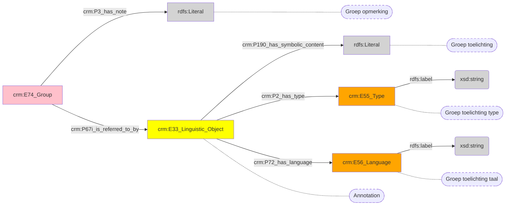

```mermaid
graph LR
1456bf2e-e37f-11ed-a1e6-00163e71351b["crm:E74_Group"]-->|"crm:P3_has_note"|59ec6912-e37f-11ed-a1e6-00163e71351b(rdfs:Literal)
41ca7056-ee3b-11ed-9655-00163e71351b["crm:E33_Linguistic_Object"]-->|"crm:P190_has_symbolic_content"|41ca7812-ee3b-11ed-9655-00163e71351b(rdfs:Literal)
41ca74f2-ee3b-11ed-9655-00163e71351b["crm:E55_Type"]-->|"rdfs:label"|41ca7aba-ee3b-11ed-9655-00163e71351b(xsd:string)
41ca76a0-ee3b-11ed-9655-00163e71351b["crm:E56_Language"]-->|"rdfs:label"|41ca7966-ee3b-11ed-9655-00163e71351b(xsd:string)
1456bf2e-e37f-11ed-a1e6-00163e71351b["crm:E74_Group"]-->|"crm:P67i_is_referred_to_by"|41ca7056-ee3b-11ed-9655-00163e71351b["crm:E33_Linguistic_Object"]
41ca7056-ee3b-11ed-9655-00163e71351b["crm:E33_Linguistic_Object"]-->|"crm:P2_has_type"|41ca74f2-ee3b-11ed-9655-00163e71351b["crm:E55_Type"]
41ca7056-ee3b-11ed-9655-00163e71351b["crm:E33_Linguistic_Object"]-->|"crm:P72_has_language"|41ca76a0-ee3b-11ed-9655-00163e71351b["crm:E56_Language"]
59ec6912-e37f-11ed-a1e6-00163e71351b["rdfs:Literal"]-.-59ec6912-e37f-11ed-a1e6-00163e71351b_s(["Groep opmerking"])
41ca7056-ee3b-11ed-9655-00163e71351b["crm:E33_Linguistic_Object"]-.-41ca7056-ee3b-11ed-9655-00163e71351b_s(["Annotation"])
41ca7812-ee3b-11ed-9655-00163e71351b["rdfs:Literal"]-.-41ca7812-ee3b-11ed-9655-00163e71351b_s(["Groep toelichting"])
41ca74f2-ee3b-11ed-9655-00163e71351b["crm:E55_Type"]-.-41ca74f2-ee3b-11ed-9655-00163e71351b_s(["Groep toelichting type"])
41ca76a0-ee3b-11ed-9655-00163e71351b["crm:E56_Language"]-.-41ca76a0-ee3b-11ed-9655-00163e71351b_s(["Groep toelichting taal"])
style 59ec6912-e37f-11ed-a1e6-00163e71351b_s stroke-dasharray: 5
style 41ca7056-ee3b-11ed-9655-00163e71351b_s stroke-dasharray: 5
style 41ca7812-ee3b-11ed-9655-00163e71351b_s stroke-dasharray: 5
style 41ca74f2-ee3b-11ed-9655-00163e71351b_s stroke-dasharray: 5
style 41ca76a0-ee3b-11ed-9655-00163e71351b_s stroke-dasharray: 5
style 1456bf2e-e37f-11ed-a1e6-00163e71351b fill:#ffc0cb
style 41ca7056-ee3b-11ed-9655-00163e71351b fill:#ffff00
style 41ca74f2-ee3b-11ed-9655-00163e71351b fill:#ffa500
style 41ca76a0-ee3b-11ed-9655-00163e71351b fill:#ffa500
style 41ca7812-ee3b-11ed-9655-00163e71351b fill:#D3D3D3
style 41ca7966-ee3b-11ed-9655-00163e71351b fill:#D3D3D3
style 41ca7aba-ee3b-11ed-9655-00163e71351b fill:#D3D3D3
style 59ec6912-e37f-11ed-a1e6-00163e71351b fill:#D3D3D3
```
