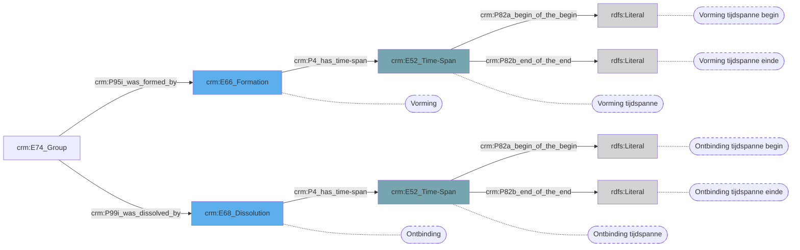

```mermaid
graph LR
5b3b6876-e407-11ed-a1e6-00163e71351b["crm:E52_Time-Span"]-->|"crm:P82a_begin_of_the_begin"|7b2434d8-e407-11ed-9655-00163e71351b(rdfs:Literal)
5b3b6876-e407-11ed-a1e6-00163e71351b["crm:E52_Time-Span"]-->|"crm:P82b_end_of_the_end"|6a5a2ee6-e407-11ed-a1e6-00163e71351b(rdfs:Literal)
e0bfc39e-e406-11ed-9064-00163e71351b["crm:E52_Time-Span"]-->|"crm:P82a_begin_of_the_begin"|f39c9af0-e406-11ed-9232-00163e71351b(rdfs:Literal)
e0bfc39e-e406-11ed-9064-00163e71351b["crm:E52_Time-Span"]-->|"crm:P82b_end_of_the_end"|0cee5034-e407-11ed-9655-00163e71351b(rdfs:Literal)
1456bf2e-e37f-11ed-a1e6-00163e71351b["crm:E74_Group"]-->|"crm:P95i_was_formed_by"|2211ad04-e37f-11ed-9655-00163e71351b["crm:E66_Formation"]
1456bf2e-e37f-11ed-a1e6-00163e71351b["crm:E74_Group"]-->|"crm:P99i_was_dissolved_by"|378ee0b6-e37f-11ed-9655-00163e71351b["crm:E68_Dissolution"]
2211ad04-e37f-11ed-9655-00163e71351b["crm:E66_Formation"]-->|"crm:P4_has_time-span"|5b3b6876-e407-11ed-a1e6-00163e71351b["crm:E52_Time-Span"]
378ee0b6-e37f-11ed-9655-00163e71351b["crm:E68_Dissolution"]-->|"crm:P4_has_time-span"|e0bfc39e-e406-11ed-9064-00163e71351b["crm:E52_Time-Span"]
style 2211ad04-e37f-11ed-9655-00163e71351b_s stroke-dasharray: 5
style 378ee0b6-e37f-11ed-9655-00163e71351b_s stroke-dasharray: 5
style 5b3b6876-e407-11ed-a1e6-00163e71351b_s stroke-dasharray: 5
style e0bfc39e-e406-11ed-9064-00163e71351b_s stroke-dasharray: 5
style 7b2434d8-e407-11ed-9655-00163e71351b_s stroke-dasharray: 5
style 6a5a2ee6-e407-11ed-a1e6-00163e71351b_s stroke-dasharray: 5
style f39c9af0-e406-11ed-9232-00163e71351b_s stroke-dasharray: 5
style 0cee5034-e407-11ed-9655-00163e71351b_s stroke-dasharray: 5
2211ad04-e37f-11ed-9655-00163e71351b["crm:E66_Formation"]-.-2211ad04-e37f-11ed-9655-00163e71351b_s(["Vorming"])
378ee0b6-e37f-11ed-9655-00163e71351b["crm:E68_Dissolution"]-.-378ee0b6-e37f-11ed-9655-00163e71351b_s(["Ontbinding"])
5b3b6876-e407-11ed-a1e6-00163e71351b["crm:E52_Time-Span"]-.-5b3b6876-e407-11ed-a1e6-00163e71351b_s(["Vorming tijdspanne"])
e0bfc39e-e406-11ed-9064-00163e71351b["crm:E52_Time-Span"]-.-e0bfc39e-e406-11ed-9064-00163e71351b_s(["Ontbinding tijdspanne"])
7b2434d8-e407-11ed-9655-00163e71351b["rdfs:Literal"]-.-7b2434d8-e407-11ed-9655-00163e71351b_s(["Vorming tijdspanne begin"])
6a5a2ee6-e407-11ed-a1e6-00163e71351b["rdfs:Literal"]-.-6a5a2ee6-e407-11ed-a1e6-00163e71351b_s(["Vorming tijdspanne einde"])
f39c9af0-e406-11ed-9232-00163e71351b["rdfs:Literal"]-.-f39c9af0-e406-11ed-9232-00163e71351b_s(["Ontbinding tijdspanne begin"])
0cee5034-e407-11ed-9655-00163e71351b["rdfs:Literal"]-.-0cee5034-e407-11ed-9655-00163e71351b_s(["Ontbinding tijdspanne einde"])
style 0cee5034-e407-11ed-9655-00163e71351b fill:#D3D3D3
style 2211ad04-e37f-11ed-9655-00163e71351b fill:#5DAEEC
style 378ee0b6-e37f-11ed-9655-00163e71351b fill:#5DAEEC
style 5b3b6876-e407-11ed-a1e6-00163e71351b fill:#76A5AF
style 6a5a2ee6-e407-11ed-a1e6-00163e71351b fill:#D3D3D3
style 7b2434d8-e407-11ed-9655-00163e71351b fill:#D3D3D3
style e0bfc39e-e406-11ed-9064-00163e71351b fill:#76A5AF
style f39c9af0-e406-11ed-9232-00163e71351b fill:#D3D3D3
```
