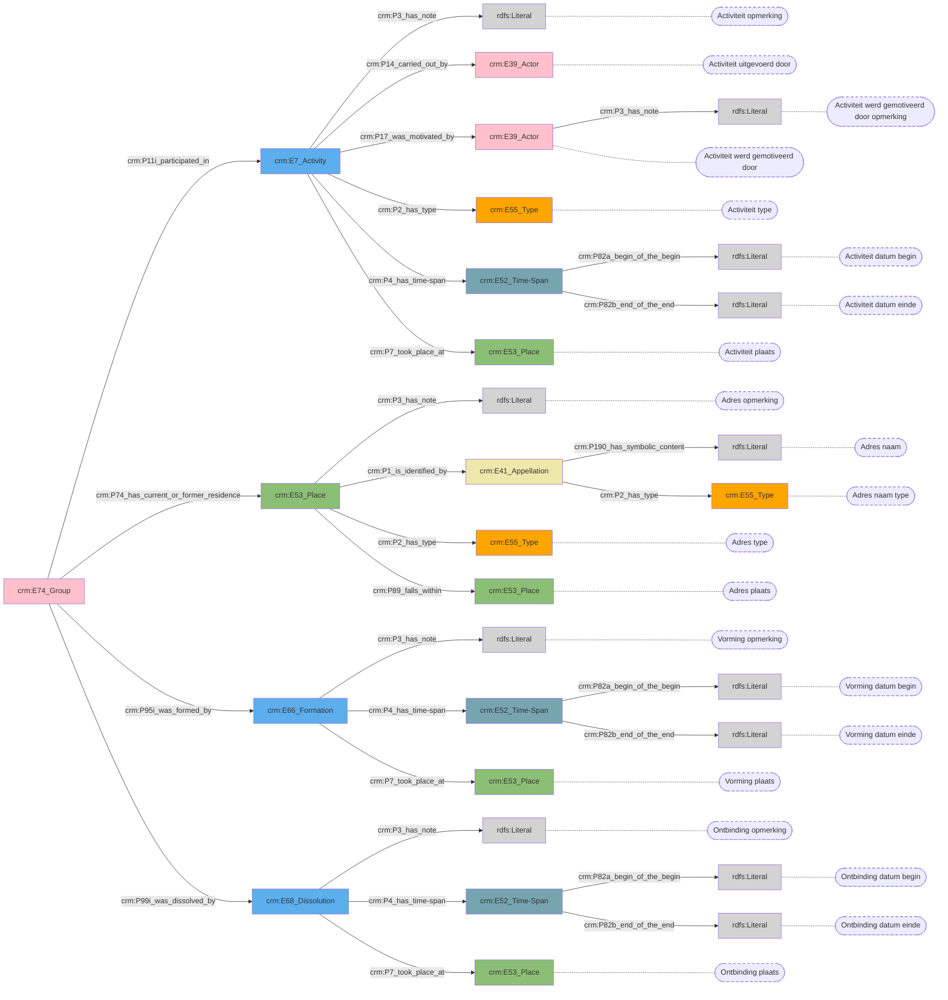

```mermaid
graph LR
style 0cee5034-e407-11ed-9655-00163e71351b fill:#D3D3D3
style 112e8a3a-14e6-11ef-9df9-960002548b4f fill:#ffc0cb
style 1456bf2e-e37f-11ed-a1e6-00163e71351b fill:#ffc0cb
style 2211ad04-e37f-11ed-9655-00163e71351b fill:#5DAEEC
style 33f0c3f3-14ec-11ef-8dc7-960002548b4f fill:#D3D3D3
style 378ee0b6-e37f-11ed-9655-00163e71351b fill:#5DAEEC
style 527971a8-14ec-11ef-b3f7-960002548b4f fill:#8CBF76
style 595b3a84-14ee-11ef-8214-960002548b4f fill:#D3D3D3
style 5b3b6876-e407-11ed-a1e6-00163e71351b fill:#76A5AF
style 6a5a2ee6-e407-11ed-a1e6-00163e71351b fill:#D3D3D3
style 7b2434d8-e407-11ed-9655-00163e71351b fill:#D3D3D3
style 9b476ca1-174e-11ef-8074-960002548b4f fill:#ffc0cb
style 9c2d354a-14ef-11ef-913e-960002548b4f fill:#8CBF76
style 9c2d3985-14ef-11ef-ac57-960002548b4f fill:#8CBF76
style 9c2d3ad6-14ef-11ef-b27a-960002548b4f fill:#ffa500
style 9c2d3df2-14ef-11ef-bf88-960002548b4f fill:#D3D3D3
style 9c2d3edd-14ef-11ef-b842-960002548b4f fill:#ffa500
style 9c2d4097-14ef-11ef-9b40-960002548b4f fill:#D3D3D3
style 9c2d4174-14ef-11ef-a34c-960002548b4f fill:#EEE8AA
style c5452210-14ed-11ef-9d51-960002548b4f fill:#8CBF76
style cc91809b-2985-11ef-835f-960002548b4f fill:#D3D3D3
style e0bfc39e-e406-11ed-9064-00163e71351b fill:#76A5AF
style f39c9af0-e406-11ed-9232-00163e71351b fill:#D3D3D3
style f5845de0-14ed-11ef-89eb-960002548b4f fill:#D3D3D3
style f7ee0677-14e5-11ef-befd-960002548b4f fill:#5DAEEC
style f7ee0c43-14e5-11ef-8188-960002548b4f fill:#8CBF76
style f7ee0d52-14e5-11ef-8f14-960002548b4f fill:#ffa500
style f7ee0e42-14e5-11ef-bcec-960002548b4f fill:#D3D3D3
style f7ee1008-14e5-11ef-8e77-960002548b4f fill:#D3D3D3
style f7ee10e3-14e5-11ef-adb9-960002548b4f fill:#76A5AF
2211ad04-e37f-11ed-9655-00163e71351b["crm:E66_Formation"]-->|"crm:P3_has_note"|595b3a84-14ee-11ef-8214-960002548b4f(rdfs:Literal)
378ee0b6-e37f-11ed-9655-00163e71351b["crm:E68_Dissolution"]-->|"crm:P3_has_note"|f5845de0-14ed-11ef-89eb-960002548b4f(rdfs:Literal)
5b3b6876-e407-11ed-a1e6-00163e71351b["crm:E52_Time-Span"]-->|"crm:P82a_begin_of_the_begin"|7b2434d8-e407-11ed-9655-00163e71351b(rdfs:Literal)
5b3b6876-e407-11ed-a1e6-00163e71351b["crm:E52_Time-Span"]-->|"crm:P82b_end_of_the_end"|6a5a2ee6-e407-11ed-a1e6-00163e71351b(rdfs:Literal)
9b476ca1-174e-11ef-8074-960002548b4f["crm:E39_Actor"]-->|"crm:P3_has_note"|cc91809b-2985-11ef-835f-960002548b4f(rdfs:Literal)
9c2d354a-14ef-11ef-913e-960002548b4f["crm:E53_Place"]-->|"crm:P3_has_note"|9c2d3df2-14ef-11ef-bf88-960002548b4f(rdfs:Literal)
9c2d4174-14ef-11ef-a34c-960002548b4f["crm:E41_Appellation"]-->|"crm:P190_has_symbolic_content"|9c2d4097-14ef-11ef-9b40-960002548b4f(rdfs:Literal)
e0bfc39e-e406-11ed-9064-00163e71351b["crm:E52_Time-Span"]-->|"crm:P82a_begin_of_the_begin"|f39c9af0-e406-11ed-9232-00163e71351b(rdfs:Literal)
e0bfc39e-e406-11ed-9064-00163e71351b["crm:E52_Time-Span"]-->|"crm:P82b_end_of_the_end"|0cee5034-e407-11ed-9655-00163e71351b(rdfs:Literal)
f7ee0677-14e5-11ef-befd-960002548b4f["crm:E7_Activity"]-->|"crm:P3_has_note"|33f0c3f3-14ec-11ef-8dc7-960002548b4f(rdfs:Literal)
f7ee10e3-14e5-11ef-adb9-960002548b4f["crm:E52_Time-Span"]-->|"crm:P82a_begin_of_the_begin"|f7ee0e42-14e5-11ef-bcec-960002548b4f(rdfs:Literal)
f7ee10e3-14e5-11ef-adb9-960002548b4f["crm:E52_Time-Span"]-->|"crm:P82b_end_of_the_end"|f7ee1008-14e5-11ef-8e77-960002548b4f(rdfs:Literal)
595b3a84-14ee-11ef-8214-960002548b4f["rdfs:Literal"]-.-595b3a84-14ee-11ef-8214-960002548b4f_s(["Vorming opmerking"])
527971a8-14ec-11ef-b3f7-960002548b4f["crm:E53_Place"]-.-527971a8-14ec-11ef-b3f7-960002548b4f_s(["Vorming plaats"])
f5845de0-14ed-11ef-89eb-960002548b4f["rdfs:Literal"]-.-f5845de0-14ed-11ef-89eb-960002548b4f_s(["Ontbinding opmerking"])
c5452210-14ed-11ef-9d51-960002548b4f["crm:E53_Place"]-.-c5452210-14ed-11ef-9d51-960002548b4f_s(["Ontbinding plaats"])
7b2434d8-e407-11ed-9655-00163e71351b["rdfs:Literal"]-.-7b2434d8-e407-11ed-9655-00163e71351b_s(["Vorming datum begin"])
6a5a2ee6-e407-11ed-a1e6-00163e71351b["rdfs:Literal"]-.-6a5a2ee6-e407-11ed-a1e6-00163e71351b_s(["Vorming datum einde"])
cc91809b-2985-11ef-835f-960002548b4f["rdfs:Literal"]-.-cc91809b-2985-11ef-835f-960002548b4f_s(["Activiteit werd gemotiveerd door opmerking"])
9c2d3ad6-14ef-11ef-b27a-960002548b4f["crm:E55_Type"]-.-9c2d3ad6-14ef-11ef-b27a-960002548b4f_s(["Adres type"])
9c2d3df2-14ef-11ef-bf88-960002548b4f["rdfs:Literal"]-.-9c2d3df2-14ef-11ef-bf88-960002548b4f_s(["Adres opmerking"])
9c2d3985-14ef-11ef-ac57-960002548b4f["crm:E53_Place"]-.-9c2d3985-14ef-11ef-ac57-960002548b4f_s(["Adres plaats"])
9c2d4097-14ef-11ef-9b40-960002548b4f["rdfs:Literal"]-.-9c2d4097-14ef-11ef-9b40-960002548b4f_s(["Adres naam"])
9c2d3edd-14ef-11ef-b842-960002548b4f["crm:E55_Type"]-.-9c2d3edd-14ef-11ef-b842-960002548b4f_s(["Adres naam type"])
f39c9af0-e406-11ed-9232-00163e71351b["rdfs:Literal"]-.-f39c9af0-e406-11ed-9232-00163e71351b_s(["Ontbinding datum begin"])
0cee5034-e407-11ed-9655-00163e71351b["rdfs:Literal"]-.-0cee5034-e407-11ed-9655-00163e71351b_s(["Ontbinding datum einde"])
112e8a3a-14e6-11ef-9df9-960002548b4f["crm:E39_Actor"]-.-112e8a3a-14e6-11ef-9df9-960002548b4f_s(["Activiteit uitgevoerd door"])
9b476ca1-174e-11ef-8074-960002548b4f["crm:E39_Actor"]-.-9b476ca1-174e-11ef-8074-960002548b4f_s(["Activiteit werd gemotiveerd door"])
f7ee0d52-14e5-11ef-8f14-960002548b4f["crm:E55_Type"]-.-f7ee0d52-14e5-11ef-8f14-960002548b4f_s(["Activiteit type"])
33f0c3f3-14ec-11ef-8dc7-960002548b4f["rdfs:Literal"]-.-33f0c3f3-14ec-11ef-8dc7-960002548b4f_s(["Activiteit opmerking"])
f7ee0c43-14e5-11ef-8188-960002548b4f["crm:E53_Place"]-.-f7ee0c43-14e5-11ef-8188-960002548b4f_s(["Activiteit plaats"])
f7ee0e42-14e5-11ef-bcec-960002548b4f["rdfs:Literal"]-.-f7ee0e42-14e5-11ef-bcec-960002548b4f_s(["Activiteit datum begin"])
f7ee1008-14e5-11ef-8e77-960002548b4f["rdfs:Literal"]-.-f7ee1008-14e5-11ef-8e77-960002548b4f_s(["Activiteit datum einde"])
style 595b3a84-14ee-11ef-8214-960002548b4f_s stroke-dasharray: 5
style 527971a8-14ec-11ef-b3f7-960002548b4f_s stroke-dasharray: 5
style f5845de0-14ed-11ef-89eb-960002548b4f_s stroke-dasharray: 5
style c5452210-14ed-11ef-9d51-960002548b4f_s stroke-dasharray: 5
style 7b2434d8-e407-11ed-9655-00163e71351b_s stroke-dasharray: 5
style 6a5a2ee6-e407-11ed-a1e6-00163e71351b_s stroke-dasharray: 5
style cc91809b-2985-11ef-835f-960002548b4f_s stroke-dasharray: 5
style 9c2d3ad6-14ef-11ef-b27a-960002548b4f_s stroke-dasharray: 5
style 9c2d3df2-14ef-11ef-bf88-960002548b4f_s stroke-dasharray: 5
style 9c2d3985-14ef-11ef-ac57-960002548b4f_s stroke-dasharray: 5
style 9c2d4097-14ef-11ef-9b40-960002548b4f_s stroke-dasharray: 5
style 9c2d3edd-14ef-11ef-b842-960002548b4f_s stroke-dasharray: 5
style f39c9af0-e406-11ed-9232-00163e71351b_s stroke-dasharray: 5
style 0cee5034-e407-11ed-9655-00163e71351b_s stroke-dasharray: 5
style 112e8a3a-14e6-11ef-9df9-960002548b4f_s stroke-dasharray: 5
style 9b476ca1-174e-11ef-8074-960002548b4f_s stroke-dasharray: 5
style f7ee0d52-14e5-11ef-8f14-960002548b4f_s stroke-dasharray: 5
style 33f0c3f3-14ec-11ef-8dc7-960002548b4f_s stroke-dasharray: 5
style f7ee0c43-14e5-11ef-8188-960002548b4f_s stroke-dasharray: 5
style f7ee0e42-14e5-11ef-bcec-960002548b4f_s stroke-dasharray: 5
style f7ee1008-14e5-11ef-8e77-960002548b4f_s stroke-dasharray: 5
1456bf2e-e37f-11ed-a1e6-00163e71351b["crm:E74_Group"]-->|"crm:P11i_participated_in"|f7ee0677-14e5-11ef-befd-960002548b4f["crm:E7_Activity"]
1456bf2e-e37f-11ed-a1e6-00163e71351b["crm:E74_Group"]-->|"crm:P74_has_current_or_former_residence"|9c2d354a-14ef-11ef-913e-960002548b4f["crm:E53_Place"]
1456bf2e-e37f-11ed-a1e6-00163e71351b["crm:E74_Group"]-->|"crm:P95i_was_formed_by"|2211ad04-e37f-11ed-9655-00163e71351b["crm:E66_Formation"]
1456bf2e-e37f-11ed-a1e6-00163e71351b["crm:E74_Group"]-->|"crm:P99i_was_dissolved_by"|378ee0b6-e37f-11ed-9655-00163e71351b["crm:E68_Dissolution"]
2211ad04-e37f-11ed-9655-00163e71351b["crm:E66_Formation"]-->|"crm:P4_has_time-span"|5b3b6876-e407-11ed-a1e6-00163e71351b["crm:E52_Time-Span"]
2211ad04-e37f-11ed-9655-00163e71351b["crm:E66_Formation"]-->|"crm:P7_took_place_at"|527971a8-14ec-11ef-b3f7-960002548b4f["crm:E53_Place"]
378ee0b6-e37f-11ed-9655-00163e71351b["crm:E68_Dissolution"]-->|"crm:P4_has_time-span"|e0bfc39e-e406-11ed-9064-00163e71351b["crm:E52_Time-Span"]
378ee0b6-e37f-11ed-9655-00163e71351b["crm:E68_Dissolution"]-->|"crm:P7_took_place_at"|c5452210-14ed-11ef-9d51-960002548b4f["crm:E53_Place"]
9c2d354a-14ef-11ef-913e-960002548b4f["crm:E53_Place"]-->|"crm:P1_is_identified_by"|9c2d4174-14ef-11ef-a34c-960002548b4f["crm:E41_Appellation"]
9c2d354a-14ef-11ef-913e-960002548b4f["crm:E53_Place"]-->|"crm:P2_has_type"|9c2d3ad6-14ef-11ef-b27a-960002548b4f["crm:E55_Type"]
9c2d354a-14ef-11ef-913e-960002548b4f["crm:E53_Place"]-->|"crm:P89_falls_within"|9c2d3985-14ef-11ef-ac57-960002548b4f["crm:E53_Place"]
9c2d4174-14ef-11ef-a34c-960002548b4f["crm:E41_Appellation"]-->|"crm:P2_has_type"|9c2d3edd-14ef-11ef-b842-960002548b4f["crm:E55_Type"]
f7ee0677-14e5-11ef-befd-960002548b4f["crm:E7_Activity"]-->|"crm:P14_carried_out_by"|112e8a3a-14e6-11ef-9df9-960002548b4f["crm:E39_Actor"]
f7ee0677-14e5-11ef-befd-960002548b4f["crm:E7_Activity"]-->|"crm:P17_was_motivated_by"|9b476ca1-174e-11ef-8074-960002548b4f["crm:E39_Actor"]
f7ee0677-14e5-11ef-befd-960002548b4f["crm:E7_Activity"]-->|"crm:P2_has_type"|f7ee0d52-14e5-11ef-8f14-960002548b4f["crm:E55_Type"]
f7ee0677-14e5-11ef-befd-960002548b4f["crm:E7_Activity"]-->|"crm:P4_has_time-span"|f7ee10e3-14e5-11ef-adb9-960002548b4f["crm:E52_Time-Span"]
f7ee0677-14e5-11ef-befd-960002548b4f["crm:E7_Activity"]-->|"crm:P7_took_place_at"|f7ee0c43-14e5-11ef-8188-960002548b4f["crm:E53_Place"]
```
