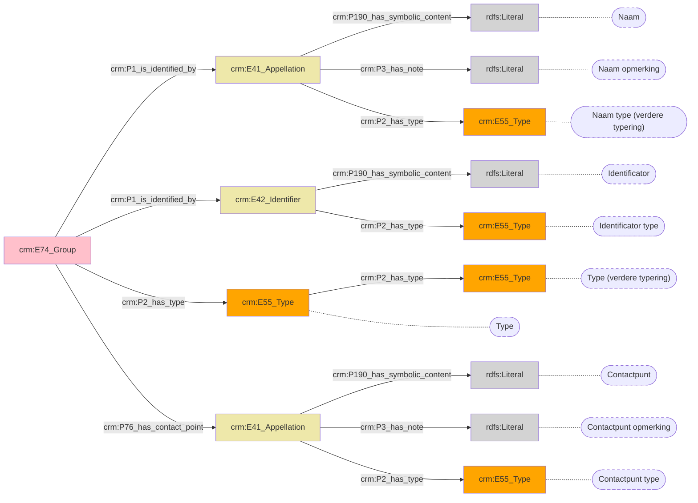

```mermaid
graph LR
style 1456bf2e-e37f-11ed-a1e6-00163e71351b fill:#ffc0cb
style 45a2ea12-e37f-11ed-9064-00163e71351b fill:#EEE8AA
style 45a2f494-e37f-11ed-9064-00163e71351b fill:#D3D3D3
style 45a2f71e-e37f-11ed-9064-00163e71351b fill:#ffa500
style 523901ae-2986-11ef-a78c-960002548b4f fill:#D3D3D3
style 595771f3-14ef-11ef-8e02-960002548b4f fill:#EEE8AA
style 59577630-14ef-11ef-9474-960002548b4f fill:#D3D3D3
style 5957777e-14ef-11ef-bef1-960002548b4f fill:#ffa500
style 59577966-14ef-11ef-a727-960002548b4f fill:#D3D3D3
style 7e916952-18e9-11ef-a2b0-960002548b4f fill:#EEE8AA
style 7e916e99-18e9-11ef-b0f8-960002548b4f fill:#D3D3D3
style 7e916f95-18e9-11ef-9d59-960002548b4f fill:#ffa500
style cc86d7fa-e37f-11ed-9655-00163e71351b fill:#ffa500
style cc86dc96-e37f-11ed-9655-00163e71351b fill:#ffa500
45a2ea12-e37f-11ed-9064-00163e71351b["crm:E41_Appellation"]-->|"crm:P190_has_symbolic_content"|45a2f494-e37f-11ed-9064-00163e71351b(rdfs:Literal)
45a2ea12-e37f-11ed-9064-00163e71351b["crm:E41_Appellation"]-->|"crm:P3_has_note"|523901ae-2986-11ef-a78c-960002548b4f(rdfs:Literal)
595771f3-14ef-11ef-8e02-960002548b4f["crm:E41_Appellation"]-->|"crm:P190_has_symbolic_content"|59577966-14ef-11ef-a727-960002548b4f(rdfs:Literal)
595771f3-14ef-11ef-8e02-960002548b4f["crm:E41_Appellation"]-->|"crm:P3_has_note"|59577630-14ef-11ef-9474-960002548b4f(rdfs:Literal)
7e916952-18e9-11ef-a2b0-960002548b4f["crm:E42_Identifier"]-->|"crm:P190_has_symbolic_content"|7e916e99-18e9-11ef-b0f8-960002548b4f(rdfs:Literal)
1456bf2e-e37f-11ed-a1e6-00163e71351b["crm:E74_Group"]-->|"crm:P1_is_identified_by"|45a2ea12-e37f-11ed-9064-00163e71351b["crm:E41_Appellation"]
1456bf2e-e37f-11ed-a1e6-00163e71351b["crm:E74_Group"]-->|"crm:P1_is_identified_by"|7e916952-18e9-11ef-a2b0-960002548b4f["crm:E42_Identifier"]
1456bf2e-e37f-11ed-a1e6-00163e71351b["crm:E74_Group"]-->|"crm:P2_has_type"|cc86d7fa-e37f-11ed-9655-00163e71351b["crm:E55_Type"]
1456bf2e-e37f-11ed-a1e6-00163e71351b["crm:E74_Group"]-->|"crm:P76_has_contact_point"|595771f3-14ef-11ef-8e02-960002548b4f["crm:E41_Appellation"]
45a2ea12-e37f-11ed-9064-00163e71351b["crm:E41_Appellation"]-->|"crm:P2_has_type"|45a2f71e-e37f-11ed-9064-00163e71351b["crm:E55_Type"]
595771f3-14ef-11ef-8e02-960002548b4f["crm:E41_Appellation"]-->|"crm:P2_has_type"|5957777e-14ef-11ef-bef1-960002548b4f["crm:E55_Type"]
7e916952-18e9-11ef-a2b0-960002548b4f["crm:E42_Identifier"]-->|"crm:P2_has_type"|7e916f95-18e9-11ef-9d59-960002548b4f["crm:E55_Type"]
cc86d7fa-e37f-11ed-9655-00163e71351b["crm:E55_Type"]-->|"crm:P2_has_type"|cc86dc96-e37f-11ed-9655-00163e71351b["crm:E55_Type"]
cc86d7fa-e37f-11ed-9655-00163e71351b["crm:E55_Type"]-.-cc86d7fa-e37f-11ed-9655-00163e71351b_s(["Type"])
45a2f494-e37f-11ed-9064-00163e71351b["rdfs:Literal"]-.-45a2f494-e37f-11ed-9064-00163e71351b_s(["Naam"])
45a2f71e-e37f-11ed-9064-00163e71351b["crm:E55_Type"]-.-45a2f71e-e37f-11ed-9064-00163e71351b_s(["Naam type (verdere typering)"])
523901ae-2986-11ef-a78c-960002548b4f["rdfs:Literal"]-.-523901ae-2986-11ef-a78c-960002548b4f_s(["Naam opmerking"])
59577966-14ef-11ef-a727-960002548b4f["rdfs:Literal"]-.-59577966-14ef-11ef-a727-960002548b4f_s(["Contactpunt"])
5957777e-14ef-11ef-bef1-960002548b4f["crm:E55_Type"]-.-5957777e-14ef-11ef-bef1-960002548b4f_s(["Contactpunt type"])
59577630-14ef-11ef-9474-960002548b4f["rdfs:Literal"]-.-59577630-14ef-11ef-9474-960002548b4f_s(["Contactpunt opmerking"])
7e916e99-18e9-11ef-b0f8-960002548b4f["rdfs:Literal"]-.-7e916e99-18e9-11ef-b0f8-960002548b4f_s(["Identificator"])
7e916f95-18e9-11ef-9d59-960002548b4f["crm:E55_Type"]-.-7e916f95-18e9-11ef-9d59-960002548b4f_s(["Identificator type"])
cc86dc96-e37f-11ed-9655-00163e71351b["crm:E55_Type"]-.-cc86dc96-e37f-11ed-9655-00163e71351b_s(["Type (verdere typering)"])
style cc86d7fa-e37f-11ed-9655-00163e71351b_s stroke-dasharray: 5
style 45a2f494-e37f-11ed-9064-00163e71351b_s stroke-dasharray: 5
style 45a2f71e-e37f-11ed-9064-00163e71351b_s stroke-dasharray: 5
style 523901ae-2986-11ef-a78c-960002548b4f_s stroke-dasharray: 5
style 59577966-14ef-11ef-a727-960002548b4f_s stroke-dasharray: 5
style 5957777e-14ef-11ef-bef1-960002548b4f_s stroke-dasharray: 5
style 59577630-14ef-11ef-9474-960002548b4f_s stroke-dasharray: 5
style 7e916e99-18e9-11ef-b0f8-960002548b4f_s stroke-dasharray: 5
style 7e916f95-18e9-11ef-9d59-960002548b4f_s stroke-dasharray: 5
style cc86dc96-e37f-11ed-9655-00163e71351b_s stroke-dasharray: 5
```
