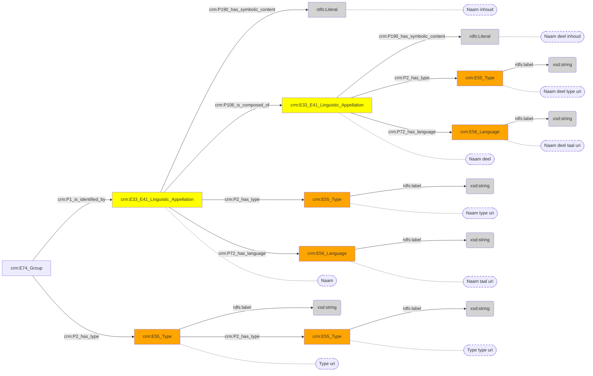

```mermaid
graph LR
45a2ea12-e37f-11ed-9064-00163e71351b["crm:E33_E41_Linguistic_Appellation"]-->|"crm:P190_has_symbolic_content"|45a2f494-e37f-11ed-9064-00163e71351b(rdfs:Literal)
45a2f07a-e37f-11ed-9064-00163e71351b["crm:E56_Language"]-->|"rdfs:label"|45a2f1ec-e37f-11ed-9064-00163e71351b(xsd:string)
45a2f5de-e37f-11ed-9064-00163e71351b["crm:E56_Language"]-->|"rdfs:label"|45a2f994-e37f-11ed-9064-00163e71351b(xsd:string)
45a2f71e-e37f-11ed-9064-00163e71351b["crm:E55_Type"]-->|"rdfs:label"|45a2f85e-e37f-11ed-9064-00163e71351b(xsd:string)
45a2fade-e37f-11ed-9064-00163e71351b["crm:E33_E41_Linguistic_Appellation"]-->|"crm:P190_has_symbolic_content"|45a2f340-e37f-11ed-9064-00163e71351b(rdfs:Literal)
45a2fc28-e37f-11ed-9064-00163e71351b["crm:E55_Type"]-->|"rdfs:label"|45a2eee0-e37f-11ed-9064-00163e71351b(xsd:string)
cc86d7fa-e37f-11ed-9655-00163e71351b["crm:E55_Type"]-->|"rdfs:label"|cc86dfa2-e37f-11ed-9655-00163e71351b(xsd:string)
cc86dc96-e37f-11ed-9655-00163e71351b["crm:E55_Type"]-->|"rdfs:label"|cc86de3a-e37f-11ed-9655-00163e71351b(xsd:string)
1456bf2e-e37f-11ed-a1e6-00163e71351b["crm:E74_Group"]-->|"crm:P1_is_identified_by"|45a2ea12-e37f-11ed-9064-00163e71351b["crm:E33_E41_Linguistic_Appellation"]
1456bf2e-e37f-11ed-a1e6-00163e71351b["crm:E74_Group"]-->|"crm:P2_has_type"|cc86d7fa-e37f-11ed-9655-00163e71351b["crm:E55_Type"]
45a2ea12-e37f-11ed-9064-00163e71351b["crm:E33_E41_Linguistic_Appellation"]-->|"crm:P106_is_composed_of"|45a2fade-e37f-11ed-9064-00163e71351b["crm:E33_E41_Linguistic_Appellation"]
45a2ea12-e37f-11ed-9064-00163e71351b["crm:E33_E41_Linguistic_Appellation"]-->|"crm:P2_has_type"|45a2f71e-e37f-11ed-9064-00163e71351b["crm:E55_Type"]
45a2ea12-e37f-11ed-9064-00163e71351b["crm:E33_E41_Linguistic_Appellation"]-->|"crm:P72_has_language"|45a2f5de-e37f-11ed-9064-00163e71351b["crm:E56_Language"]
45a2fade-e37f-11ed-9064-00163e71351b["crm:E33_E41_Linguistic_Appellation"]-->|"crm:P2_has_type"|45a2fc28-e37f-11ed-9064-00163e71351b["crm:E55_Type"]
45a2fade-e37f-11ed-9064-00163e71351b["crm:E33_E41_Linguistic_Appellation"]-->|"crm:P72_has_language"|45a2f07a-e37f-11ed-9064-00163e71351b["crm:E56_Language"]
cc86d7fa-e37f-11ed-9655-00163e71351b["crm:E55_Type"]-->|"crm:P2_has_type"|cc86dc96-e37f-11ed-9655-00163e71351b["crm:E55_Type"]
style 45a2ea12-e37f-11ed-9064-00163e71351b_s stroke-dasharray: 5
style cc86d7fa-e37f-11ed-9655-00163e71351b_s stroke-dasharray: 5
style 45a2fade-e37f-11ed-9064-00163e71351b_s stroke-dasharray: 5
style 45a2f494-e37f-11ed-9064-00163e71351b_s stroke-dasharray: 5
style 45a2f71e-e37f-11ed-9064-00163e71351b_s stroke-dasharray: 5
style 45a2f5de-e37f-11ed-9064-00163e71351b_s stroke-dasharray: 5
style 45a2f340-e37f-11ed-9064-00163e71351b_s stroke-dasharray: 5
style 45a2fc28-e37f-11ed-9064-00163e71351b_s stroke-dasharray: 5
style 45a2f07a-e37f-11ed-9064-00163e71351b_s stroke-dasharray: 5
style cc86dc96-e37f-11ed-9655-00163e71351b_s stroke-dasharray: 5
45a2ea12-e37f-11ed-9064-00163e71351b["crm:E33_E41_Linguistic_Appellation"]-.-45a2ea12-e37f-11ed-9064-00163e71351b_s(["Naam"])
cc86d7fa-e37f-11ed-9655-00163e71351b["crm:E55_Type"]-.-cc86d7fa-e37f-11ed-9655-00163e71351b_s(["Type uri"])
45a2fade-e37f-11ed-9064-00163e71351b["crm:E33_E41_Linguistic_Appellation"]-.-45a2fade-e37f-11ed-9064-00163e71351b_s(["Naam deel"])
45a2f494-e37f-11ed-9064-00163e71351b["rdfs:Literal"]-.-45a2f494-e37f-11ed-9064-00163e71351b_s(["Naam inhoud"])
45a2f71e-e37f-11ed-9064-00163e71351b["crm:E55_Type"]-.-45a2f71e-e37f-11ed-9064-00163e71351b_s(["Naam type uri"])
45a2f5de-e37f-11ed-9064-00163e71351b["crm:E56_Language"]-.-45a2f5de-e37f-11ed-9064-00163e71351b_s(["Naam taal uri"])
45a2f340-e37f-11ed-9064-00163e71351b["rdfs:Literal"]-.-45a2f340-e37f-11ed-9064-00163e71351b_s(["Naam deel inhoud"])
45a2fc28-e37f-11ed-9064-00163e71351b["crm:E55_Type"]-.-45a2fc28-e37f-11ed-9064-00163e71351b_s(["Naam deel type uri"])
45a2f07a-e37f-11ed-9064-00163e71351b["crm:E56_Language"]-.-45a2f07a-e37f-11ed-9064-00163e71351b_s(["Naam deel taal uri"])
cc86dc96-e37f-11ed-9655-00163e71351b["crm:E55_Type"]-.-cc86dc96-e37f-11ed-9655-00163e71351b_s(["Type type uri"])
style 45a2ea12-e37f-11ed-9064-00163e71351b fill:#ffff00
style 45a2eee0-e37f-11ed-9064-00163e71351b fill:#D3D3D3
style 45a2f07a-e37f-11ed-9064-00163e71351b fill:#ffa500
style 45a2f1ec-e37f-11ed-9064-00163e71351b fill:#D3D3D3
style 45a2f340-e37f-11ed-9064-00163e71351b fill:#D3D3D3
style 45a2f494-e37f-11ed-9064-00163e71351b fill:#D3D3D3
style 45a2f5de-e37f-11ed-9064-00163e71351b fill:#ffa500
style 45a2f71e-e37f-11ed-9064-00163e71351b fill:#ffa500
style 45a2f85e-e37f-11ed-9064-00163e71351b fill:#D3D3D3
style 45a2f994-e37f-11ed-9064-00163e71351b fill:#D3D3D3
style 45a2fade-e37f-11ed-9064-00163e71351b fill:#ffff00
style 45a2fc28-e37f-11ed-9064-00163e71351b fill:#ffa500
style cc86d7fa-e37f-11ed-9655-00163e71351b fill:#ffa500
style cc86dc96-e37f-11ed-9655-00163e71351b fill:#ffa500
style cc86de3a-e37f-11ed-9655-00163e71351b fill:#D3D3D3
style cc86dfa2-e37f-11ed-9655-00163e71351b fill:#D3D3D3
```
