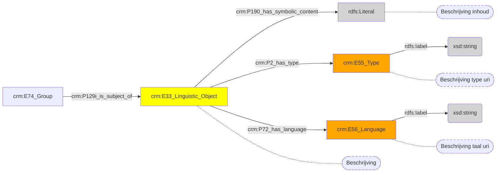

```mermaid
graph LR
19ab4e7a-ee62-11ed-9232-00163e71351b["crm:E33_Linguistic_Object"]-->|"crm:P190_has_symbolic_content"|19ab555a-ee62-11ed-9232-00163e71351b(rdfs:Literal)
19ab5776-ee62-11ed-9232-00163e71351b["crm:E55_Type"]-->|"rdfs:label"|19ab567c-ee62-11ed-9232-00163e71351b(xsd:string)
19ab5938-ee62-11ed-9232-00163e71351b["crm:E56_Language"]-->|"rdfs:label"|19ab585c-ee62-11ed-9232-00163e71351b(xsd:string)
1456bf2e-e37f-11ed-a1e6-00163e71351b["crm:E74_Group"]-->|"crm:P129i_is_subject_of"|19ab4e7a-ee62-11ed-9232-00163e71351b["crm:E33_Linguistic_Object"]
19ab4e7a-ee62-11ed-9232-00163e71351b["crm:E33_Linguistic_Object"]-->|"crm:P2_has_type"|19ab5776-ee62-11ed-9232-00163e71351b["crm:E55_Type"]
19ab4e7a-ee62-11ed-9232-00163e71351b["crm:E33_Linguistic_Object"]-->|"crm:P72_has_language"|19ab5938-ee62-11ed-9232-00163e71351b["crm:E56_Language"]
style 19ab4e7a-ee62-11ed-9232-00163e71351b_s stroke-dasharray: 5
style 19ab555a-ee62-11ed-9232-00163e71351b_s stroke-dasharray: 5
style 19ab5776-ee62-11ed-9232-00163e71351b_s stroke-dasharray: 5
style 19ab5938-ee62-11ed-9232-00163e71351b_s stroke-dasharray: 5
19ab4e7a-ee62-11ed-9232-00163e71351b["crm:E33_Linguistic_Object"]-.-19ab4e7a-ee62-11ed-9232-00163e71351b_s(["Beschrijving"])
19ab555a-ee62-11ed-9232-00163e71351b["rdfs:Literal"]-.-19ab555a-ee62-11ed-9232-00163e71351b_s(["Beschrijving inhoud"])
19ab5776-ee62-11ed-9232-00163e71351b["crm:E55_Type"]-.-19ab5776-ee62-11ed-9232-00163e71351b_s(["Beschrijving type uri"])
19ab5938-ee62-11ed-9232-00163e71351b["crm:E56_Language"]-.-19ab5938-ee62-11ed-9232-00163e71351b_s(["Beschrijving taal uri"])
style 19ab4e7a-ee62-11ed-9232-00163e71351b fill:#ffff00
style 19ab555a-ee62-11ed-9232-00163e71351b fill:#D3D3D3
style 19ab567c-ee62-11ed-9232-00163e71351b fill:#D3D3D3
style 19ab5776-ee62-11ed-9232-00163e71351b fill:#ffa500
style 19ab585c-ee62-11ed-9232-00163e71351b fill:#D3D3D3
style 19ab5938-ee62-11ed-9232-00163e71351b fill:#ffa500
```
