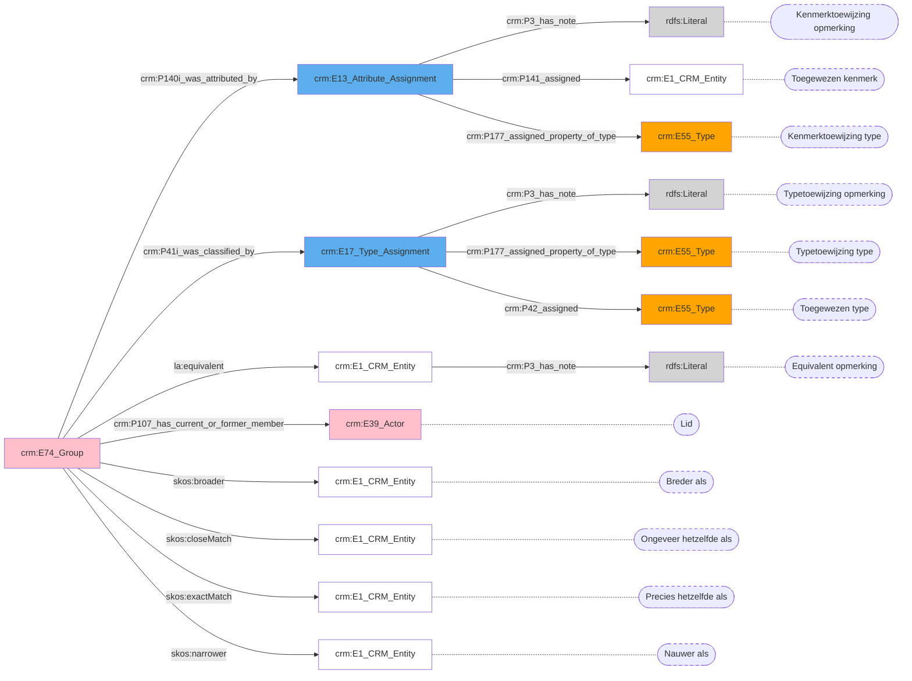

```mermaid
graph LR
style 0c8f3296-14ee-11ef-9cee-960002548b4f fill:#D3D3D3
style 1456bf2e-e37f-11ed-a1e6-00163e71351b fill:#ffc0cb
style 18f6264d-181d-11ef-a33c-960002548b4f fill:#5DAEEC
style 18f62a62-181d-11ef-8e91-960002548b4f fill:#ffa500
style 18f62ba9-181d-11ef-8a38-960002548b4f fill:#D3D3D3
style 18f62ca5-181d-11ef-9579-960002548b4f fill:#ffffff
style 49dc2d7e-1db1-11ef-8a02-960002548b4f fill:#ffffff
style 5725a4e9-1db1-11ef-b30a-960002548b4f fill:#ffffff
style 606baece-e37f-11ed-a1e6-00163e71351b fill:#ffc0cb
style 62ff9964-1db1-11ef-b5fc-960002548b4f fill:#ffffff
style 6eab5bcd-1db1-11ef-8e2a-960002548b4f fill:#ffffff
style da1e0017-181e-11ef-92b8-960002548b4f fill:#5DAEEC
style da1e041d-181e-11ef-aaa2-960002548b4f fill:#ffa500
style da1e0560-181e-11ef-9b90-960002548b4f fill:#ffa500
style da1e081a-181e-11ef-afbe-960002548b4f fill:#D3D3D3
style f6d70486-e405-11ed-9064-00163e71351b fill:#ffffff
18f6264d-181d-11ef-a33c-960002548b4f["crm:E13_Attribute_Assignment"]-->|"crm:P3_has_note"|18f62ba9-181d-11ef-8a38-960002548b4f(rdfs:Literal)
da1e0017-181e-11ef-92b8-960002548b4f["crm:E17_Type_Assignment"]-->|"crm:P3_has_note"|da1e081a-181e-11ef-afbe-960002548b4f(rdfs:Literal)
f6d70486-e405-11ed-9064-00163e71351b["crm:E1_CRM_Entity"]-->|"crm:P3_has_note"|0c8f3296-14ee-11ef-9cee-960002548b4f(rdfs:Literal)
style 606baece-e37f-11ed-a1e6-00163e71351b_s stroke-dasharray: 5
style 49dc2d7e-1db1-11ef-8a02-960002548b4f_s stroke-dasharray: 5
style 5725a4e9-1db1-11ef-b30a-960002548b4f_s stroke-dasharray: 5
style 62ff9964-1db1-11ef-b5fc-960002548b4f_s stroke-dasharray: 5
style 6eab5bcd-1db1-11ef-8e2a-960002548b4f_s stroke-dasharray: 5
style 18f62ca5-181d-11ef-9579-960002548b4f_s stroke-dasharray: 5
style 18f62a62-181d-11ef-8e91-960002548b4f_s stroke-dasharray: 5
style 18f62ba9-181d-11ef-8a38-960002548b4f_s stroke-dasharray: 5
style da1e041d-181e-11ef-aaa2-960002548b4f_s stroke-dasharray: 5
style da1e081a-181e-11ef-afbe-960002548b4f_s stroke-dasharray: 5
style da1e0560-181e-11ef-9b90-960002548b4f_s stroke-dasharray: 5
style 0c8f3296-14ee-11ef-9cee-960002548b4f_s stroke-dasharray: 5
606baece-e37f-11ed-a1e6-00163e71351b["crm:E39_Actor"]-.-606baece-e37f-11ed-a1e6-00163e71351b_s(["Lid"])
49dc2d7e-1db1-11ef-8a02-960002548b4f["crm:E1_CRM_Entity"]-.-49dc2d7e-1db1-11ef-8a02-960002548b4f_s(["Breder als"])
5725a4e9-1db1-11ef-b30a-960002548b4f["crm:E1_CRM_Entity"]-.-5725a4e9-1db1-11ef-b30a-960002548b4f_s(["Ongeveer hetzelfde als"])
62ff9964-1db1-11ef-b5fc-960002548b4f["crm:E1_CRM_Entity"]-.-62ff9964-1db1-11ef-b5fc-960002548b4f_s(["Precies hetzelfde als"])
6eab5bcd-1db1-11ef-8e2a-960002548b4f["crm:E1_CRM_Entity"]-.-6eab5bcd-1db1-11ef-8e2a-960002548b4f_s(["Nauwer als"])
18f62ca5-181d-11ef-9579-960002548b4f["crm:E1_CRM_Entity"]-.-18f62ca5-181d-11ef-9579-960002548b4f_s(["Toegewezen kenmerk"])
18f62a62-181d-11ef-8e91-960002548b4f["crm:E55_Type"]-.-18f62a62-181d-11ef-8e91-960002548b4f_s(["Kenmerktoewijzing type"])
18f62ba9-181d-11ef-8a38-960002548b4f["rdfs:Literal"]-.-18f62ba9-181d-11ef-8a38-960002548b4f_s(["Kenmerktoewijzing opmerking"])
da1e041d-181e-11ef-aaa2-960002548b4f["crm:E55_Type"]-.-da1e041d-181e-11ef-aaa2-960002548b4f_s(["Typetoewijzing type"])
da1e081a-181e-11ef-afbe-960002548b4f["rdfs:Literal"]-.-da1e081a-181e-11ef-afbe-960002548b4f_s(["Typetoewijzing opmerking"])
da1e0560-181e-11ef-9b90-960002548b4f["crm:E55_Type"]-.-da1e0560-181e-11ef-9b90-960002548b4f_s(["Toegewezen type"])
0c8f3296-14ee-11ef-9cee-960002548b4f["rdfs:Literal"]-.-0c8f3296-14ee-11ef-9cee-960002548b4f_s(["Equivalent opmerking"])
1456bf2e-e37f-11ed-a1e6-00163e71351b["crm:E74_Group"]-->|"crm:P107_has_current_or_former_member"|606baece-e37f-11ed-a1e6-00163e71351b["crm:E39_Actor"]
1456bf2e-e37f-11ed-a1e6-00163e71351b["crm:E74_Group"]-->|"crm:P140i_was_attributed_by"|18f6264d-181d-11ef-a33c-960002548b4f["crm:E13_Attribute_Assignment"]
1456bf2e-e37f-11ed-a1e6-00163e71351b["crm:E74_Group"]-->|"crm:P41i_was_classified_by"|da1e0017-181e-11ef-92b8-960002548b4f["crm:E17_Type_Assignment"]
1456bf2e-e37f-11ed-a1e6-00163e71351b["crm:E74_Group"]-->|"skos:broader"|49dc2d7e-1db1-11ef-8a02-960002548b4f["crm:E1_CRM_Entity"]
1456bf2e-e37f-11ed-a1e6-00163e71351b["crm:E74_Group"]-->|"skos:closeMatch"|5725a4e9-1db1-11ef-b30a-960002548b4f["crm:E1_CRM_Entity"]
1456bf2e-e37f-11ed-a1e6-00163e71351b["crm:E74_Group"]-->|"skos:exactMatch"|62ff9964-1db1-11ef-b5fc-960002548b4f["crm:E1_CRM_Entity"]
1456bf2e-e37f-11ed-a1e6-00163e71351b["crm:E74_Group"]-->|"skos:narrower"|6eab5bcd-1db1-11ef-8e2a-960002548b4f["crm:E1_CRM_Entity"]
1456bf2e-e37f-11ed-a1e6-00163e71351b["crm:E74_Group"]-->|"la:equivalent"|f6d70486-e405-11ed-9064-00163e71351b["crm:E1_CRM_Entity"]
18f6264d-181d-11ef-a33c-960002548b4f["crm:E13_Attribute_Assignment"]-->|"crm:P141_assigned"|18f62ca5-181d-11ef-9579-960002548b4f["crm:E1_CRM_Entity"]
18f6264d-181d-11ef-a33c-960002548b4f["crm:E13_Attribute_Assignment"]-->|"crm:P177_assigned_property_of_type"|18f62a62-181d-11ef-8e91-960002548b4f["crm:E55_Type"]
da1e0017-181e-11ef-92b8-960002548b4f["crm:E17_Type_Assignment"]-->|"crm:P177_assigned_property_of_type"|da1e041d-181e-11ef-aaa2-960002548b4f["crm:E55_Type"]
da1e0017-181e-11ef-92b8-960002548b4f["crm:E17_Type_Assignment"]-->|"crm:P42_assigned"|da1e0560-181e-11ef-9b90-960002548b4f["crm:E55_Type"]
```
