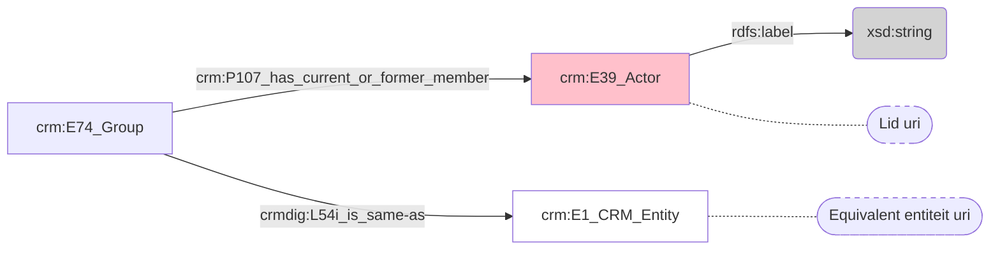

```mermaid
graph LR
606baece-e37f-11ed-a1e6-00163e71351b["crm:E39_Actor"]-->|"rdfs:label"|7c47ce20-e406-11ed-a1e6-00163e71351b(xsd:string)
1456bf2e-e37f-11ed-a1e6-00163e71351b["crm:E74_Group"]-->|"crm:P107_has_current_or_former_member"|606baece-e37f-11ed-a1e6-00163e71351b["crm:E39_Actor"]
1456bf2e-e37f-11ed-a1e6-00163e71351b["crm:E74_Group"]-->|"crmdig:L54i_is_same-as"|f6d70486-e405-11ed-9064-00163e71351b["crm:E1_CRM_Entity"]
style 606baece-e37f-11ed-a1e6-00163e71351b_s stroke-dasharray: 5
style f6d70486-e405-11ed-9064-00163e71351b_s stroke-dasharray: 5
606baece-e37f-11ed-a1e6-00163e71351b["crm:E39_Actor"]-.-606baece-e37f-11ed-a1e6-00163e71351b_s(["Lid uri"])
f6d70486-e405-11ed-9064-00163e71351b["crm:E1_CRM_Entity"]-.-f6d70486-e405-11ed-9064-00163e71351b_s(["Equivalent entiteit uri"])
style 606baece-e37f-11ed-a1e6-00163e71351b fill:#ffc0cb
style 7c47ce20-e406-11ed-a1e6-00163e71351b fill:#D3D3D3
style f6d70486-e405-11ed-9064-00163e71351b fill:#ffffff
```
