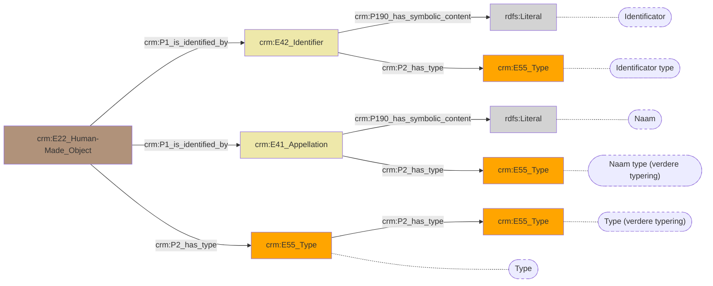

```mermaid
graph LR
style 650ddbe2-1dae-11ef-b969-960002548b4f fill:#EEE8AA
style 650de308-1dae-11ef-9701-960002548b4f fill:#D3D3D3
style 650de46f-1dae-11ef-837e-960002548b4f fill:#ffa500
style 78c3d670-1dae-11ef-bad9-960002548b4f fill:#EEE8AA
style 78c3dbc5-1dae-11ef-aa3f-960002548b4f fill:#ffa500
style 78c3dec5-1dae-11ef-8c12-960002548b4f fill:#D3D3D3
style 9c9c2491-1dae-11ef-b9ff-960002548b4f fill:#ffa500
style 9c9c298d-1dae-11ef-9e08-960002548b4f fill:#ffa500
style f22f2c4a-1dad-11ef-bd1b-960002548b4f fill:#B0927A
650ddbe2-1dae-11ef-b969-960002548b4f["crm:E42_Identifier"]-->|"crm:P190_has_symbolic_content"|650de308-1dae-11ef-9701-960002548b4f(rdfs:Literal)
78c3d670-1dae-11ef-bad9-960002548b4f["crm:E41_Appellation"]-->|"crm:P190_has_symbolic_content"|78c3dec5-1dae-11ef-8c12-960002548b4f(rdfs:Literal)
style 650de308-1dae-11ef-9701-960002548b4f_s stroke-dasharray: 5
style 650de46f-1dae-11ef-837e-960002548b4f_s stroke-dasharray: 5
style 78c3dec5-1dae-11ef-8c12-960002548b4f_s stroke-dasharray: 5
style 78c3dbc5-1dae-11ef-aa3f-960002548b4f_s stroke-dasharray: 5
style 9c9c298d-1dae-11ef-9e08-960002548b4f_s stroke-dasharray: 5
style 9c9c2491-1dae-11ef-b9ff-960002548b4f_s stroke-dasharray: 5
650de308-1dae-11ef-9701-960002548b4f["rdfs:Literal"]-.-650de308-1dae-11ef-9701-960002548b4f_s(["Identificator"])
650de46f-1dae-11ef-837e-960002548b4f["crm:E55_Type"]-.-650de46f-1dae-11ef-837e-960002548b4f_s(["Identificator type"])
78c3dec5-1dae-11ef-8c12-960002548b4f["rdfs:Literal"]-.-78c3dec5-1dae-11ef-8c12-960002548b4f_s(["Naam"])
78c3dbc5-1dae-11ef-aa3f-960002548b4f["crm:E55_Type"]-.-78c3dbc5-1dae-11ef-aa3f-960002548b4f_s(["Naam type (verdere typering)"])
9c9c298d-1dae-11ef-9e08-960002548b4f["crm:E55_Type"]-.-9c9c298d-1dae-11ef-9e08-960002548b4f_s(["Type (verdere typering)"])
9c9c2491-1dae-11ef-b9ff-960002548b4f["crm:E55_Type"]-.-9c9c2491-1dae-11ef-b9ff-960002548b4f_s(["Type"])
650ddbe2-1dae-11ef-b969-960002548b4f["crm:E42_Identifier"]-->|"crm:P2_has_type"|650de46f-1dae-11ef-837e-960002548b4f["crm:E55_Type"]
78c3d670-1dae-11ef-bad9-960002548b4f["crm:E41_Appellation"]-->|"crm:P2_has_type"|78c3dbc5-1dae-11ef-aa3f-960002548b4f["crm:E55_Type"]
9c9c2491-1dae-11ef-b9ff-960002548b4f["crm:E55_Type"]-->|"crm:P2_has_type"|9c9c298d-1dae-11ef-9e08-960002548b4f["crm:E55_Type"]
f22f2c4a-1dad-11ef-bd1b-960002548b4f["crm:E22_Human-Made_Object"]-->|"crm:P1_is_identified_by"|650ddbe2-1dae-11ef-b969-960002548b4f["crm:E42_Identifier"]
f22f2c4a-1dad-11ef-bd1b-960002548b4f["crm:E22_Human-Made_Object"]-->|"crm:P1_is_identified_by"|78c3d670-1dae-11ef-bad9-960002548b4f["crm:E41_Appellation"]
f22f2c4a-1dad-11ef-bd1b-960002548b4f["crm:E22_Human-Made_Object"]-->|"crm:P2_has_type"|9c9c2491-1dae-11ef-b9ff-960002548b4f["crm:E55_Type"]
```
