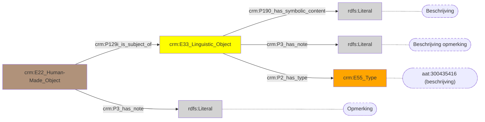

```mermaid
graph LR
style 291f3607-1dae-11ef-9ccf-960002548b4f fill:#ffff00
style 291f3b63-1dae-11ef-b4a1-960002548b4f fill:#D3D3D3
style 291f3f31-1dae-11ef-9c2d-960002548b4f fill:#D3D3D3
style 291f41e8-1dae-11ef-93b4-960002548b4f fill:#ffa500
style 888de920-1dae-11ef-8c2a-960002548b4f fill:#D3D3D3
style f22f2c4a-1dad-11ef-bd1b-960002548b4f fill:#B0927A
291f3607-1dae-11ef-9ccf-960002548b4f["crm:E33_Linguistic_Object"]-->|"crm:P190_has_symbolic_content"|291f3f31-1dae-11ef-9c2d-960002548b4f(rdfs:Literal)
291f3607-1dae-11ef-9ccf-960002548b4f["crm:E33_Linguistic_Object"]-->|"crm:P3_has_note"|291f3b63-1dae-11ef-b4a1-960002548b4f(rdfs:Literal)
f22f2c4a-1dad-11ef-bd1b-960002548b4f["crm:E22_Human-Made_Object"]-->|"crm:P3_has_note"|888de920-1dae-11ef-8c2a-960002548b4f(rdfs:Literal)
style 291f3f31-1dae-11ef-9c2d-960002548b4f_s stroke-dasharray: 5
style 291f41e8-1dae-11ef-93b4-960002548b4f_s stroke-dasharray: 5
style 291f3b63-1dae-11ef-b4a1-960002548b4f_s stroke-dasharray: 5
style 888de920-1dae-11ef-8c2a-960002548b4f_s stroke-dasharray: 5
291f3f31-1dae-11ef-9c2d-960002548b4f["rdfs:Literal"]-.-291f3f31-1dae-11ef-9c2d-960002548b4f_s(["Beschrijving"])
291f41e8-1dae-11ef-93b4-960002548b4f["crm:E55_Type"]-.-291f41e8-1dae-11ef-93b4-960002548b4f_s(["aat:300435416 (beschrijving)"])
291f3b63-1dae-11ef-b4a1-960002548b4f["rdfs:Literal"]-.-291f3b63-1dae-11ef-b4a1-960002548b4f_s(["Beschrijving opmerking"])
888de920-1dae-11ef-8c2a-960002548b4f["rdfs:Literal"]-.-888de920-1dae-11ef-8c2a-960002548b4f_s(["Opmerking"])
291f3607-1dae-11ef-9ccf-960002548b4f["crm:E33_Linguistic_Object"]-->|"crm:P2_has_type"|291f41e8-1dae-11ef-93b4-960002548b4f["crm:E55_Type"]
f22f2c4a-1dad-11ef-bd1b-960002548b4f["crm:E22_Human-Made_Object"]-->|"crm:P129i_is_subject_of"|291f3607-1dae-11ef-9ccf-960002548b4f["crm:E33_Linguistic_Object"]
```
