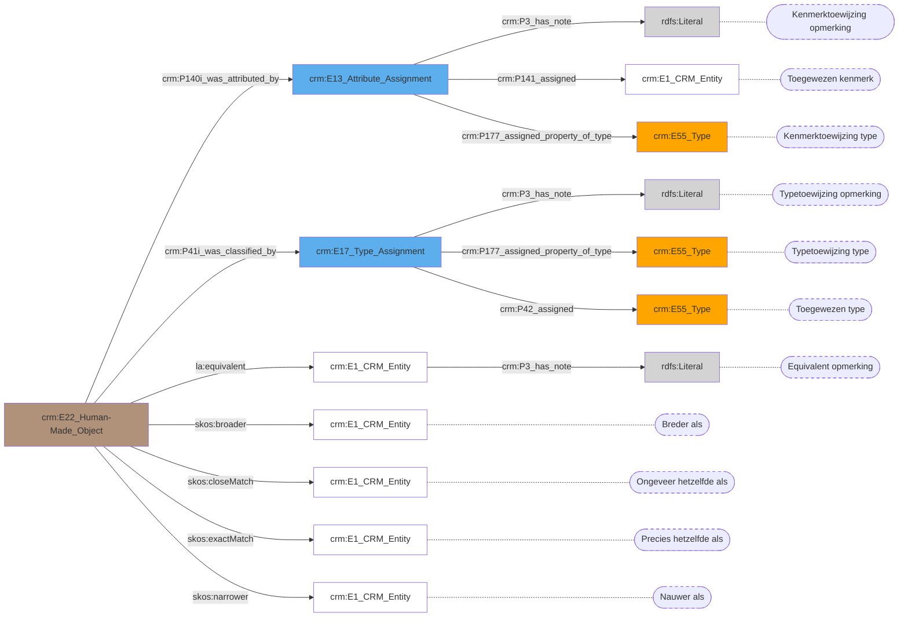

```mermaid
graph LR
style 1f4897cb-1dae-11ef-a1a4-960002548b4f fill:#5DAEEC
style 1f489dea-1dae-11ef-807d-960002548b4f fill:#D3D3D3
style 1f48a0ea-1dae-11ef-811a-960002548b4f fill:#ffa500
style 1f48a208-1dae-11ef-bb5b-960002548b4f fill:#ffffff
style 3b0020d9-1dae-11ef-a04d-960002548b4f fill:#ffffff
style 3b0025b6-1dae-11ef-8063-960002548b4f fill:#D3D3D3
style ad2c6759-1dae-11ef-812c-960002548b4f fill:#5DAEEC
style ad2c6c7a-1dae-11ef-a664-960002548b4f fill:#ffa500
style ad2c6e0e-1dae-11ef-95fa-960002548b4f fill:#ffa500
style ad2c7190-1dae-11ef-a834-960002548b4f fill:#D3D3D3
style bf8c443f-1dae-11ef-917c-960002548b4f fill:#ffffff
style cd89435c-1dae-11ef-b530-960002548b4f fill:#ffffff
style db9fda12-1dae-11ef-b108-960002548b4f fill:#ffffff
style e6f0981f-1dae-11ef-95bb-960002548b4f fill:#ffffff
style f22f2c4a-1dad-11ef-bd1b-960002548b4f fill:#B0927A
1f4897cb-1dae-11ef-a1a4-960002548b4f["crm:E13_Attribute_Assignment"]-->|"crm:P3_has_note"|1f489dea-1dae-11ef-807d-960002548b4f(rdfs:Literal)
3b0020d9-1dae-11ef-a04d-960002548b4f["crm:E1_CRM_Entity"]-->|"crm:P3_has_note"|3b0025b6-1dae-11ef-8063-960002548b4f(rdfs:Literal)
ad2c6759-1dae-11ef-812c-960002548b4f["crm:E17_Type_Assignment"]-->|"crm:P3_has_note"|ad2c7190-1dae-11ef-a834-960002548b4f(rdfs:Literal)
style 1f48a208-1dae-11ef-bb5b-960002548b4f_s stroke-dasharray: 5
style 1f48a0ea-1dae-11ef-811a-960002548b4f_s stroke-dasharray: 5
style 1f489dea-1dae-11ef-807d-960002548b4f_s stroke-dasharray: 5
style 3b0025b6-1dae-11ef-8063-960002548b4f_s stroke-dasharray: 5
style ad2c6c7a-1dae-11ef-a664-960002548b4f_s stroke-dasharray: 5
style ad2c7190-1dae-11ef-a834-960002548b4f_s stroke-dasharray: 5
style ad2c6e0e-1dae-11ef-95fa-960002548b4f_s stroke-dasharray: 5
style bf8c443f-1dae-11ef-917c-960002548b4f_s stroke-dasharray: 5
style cd89435c-1dae-11ef-b530-960002548b4f_s stroke-dasharray: 5
style db9fda12-1dae-11ef-b108-960002548b4f_s stroke-dasharray: 5
style e6f0981f-1dae-11ef-95bb-960002548b4f_s stroke-dasharray: 5
1f48a208-1dae-11ef-bb5b-960002548b4f["crm:E1_CRM_Entity"]-.-1f48a208-1dae-11ef-bb5b-960002548b4f_s(["Toegewezen kenmerk"])
1f48a0ea-1dae-11ef-811a-960002548b4f["crm:E55_Type"]-.-1f48a0ea-1dae-11ef-811a-960002548b4f_s(["Kenmerktoewijzing type"])
1f489dea-1dae-11ef-807d-960002548b4f["rdfs:Literal"]-.-1f489dea-1dae-11ef-807d-960002548b4f_s(["Kenmerktoewijzing opmerking"])
3b0025b6-1dae-11ef-8063-960002548b4f["rdfs:Literal"]-.-3b0025b6-1dae-11ef-8063-960002548b4f_s(["Equivalent opmerking"])
ad2c6c7a-1dae-11ef-a664-960002548b4f["crm:E55_Type"]-.-ad2c6c7a-1dae-11ef-a664-960002548b4f_s(["Typetoewijzing type"])
ad2c7190-1dae-11ef-a834-960002548b4f["rdfs:Literal"]-.-ad2c7190-1dae-11ef-a834-960002548b4f_s(["Typetoewijzing opmerking"])
ad2c6e0e-1dae-11ef-95fa-960002548b4f["crm:E55_Type"]-.-ad2c6e0e-1dae-11ef-95fa-960002548b4f_s(["Toegewezen type"])
bf8c443f-1dae-11ef-917c-960002548b4f["crm:E1_CRM_Entity"]-.-bf8c443f-1dae-11ef-917c-960002548b4f_s(["Breder als"])
cd89435c-1dae-11ef-b530-960002548b4f["crm:E1_CRM_Entity"]-.-cd89435c-1dae-11ef-b530-960002548b4f_s(["Ongeveer hetzelfde als"])
db9fda12-1dae-11ef-b108-960002548b4f["crm:E1_CRM_Entity"]-.-db9fda12-1dae-11ef-b108-960002548b4f_s(["Precies hetzelfde als"])
e6f0981f-1dae-11ef-95bb-960002548b4f["crm:E1_CRM_Entity"]-.-e6f0981f-1dae-11ef-95bb-960002548b4f_s(["Nauwer als"])
1f4897cb-1dae-11ef-a1a4-960002548b4f["crm:E13_Attribute_Assignment"]-->|"crm:P141_assigned"|1f48a208-1dae-11ef-bb5b-960002548b4f["crm:E1_CRM_Entity"]
1f4897cb-1dae-11ef-a1a4-960002548b4f["crm:E13_Attribute_Assignment"]-->|"crm:P177_assigned_property_of_type"|1f48a0ea-1dae-11ef-811a-960002548b4f["crm:E55_Type"]
ad2c6759-1dae-11ef-812c-960002548b4f["crm:E17_Type_Assignment"]-->|"crm:P177_assigned_property_of_type"|ad2c6c7a-1dae-11ef-a664-960002548b4f["crm:E55_Type"]
ad2c6759-1dae-11ef-812c-960002548b4f["crm:E17_Type_Assignment"]-->|"crm:P42_assigned"|ad2c6e0e-1dae-11ef-95fa-960002548b4f["crm:E55_Type"]
f22f2c4a-1dad-11ef-bd1b-960002548b4f["crm:E22_Human-Made_Object"]-->|"crm:P140i_was_attributed_by"|1f4897cb-1dae-11ef-a1a4-960002548b4f["crm:E13_Attribute_Assignment"]
f22f2c4a-1dad-11ef-bd1b-960002548b4f["crm:E22_Human-Made_Object"]-->|"crm:P41i_was_classified_by"|ad2c6759-1dae-11ef-812c-960002548b4f["crm:E17_Type_Assignment"]
f22f2c4a-1dad-11ef-bd1b-960002548b4f["crm:E22_Human-Made_Object"]-->|"skos:broader"|bf8c443f-1dae-11ef-917c-960002548b4f["crm:E1_CRM_Entity"]
f22f2c4a-1dad-11ef-bd1b-960002548b4f["crm:E22_Human-Made_Object"]-->|"skos:closeMatch"|cd89435c-1dae-11ef-b530-960002548b4f["crm:E1_CRM_Entity"]
f22f2c4a-1dad-11ef-bd1b-960002548b4f["crm:E22_Human-Made_Object"]-->|"skos:exactMatch"|db9fda12-1dae-11ef-b108-960002548b4f["crm:E1_CRM_Entity"]
f22f2c4a-1dad-11ef-bd1b-960002548b4f["crm:E22_Human-Made_Object"]-->|"skos:narrower"|e6f0981f-1dae-11ef-95bb-960002548b4f["crm:E1_CRM_Entity"]
f22f2c4a-1dad-11ef-bd1b-960002548b4f["crm:E22_Human-Made_Object"]-->|"la:equivalent"|3b0020d9-1dae-11ef-a04d-960002548b4f["crm:E1_CRM_Entity"]
```
