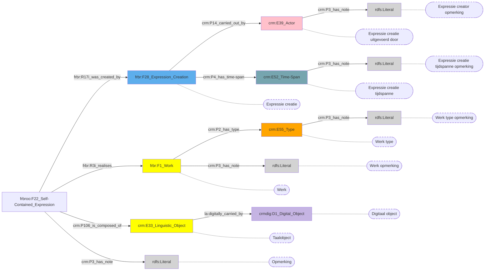

```mermaid
graph LR
669400c2-d3b6-11ed-9655-00163e71351b["crm:E33_Linguistic_Object"]-->|"la:digitally_carried_by"|4771d0d6-d3b9-11ed-a1e6-00163e71351b["crmdig:D1_Digital_Object"]
bb42ef5e-d2c4-11ed-9655-00163e71351b["frbroo:F22_Self-Contained_Expression"]-->|"frbr:R17i_was_created_by"|d8a47f40-d2c4-11ed-9064-00163e71351b["frbr:F28_Expression_Creation"]
bb42ef5e-d2c4-11ed-9655-00163e71351b["frbroo:F22_Self-Contained_Expression"]-->|"frbr:R3i_realises"|f9a8da74-d2c4-11ed-9064-00163e71351b["frbr:F1_Work"]
bb42ef5e-d2c4-11ed-9655-00163e71351b["frbroo:F22_Self-Contained_Expression"]-->|"crm:P106_is_composed_of"|669400c2-d3b6-11ed-9655-00163e71351b["crm:E33_Linguistic_Object"]
d8a47f40-d2c4-11ed-9064-00163e71351b["frbr:F28_Expression_Creation"]-->|"crm:P14_carried_out_by"|d8a48b02-d2c4-11ed-9064-00163e71351b["crm:E39_Actor"]
d8a47f40-d2c4-11ed-9064-00163e71351b["frbr:F28_Expression_Creation"]-->|"crm:P4_has_time-span"|d8a48d0a-d2c4-11ed-9064-00163e71351b["crm:E52_Time-Span"]
f9a8da74-d2c4-11ed-9064-00163e71351b["frbr:F1_Work"]-->|"crm:P2_has_type"|f9a8e0f0-d2c4-11ed-9064-00163e71351b["crm:E55_Type"]
bb42ef5e-d2c4-11ed-9655-00163e71351b["frbroo:F22_Self-Contained_Expression"]-->|"crm:P3_has_note"|e6216ca0-d2c4-11ed-9232-00163e71351b(rdfs:Literal)
d8a48b02-d2c4-11ed-9064-00163e71351b["crm:E39_Actor"]-->|"crm:P3_has_note"|d8a488e6-d2c4-11ed-9064-00163e71351b(rdfs:Literal)
d8a48d0a-d2c4-11ed-9064-00163e71351b["crm:E52_Time-Span"]-->|"crm:P3_has_note"|d8a4865c-d2c4-11ed-9064-00163e71351b(rdfs:Literal)
f9a8da74-d2c4-11ed-9064-00163e71351b["frbr:F1_Work"]-->|"crm:P3_has_note"|f9a8e26c-d2c4-11ed-9064-00163e71351b(rdfs:Literal)
f9a8e0f0-d2c4-11ed-9064-00163e71351b["crm:E55_Type"]-->|"crm:P3_has_note"|f9a8df38-d2c4-11ed-9064-00163e71351b(rdfs:Literal)
style 4771d0d6-d3b9-11ed-a1e6-00163e71351b_s stroke-dasharray: 5
style d8a47f40-d2c4-11ed-9064-00163e71351b_s stroke-dasharray: 5
style f9a8da74-d2c4-11ed-9064-00163e71351b_s stroke-dasharray: 5
style 669400c2-d3b6-11ed-9655-00163e71351b_s stroke-dasharray: 5
style e6216ca0-d2c4-11ed-9232-00163e71351b_s stroke-dasharray: 5
style d8a48b02-d2c4-11ed-9064-00163e71351b_s stroke-dasharray: 5
style d8a48d0a-d2c4-11ed-9064-00163e71351b_s stroke-dasharray: 5
style d8a488e6-d2c4-11ed-9064-00163e71351b_s stroke-dasharray: 5
style d8a4865c-d2c4-11ed-9064-00163e71351b_s stroke-dasharray: 5
style f9a8e0f0-d2c4-11ed-9064-00163e71351b_s stroke-dasharray: 5
style f9a8e26c-d2c4-11ed-9064-00163e71351b_s stroke-dasharray: 5
style f9a8df38-d2c4-11ed-9064-00163e71351b_s stroke-dasharray: 5
4771d0d6-d3b9-11ed-a1e6-00163e71351b["crmdig:D1_Digital_Object"]-.-4771d0d6-d3b9-11ed-a1e6-00163e71351b_s(["Digitaal object"])
d8a47f40-d2c4-11ed-9064-00163e71351b["frbr:F28_Expression_Creation"]-.-d8a47f40-d2c4-11ed-9064-00163e71351b_s(["Expressie creatie"])
f9a8da74-d2c4-11ed-9064-00163e71351b["frbr:F1_Work"]-.-f9a8da74-d2c4-11ed-9064-00163e71351b_s(["Werk"])
669400c2-d3b6-11ed-9655-00163e71351b["crm:E33_Linguistic_Object"]-.-669400c2-d3b6-11ed-9655-00163e71351b_s(["Taalobject"])
e6216ca0-d2c4-11ed-9232-00163e71351b["rdfs:Literal"]-.-e6216ca0-d2c4-11ed-9232-00163e71351b_s(["Opmerking"])
d8a48b02-d2c4-11ed-9064-00163e71351b["crm:E39_Actor"]-.-d8a48b02-d2c4-11ed-9064-00163e71351b_s(["Expressie creatie uitgevoerd door"])
d8a48d0a-d2c4-11ed-9064-00163e71351b["crm:E52_Time-Span"]-.-d8a48d0a-d2c4-11ed-9064-00163e71351b_s(["Expressie creatie tijdspanne"])
d8a488e6-d2c4-11ed-9064-00163e71351b["rdfs:Literal"]-.-d8a488e6-d2c4-11ed-9064-00163e71351b_s(["Expressie creator opmerking"])
d8a4865c-d2c4-11ed-9064-00163e71351b["rdfs:Literal"]-.-d8a4865c-d2c4-11ed-9064-00163e71351b_s(["Expressie creatie tijdspanne opmerking"])
f9a8e0f0-d2c4-11ed-9064-00163e71351b["crm:E55_Type"]-.-f9a8e0f0-d2c4-11ed-9064-00163e71351b_s(["Werk type"])
f9a8e26c-d2c4-11ed-9064-00163e71351b["rdfs:Literal"]-.-f9a8e26c-d2c4-11ed-9064-00163e71351b_s(["Werk opmerking"])
f9a8df38-d2c4-11ed-9064-00163e71351b["rdfs:Literal"]-.-f9a8df38-d2c4-11ed-9064-00163e71351b_s(["Werk type opmerking"])
style 4771d0d6-d3b9-11ed-a1e6-00163e71351b fill:#C5B4E3
style 669400c2-d3b6-11ed-9655-00163e71351b fill:#ffff00
style d8a47f40-d2c4-11ed-9064-00163e71351b fill:#5DAEEC
style d8a4865c-d2c4-11ed-9064-00163e71351b fill:#D3D3D3
style d8a488e6-d2c4-11ed-9064-00163e71351b fill:#D3D3D3
style d8a48b02-d2c4-11ed-9064-00163e71351b fill:#ffc0cb
style d8a48d0a-d2c4-11ed-9064-00163e71351b fill:#76A5AF
style e6216ca0-d2c4-11ed-9232-00163e71351b fill:#D3D3D3
style f9a8da74-d2c4-11ed-9064-00163e71351b fill:#ffff00
style f9a8df38-d2c4-11ed-9064-00163e71351b fill:#D3D3D3
style f9a8e0f0-d2c4-11ed-9064-00163e71351b fill:#ffa500
style f9a8e26c-d2c4-11ed-9064-00163e71351b fill:#D3D3D3
```
