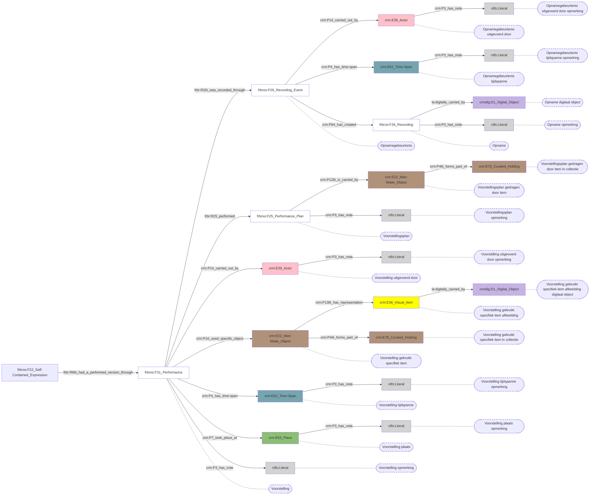

```mermaid
graph LR
2864e29c-d2c8-11ed-9655-00163e71351b["crm:E22_Man-Made_Object"]-->|"crm:P46i_forms_part_of"|c3d8b6b6-d2ca-11ed-9655-00163e71351b["crm:E78_Curated_Holding"]
5c3b1676-d2c9-11ed-a1e6-00163e71351b["crm:E22_Man-Made_Object"]-->|"crm:P138i_has_representation"|ed6c3148-d2c9-11ed-a1e6-00163e71351b["crm:E36_Visual_Item"]
5c3b1676-d2c9-11ed-a1e6-00163e71351b["crm:E22_Man-Made_Object"]-->|"crm:P46i_forms_part_of"|a6758e6e-d2ca-11ed-9232-00163e71351b["crm:E78_Curated_Holding"]
bb42ef5e-d2c4-11ed-9655-00163e71351b["frbroo:F22_Self-Contained_Expression"]-->|"frbr:R66i_had_a_performed_version_through"|eddd783a-d2c4-11ed-9064-00163e71351b["frbroo:F31_Performance"]
ed6c3148-d2c9-11ed-a1e6-00163e71351b["crm:E36_Visual_Item"]-->|"la:digitally_carried_by"|1dd06f8e-d2ca-11ed-9232-00163e71351b["crmdig:D1_Digital_Object"]
eddd783a-d2c4-11ed-9064-00163e71351b["frbroo:F31_Performance"]-->|"frbr:R20i_was_recorded_through"|eddd8906-d2c4-11ed-9064-00163e71351b["frbroo:F29_Recording_Event"]
eddd783a-d2c4-11ed-9064-00163e71351b["frbroo:F31_Performance"]-->|"frbr:R25_performed"|eddd82f8-d2c4-11ed-9064-00163e71351b["frbroo:F25_Performance_Plan"]
eddd783a-d2c4-11ed-9064-00163e71351b["frbroo:F31_Performance"]-->|"crm:P14_carried_out_by"|eddd7f7e-d2c4-11ed-9064-00163e71351b["crm:E39_Actor"]
eddd783a-d2c4-11ed-9064-00163e71351b["frbroo:F31_Performance"]-->|"crm:P16_used_specific_object"|5c3b1676-d2c9-11ed-a1e6-00163e71351b["crm:E22_Man-Made_Object"]
eddd783a-d2c4-11ed-9064-00163e71351b["frbroo:F31_Performance"]-->|"crm:P4_has_time-span"|eddd85a0-d2c4-11ed-9064-00163e71351b["crm:E52_Time-Span"]
eddd783a-d2c4-11ed-9064-00163e71351b["frbroo:F31_Performance"]-->|"crm:P7_took_place_at"|eddd8064-d2c4-11ed-9064-00163e71351b["crm:E53_Place"]
eddd7c86-d2c4-11ed-9064-00163e71351b["frbroo:F26_Recording"]-->|"la:digitally_carried_by"|4320f1e2-d2c9-11ed-9064-00163e71351b["crmdig:D1_Digital_Object"]
eddd82f8-d2c4-11ed-9064-00163e71351b["frbroo:F25_Performance_Plan"]-->|"crm:P128i_is_carried_by"|2864e29c-d2c8-11ed-9655-00163e71351b["crm:E22_Man-Made_Object"]
eddd8906-d2c4-11ed-9064-00163e71351b["frbroo:F29_Recording_Event"]-->|"crm:P14_carried_out_by"|eddd874e-d2c4-11ed-9064-00163e71351b["crm:E39_Actor"]
eddd8906-d2c4-11ed-9064-00163e71351b["frbroo:F29_Recording_Event"]-->|"crm:P4_has_time-span"|eddd882a-d2c4-11ed-9064-00163e71351b["crm:E52_Time-Span"]
eddd8906-d2c4-11ed-9064-00163e71351b["frbroo:F29_Recording_Event"]-->|"crm:P94_has_created"|eddd7c86-d2c4-11ed-9064-00163e71351b["frbroo:F26_Recording"]
eddd783a-d2c4-11ed-9064-00163e71351b["frbroo:F31_Performance"]-->|"crm:P3_has_note"|eddd7d8a-d2c4-11ed-9064-00163e71351b(rdfs:Literal)
eddd7c86-d2c4-11ed-9064-00163e71351b["frbroo:F26_Recording"]-->|"crm:P3_has_note"|eddd84c4-d2c4-11ed-9064-00163e71351b(rdfs:Literal)
eddd7f7e-d2c4-11ed-9064-00163e71351b["crm:E39_Actor"]-->|"crm:P3_has_note"|eddd8140-d2c4-11ed-9064-00163e71351b(rdfs:Literal)
eddd8064-d2c4-11ed-9064-00163e71351b["crm:E53_Place"]-->|"crm:P3_has_note"|eddd7e84-d2c4-11ed-9064-00163e71351b(rdfs:Literal)
eddd82f8-d2c4-11ed-9064-00163e71351b["frbroo:F25_Performance_Plan"]-->|"crm:P3_has_note"|eddd821c-d2c4-11ed-9064-00163e71351b(rdfs:Literal)
eddd85a0-d2c4-11ed-9064-00163e71351b["crm:E52_Time-Span"]-->|"crm:P3_has_note"|eddd8672-d2c4-11ed-9064-00163e71351b(rdfs:Literal)
eddd874e-d2c4-11ed-9064-00163e71351b["crm:E39_Actor"]-->|"crm:P3_has_note"|eddd83de-d2c4-11ed-9064-00163e71351b(rdfs:Literal)
eddd882a-d2c4-11ed-9064-00163e71351b["crm:E52_Time-Span"]-->|"crm:P3_has_note"|eddd7b6e-d2c4-11ed-9064-00163e71351b(rdfs:Literal)
style c3d8b6b6-d2ca-11ed-9655-00163e71351b_s stroke-dasharray: 5
style ed6c3148-d2c9-11ed-a1e6-00163e71351b_s stroke-dasharray: 5
style a6758e6e-d2ca-11ed-9232-00163e71351b_s stroke-dasharray: 5
style eddd783a-d2c4-11ed-9064-00163e71351b_s stroke-dasharray: 5
style 1dd06f8e-d2ca-11ed-9232-00163e71351b_s stroke-dasharray: 5
style eddd8906-d2c4-11ed-9064-00163e71351b_s stroke-dasharray: 5
style eddd82f8-d2c4-11ed-9064-00163e71351b_s stroke-dasharray: 5
style eddd7f7e-d2c4-11ed-9064-00163e71351b_s stroke-dasharray: 5
style 5c3b1676-d2c9-11ed-a1e6-00163e71351b_s stroke-dasharray: 5
style eddd7d8a-d2c4-11ed-9064-00163e71351b_s stroke-dasharray: 5
style eddd85a0-d2c4-11ed-9064-00163e71351b_s stroke-dasharray: 5
style eddd8064-d2c4-11ed-9064-00163e71351b_s stroke-dasharray: 5
style eddd84c4-d2c4-11ed-9064-00163e71351b_s stroke-dasharray: 5
style 4320f1e2-d2c9-11ed-9064-00163e71351b_s stroke-dasharray: 5
style eddd8140-d2c4-11ed-9064-00163e71351b_s stroke-dasharray: 5
style eddd7e84-d2c4-11ed-9064-00163e71351b_s stroke-dasharray: 5
style 2864e29c-d2c8-11ed-9655-00163e71351b_s stroke-dasharray: 5
style eddd821c-d2c4-11ed-9064-00163e71351b_s stroke-dasharray: 5
style eddd8672-d2c4-11ed-9064-00163e71351b_s stroke-dasharray: 5
style eddd83de-d2c4-11ed-9064-00163e71351b_s stroke-dasharray: 5
style eddd7b6e-d2c4-11ed-9064-00163e71351b_s stroke-dasharray: 5
style eddd874e-d2c4-11ed-9064-00163e71351b_s stroke-dasharray: 5
style eddd882a-d2c4-11ed-9064-00163e71351b_s stroke-dasharray: 5
style eddd7c86-d2c4-11ed-9064-00163e71351b_s stroke-dasharray: 5
c3d8b6b6-d2ca-11ed-9655-00163e71351b["crm:E78_Curated_Holding"]-.-c3d8b6b6-d2ca-11ed-9655-00163e71351b_s(["Voorstellingsplan gedragen door item in collectie"])
ed6c3148-d2c9-11ed-a1e6-00163e71351b["crm:E36_Visual_Item"]-.-ed6c3148-d2c9-11ed-a1e6-00163e71351b_s(["Voorstelling gebruikt specifiek item afbeelding"])
a6758e6e-d2ca-11ed-9232-00163e71351b["crm:E78_Curated_Holding"]-.-a6758e6e-d2ca-11ed-9232-00163e71351b_s(["Voorstelling gebruikt specifiek item in collectie"])
eddd783a-d2c4-11ed-9064-00163e71351b["frbroo:F31_Performance"]-.-eddd783a-d2c4-11ed-9064-00163e71351b_s(["Voorstelling"])
1dd06f8e-d2ca-11ed-9232-00163e71351b["crmdig:D1_Digital_Object"]-.-1dd06f8e-d2ca-11ed-9232-00163e71351b_s(["Voorstelling gebruikt specifiek item afbeelding digitaal object"])
eddd8906-d2c4-11ed-9064-00163e71351b["frbroo:F29_Recording_Event"]-.-eddd8906-d2c4-11ed-9064-00163e71351b_s(["Opnamegebeurtenis"])
eddd82f8-d2c4-11ed-9064-00163e71351b["frbroo:F25_Performance_Plan"]-.-eddd82f8-d2c4-11ed-9064-00163e71351b_s(["Voorstellingsplan"])
eddd7f7e-d2c4-11ed-9064-00163e71351b["crm:E39_Actor"]-.-eddd7f7e-d2c4-11ed-9064-00163e71351b_s(["Voorstelling uitgevoerd door"])
5c3b1676-d2c9-11ed-a1e6-00163e71351b["crm:E22_Man-Made_Object"]-.-5c3b1676-d2c9-11ed-a1e6-00163e71351b_s(["Voorstelling gebruikt specifiek item"])
eddd7d8a-d2c4-11ed-9064-00163e71351b["rdfs:Literal"]-.-eddd7d8a-d2c4-11ed-9064-00163e71351b_s(["Voorstelling opmerking"])
eddd85a0-d2c4-11ed-9064-00163e71351b["crm:E52_Time-Span"]-.-eddd85a0-d2c4-11ed-9064-00163e71351b_s(["Voorstelling tijdspanne"])
eddd8064-d2c4-11ed-9064-00163e71351b["crm:E53_Place"]-.-eddd8064-d2c4-11ed-9064-00163e71351b_s(["Voorstelling plaats"])
eddd84c4-d2c4-11ed-9064-00163e71351b["rdfs:Literal"]-.-eddd84c4-d2c4-11ed-9064-00163e71351b_s(["Opname opmerking"])
4320f1e2-d2c9-11ed-9064-00163e71351b["crmdig:D1_Digital_Object"]-.-4320f1e2-d2c9-11ed-9064-00163e71351b_s(["Opname digitaal object"])
eddd8140-d2c4-11ed-9064-00163e71351b["rdfs:Literal"]-.-eddd8140-d2c4-11ed-9064-00163e71351b_s(["Voorstelling uitgevoerd door opmerking"])
eddd7e84-d2c4-11ed-9064-00163e71351b["rdfs:Literal"]-.-eddd7e84-d2c4-11ed-9064-00163e71351b_s(["Voorstelling plaats opmerking"])
2864e29c-d2c8-11ed-9655-00163e71351b["crm:E22_Man-Made_Object"]-.-2864e29c-d2c8-11ed-9655-00163e71351b_s(["Voorstellingsplan gedragen door item"])
eddd821c-d2c4-11ed-9064-00163e71351b["rdfs:Literal"]-.-eddd821c-d2c4-11ed-9064-00163e71351b_s(["Voorstellingsplan opmerking"])
eddd8672-d2c4-11ed-9064-00163e71351b["rdfs:Literal"]-.-eddd8672-d2c4-11ed-9064-00163e71351b_s(["Voorstelling tijdspanne opmerking"])
eddd83de-d2c4-11ed-9064-00163e71351b["rdfs:Literal"]-.-eddd83de-d2c4-11ed-9064-00163e71351b_s(["Opnamegebeurtenis uitgevoerd door opmerking"])
eddd7b6e-d2c4-11ed-9064-00163e71351b["rdfs:Literal"]-.-eddd7b6e-d2c4-11ed-9064-00163e71351b_s(["Opnamegebeurtenis tijdspanne opmerking"])
eddd874e-d2c4-11ed-9064-00163e71351b["crm:E39_Actor"]-.-eddd874e-d2c4-11ed-9064-00163e71351b_s(["Opnamegebeurtenis uitgevoerd door"])
eddd882a-d2c4-11ed-9064-00163e71351b["crm:E52_Time-Span"]-.-eddd882a-d2c4-11ed-9064-00163e71351b_s(["Opnamegebeurtenis tijdspanne"])
eddd7c86-d2c4-11ed-9064-00163e71351b["frbroo:F26_Recording"]-.-eddd7c86-d2c4-11ed-9064-00163e71351b_s(["Opname"])
style 1dd06f8e-d2ca-11ed-9232-00163e71351b fill:#C5B4E3
style 2864e29c-d2c8-11ed-9655-00163e71351b fill:#B0927A
style 4320f1e2-d2c9-11ed-9064-00163e71351b fill:#C5B4E3
style 5c3b1676-d2c9-11ed-a1e6-00163e71351b fill:#B0927A
style a6758e6e-d2ca-11ed-9232-00163e71351b fill:#B0927A
style c3d8b6b6-d2ca-11ed-9655-00163e71351b fill:#B0927A
style ed6c3148-d2c9-11ed-a1e6-00163e71351b fill:#ffff00
style eddd783a-d2c4-11ed-9064-00163e71351b fill:#ffffff
style eddd7b6e-d2c4-11ed-9064-00163e71351b fill:#D3D3D3
style eddd7c86-d2c4-11ed-9064-00163e71351b fill:#ffffff
style eddd7d8a-d2c4-11ed-9064-00163e71351b fill:#D3D3D3
style eddd7e84-d2c4-11ed-9064-00163e71351b fill:#D3D3D3
style eddd7f7e-d2c4-11ed-9064-00163e71351b fill:#ffc0cb
style eddd8064-d2c4-11ed-9064-00163e71351b fill:#8CBF76
style eddd8140-d2c4-11ed-9064-00163e71351b fill:#D3D3D3
style eddd821c-d2c4-11ed-9064-00163e71351b fill:#D3D3D3
style eddd82f8-d2c4-11ed-9064-00163e71351b fill:#ffffff
style eddd83de-d2c4-11ed-9064-00163e71351b fill:#D3D3D3
style eddd84c4-d2c4-11ed-9064-00163e71351b fill:#D3D3D3
style eddd85a0-d2c4-11ed-9064-00163e71351b fill:#76A5AF
style eddd8672-d2c4-11ed-9064-00163e71351b fill:#D3D3D3
style eddd874e-d2c4-11ed-9064-00163e71351b fill:#ffc0cb
style eddd882a-d2c4-11ed-9064-00163e71351b fill:#76A5AF
style eddd8906-d2c4-11ed-9064-00163e71351b fill:#ffffff
```
