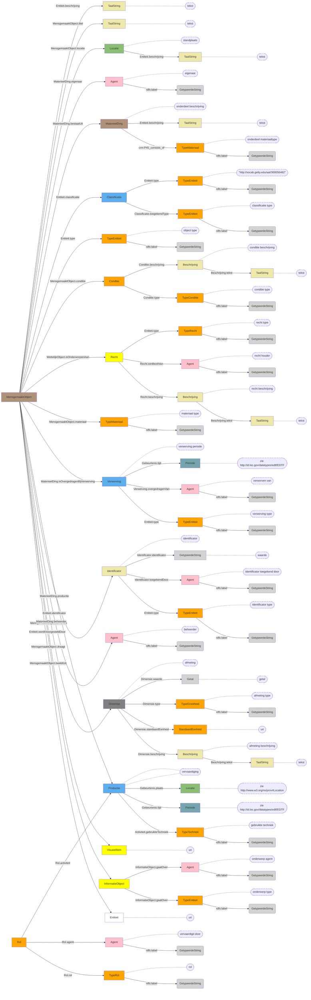

```mermaid
graph LR
50[Verwerving]-->|Entiteit.type|51[TypeEntiteit]
61[Rol]-->|Rol.rol|64[TypeRol]
30[Classificatie]-->|Classificatie.toegekendType|31[TypeEntiteit]
72[Dimensie]-->|Dimensie.beschrijving|73[Beschrijving]
188[InformatieObject]-->|InformatieObject.gaatOver|190[TypeEntiteit]
22[MensgemaaktObject]-->|MensgemaaktObject.beeldtUit|66[Entiteit]
22[MensgemaaktObject]-->|MensgemaaktObject.draagt|188[InformatieObject]
22[MensgemaaktObject]-->|Entiteit.wordtVoorgesteldDoor|37[VisueelItem]
24[Identificator]-->|Entiteit.type|25[TypeEntiteit]
22[MensgemaaktObject]-->|MensgemaaktObject.dimensie|72[Dimensie]
22[MensgemaaktObject]-->|MaterieelDing.beheerder|38[Agent]
84[Recht]-->|Recht.beschrijving|85[Beschrijving]
22[MensgemaaktObject]-->|Entiteit.identificator|24[Identificator]
22[MensgemaaktObject]-->|MaterieelDing.productie|56[Productie]
22[MensgemaaktObject]-->|MaterieelDing.isOvergedragenBijVerwerving|50[Verwerving]
22[MensgemaaktObject]-->|MensgemaaktObject.materiaal|81[TypeMateriaal]
30[Classificatie]-->|Entiteit.type|194[TypeEntiteit]
188[InformatieObject]-->|InformatieObject.gaatOver|218[Agent]
61[Rol]-->|Rol.agent|62[Agent]
61[Rol]-->|Rol.activiteit|56[Productie]
56[Productie]-->|Activiteit.gebruikteTechniek|57[TypeTechniek]
72[Dimensie]-->|Dimensie.standaardEenheid|75[StandaardEenheid]
67[Conditie]-->|Conditie.type|70[TypeConditie]
22[MensgemaaktObject]-->|WettelijkObject.isOnderworpenAan|84[Recht]
72[Dimensie]-->|Dimensie.type|76[TypeGrootheid]
24[Identificator]-->|Identificator.toegekendDoor|28[Agent]
22[MensgemaaktObject]-->|MensgemaaktObject.conditie|67[Conditie]
22[MensgemaaktObject]-->|Entiteit.type|35[TypeEntiteit]
22[MensgemaaktObject]-->|Entiteit.classificatie|30[Classificatie]
50[Verwerving]-->|Verwerving.overgedragenVan|54[Agent]
40[MaterieelDing]-->|crm:P45_consists_of|215[TypeMateriaal]
84[Recht]-->|Recht.isInBezitVan|87[Agent]
22[MensgemaaktObject]-->|MaterieelDing.bestaatUit|40[MaterieelDing]
84[Recht]-->|Entiteit.type|89[TypeRecht]
67[Conditie]-->|Conditie.beschrijving|68[Beschrijving]
22[MensgemaaktObject]-->|MaterieelDing.eigenaar|48[Agent]
51[TypeEntiteit]-->|rdfs:label|52(GetypeerdeString)
73[Beschrijving]-->|Beschrijving.tekst|74(TaalString)
87[Agent]-->|rdfs:label|88(GetypeerdeString)
35[TypeEntiteit]-->|rdfs:label|36(GetypeerdeString)
89[TypeRecht]-->|rdfs:label|90(GetypeerdeString)
22[MensgemaaktObject]-->|MensgemaaktObject.locatie|79(Locatie)
85[Beschrijving]-->|Beschrijving.tekst|86(TaalString)
40[MaterieelDing]-->|Entiteit.beschrijving|217(TaalString)
64[TypeRol]-->|rdfs:label|65(GetypeerdeString)
48[Agent]-->|rdfs:label|49(GetypeerdeString)
70[TypeConditie]-->|rdfs:label|71(GetypeerdeString)
57[TypeTechniek]-->|rdfs:label|58(GetypeerdeString)
50[Verwerving]-->|Gebeurtenis.tijd|53(Periode)
24[Identificator]-->|Identificator.identificator|27(GetypeerdeString)
218[Agent]-->|rdfs:label|192(GetypeerdeString)
190[TypeEntiteit]-->|rdfs:label|191(GetypeerdeString)
194[TypeEntiteit]-->|rdfs:label|195(GetypeerdeString)
68[Beschrijving]-->|Beschrijving.tekst|69(TaalString)
62[Agent]-->|rdfs:label|63(GetypeerdeString)
56[Productie]-->|Gebeurtenis.tijd|60(Periode)
81[TypeMateriaal]-->|rdfs:label|82(GetypeerdeString)
38[Agent]-->|rdfs:label|39(GetypeerdeString)
22[MensgemaaktObject]-->|MensgemaaktObject.titel|83(TaalString)
72[Dimensie]-->|Dimensie.waarde|78(Getal)
79[Locatie]-->|Entiteit.beschrijving|80(TaalString)
22[MensgemaaktObject]-->|Entiteit.beschrijving|23(TaalString)
28[Agent]-->|rdfs:label|29(GetypeerdeString)
56[Productie]-->|Gebeurtenis.plaats|59(Locatie)
31[TypeEntiteit]-->|rdfs:label|32(GetypeerdeString)
54[Agent]-->|rdfs:label|55(GetypeerdeString)
25[TypeEntiteit]-->|rdfs:label|26(GetypeerdeString)
215[TypeMateriaal]-->|rdfs:label|216(GetypeerdeString)
76[TypeGrootheid]-->|rdfs:label|77(GetypeerdeString)
style 51_s stroke-dasharray: 5
style 64_s stroke-dasharray: 5
style 31_s stroke-dasharray: 5
style 74_s stroke-dasharray: 5
style 73_s stroke-dasharray: 5
style 190_s stroke-dasharray: 5
style 66_s stroke-dasharray: 5
style 79_s stroke-dasharray: 5
style 86_s stroke-dasharray: 5
style 217_s stroke-dasharray: 5
style 37_s stroke-dasharray: 5
style 25_s stroke-dasharray: 5
style 72_s stroke-dasharray: 5
style 38_s stroke-dasharray: 5
style 85_s stroke-dasharray: 5
style 24_s stroke-dasharray: 5
style 53_s stroke-dasharray: 5
style 27_s stroke-dasharray: 5
style 56_s stroke-dasharray: 5
style 50_s stroke-dasharray: 5
style 81_s stroke-dasharray: 5
style 194_s stroke-dasharray: 5
style 218_s stroke-dasharray: 5
style 62_s stroke-dasharray: 5
style 56_s stroke-dasharray: 5
style 57_s stroke-dasharray: 5
style 75_s stroke-dasharray: 5
style 70_s stroke-dasharray: 5
style 69_s stroke-dasharray: 5
style 76_s stroke-dasharray: 5
style 60_s stroke-dasharray: 5
style 28_s stroke-dasharray: 5
style 83_s stroke-dasharray: 5
style 78_s stroke-dasharray: 5
style 35_s stroke-dasharray: 5
style 80_s stroke-dasharray: 5
style 54_s stroke-dasharray: 5
style 23_s stroke-dasharray: 5
style 215_s stroke-dasharray: 5
style 59_s stroke-dasharray: 5
style 87_s stroke-dasharray: 5
style 40_s stroke-dasharray: 5
style 89_s stroke-dasharray: 5
style 68_s stroke-dasharray: 5
style 48_s stroke-dasharray: 5
51[TypeEntiteit]-.-51_s([verwerving type])
64[TypeRol]-.-64_s([rol])
31[TypeEntiteit]-.-31_s([classificatie type])
74[TaalString]-.-74_s([tekst])
73[Beschrijving]-.-73_s([afmeting beschrijving])
190[TypeEntiteit]-.-190_s([onderwerp type])
66[Entiteit]-.-66_s([uri])
79[Locatie]-.-79_s([standplaats])
86[TaalString]-.-86_s([tekst])
217[TaalString]-.-217_s([tekst])
37[VisueelItem]-.-37_s([uri])
25[TypeEntiteit]-.-25_s([identificator type])
72[Dimensie]-.-72_s([afmeting])
38[Agent]-.-38_s([beheerder])
85[Beschrijving]-.-85_s([recht beschrijving])
24[Identificator]-.-24_s([identificator])
53[Periode]-.-53_s([zie http://id.loc.gov/datatypes/edtf/EDTF])
27[GetypeerdeString]-.-27_s([waarde])
56[Productie]-.-56_s([vervaardiging])
50[Verwerving]-.-50_s([verwerving periode])
81[TypeMateriaal]-.-81_s([materiaal type])
194[TypeEntiteit]-.-194_s([''http://vocab.getty.edu/aat/300056462''])
218[Agent]-.-218_s([onderwerp agent])
62[Agent]-.-62_s([vervaardigd door])
56[Productie]-.-56_s([vervaardiging])
57[TypeTechniek]-.-57_s([gebruikte techniek])
75[StandaardEenheid]-.-75_s([uri])
70[TypeConditie]-.-70_s([conditie type])
69[TaalString]-.-69_s([tekst])
76[TypeGrootheid]-.-76_s([afmeting type])
60[Periode]-.-60_s([zie http://id.loc.gov/datatypes/edtf/EDTF])
28[Agent]-.-28_s([identificator toegekend door])
83[TaalString]-.-83_s([tekst])
78[Getal]-.-78_s([getal])
35[TypeEntiteit]-.-35_s([object type])
80[TaalString]-.-80_s([tekst])
54[Agent]-.-54_s([verworven van])
23[TaalString]-.-23_s([tekst])
215[TypeMateriaal]-.-215_s([onderdeel materiaaltype])
59[Locatie]-.-59_s([zie http://www.w3.org/ns/prov#Location])
87[Agent]-.-87_s([recht houder])
40[MaterieelDing]-.-40_s([onderdeel beschrijving])
89[TypeRecht]-.-89_s([recht type])
68[Beschrijving]-.-68_s([conditie beschrijving])
48[Agent]-.-48_s([eigenaar])
style 188 fill:#ffff00
style 190 fill:#ffa500
style 191 fill:#D3D3D3
style 192 fill:#D3D3D3
style 194 fill:#ffa500
style 195 fill:#D3D3D3
style 215 fill:#ffa500
style 216 fill:#D3D3D3
style 217 fill:#EEE8AA
style 218 fill:#ffc0cb
style 22 fill:#B0927A
style 23 fill:#EEE8AA
style 24 fill:#EEE8AA
style 25 fill:#ffa500
style 26 fill:#D3D3D3
style 27 fill:#D3D3D3
style 28 fill:#ffc0cb
style 29 fill:#D3D3D3
style 30 fill:#5DAEEC
style 31 fill:#ffa500
style 32 fill:#D3D3D3
style 35 fill:#ffa500
style 36 fill:#D3D3D3
style 37 fill:#ffff00
style 38 fill:#ffc0cb
style 39 fill:#D3D3D3
style 40 fill:#B0927A
style 48 fill:#ffc0cb
style 49 fill:#D3D3D3
style 50 fill:#5DAEEC
style 51 fill:#ffa500
style 52 fill:#D3D3D3
style 53 fill:#76A5AF
style 54 fill:#ffc0cb
style 55 fill:#D3D3D3
style 56 fill:#5DAEEC
style 57 fill:#ffa500
style 58 fill:#D3D3D3
style 59 fill:#8CBF76
style 60 fill:#76A5AF
style 61 fill:#ffa500
style 62 fill:#ffc0cb
style 63 fill:#D3D3D3
style 64 fill:#ffa500
style 65 fill:#D3D3D3
style 66 fill:#ffffff
style 67 fill:#ffa500
style 68 fill:#EEE8AA
style 69 fill:#EEE8AA
style 70 fill:#ffa500
style 71 fill:#D3D3D3
style 72 fill:#808080
style 73 fill:#EEE8AA
style 74 fill:#EEE8AA
style 75 fill:#ffa500
style 76 fill:#ffa500
style 77 fill:#D3D3D3
style 78 fill:#D3D3D3
style 79 fill:#8CBF76
style 80 fill:#EEE8AA
style 81 fill:#ffa500
style 82 fill:#D3D3D3
style 83 fill:#EEE8AA
style 84 fill:#ffff00
style 85 fill:#EEE8AA
style 86 fill:#EEE8AA
style 87 fill:#ffc0cb
style 88 fill:#D3D3D3
style 89 fill:#ffa500
style 90 fill:#D3D3D3
```
