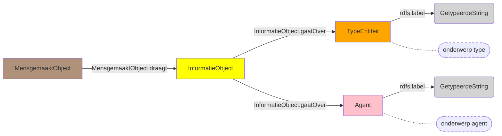

```mermaid
graph LR
190[TypeEntiteit]-->|rdfs:label|191(GetypeerdeString)
218[Agent]-->|rdfs:label|192(GetypeerdeString)
188[InformatieObject]-->|InformatieObject.gaatOver|190[TypeEntiteit]
188[InformatieObject]-->|InformatieObject.gaatOver|218[Agent]
22[MensgemaaktObject]-->|MensgemaaktObject.draagt|188[InformatieObject]
style 190_s stroke-dasharray: 5
style 218_s stroke-dasharray: 5
190[TypeEntiteit]-.-190_s([onderwerp type])
218[Agent]-.-218_s([onderwerp agent])
style 188 fill:#ffff00
style 190 fill:#ffa500
style 191 fill:#D3D3D3
style 192 fill:#D3D3D3
style 218 fill:#ffc0cb
style 22 fill:#B0927A
```
