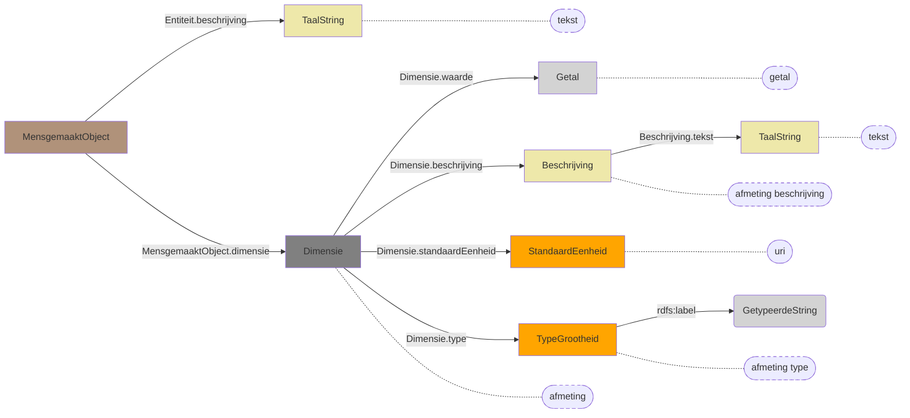

```mermaid
graph LR
22[MensgemaaktObject]-->|Entiteit.beschrijving|23(TaalString)
72[Dimensie]-->|Dimensie.waarde|78(Getal)
73[Beschrijving]-->|Beschrijving.tekst|74(TaalString)
76[TypeGrootheid]-->|rdfs:label|77(GetypeerdeString)
22[MensgemaaktObject]-->|MensgemaaktObject.dimensie|72[Dimensie]
72[Dimensie]-->|Dimensie.beschrijving|73[Beschrijving]
72[Dimensie]-->|Dimensie.standaardEenheid|75[StandaardEenheid]
72[Dimensie]-->|Dimensie.type|76[TypeGrootheid]
23[TaalString]-.-23_s([tekst])
72[Dimensie]-.-72_s([afmeting])
73[Beschrijving]-.-73_s([afmeting beschrijving])
75[StandaardEenheid]-.-75_s([uri])
76[TypeGrootheid]-.-76_s([afmeting type])
78[Getal]-.-78_s([getal])
74[TaalString]-.-74_s([tekst])
style 23_s stroke-dasharray: 5
style 72_s stroke-dasharray: 5
style 73_s stroke-dasharray: 5
style 75_s stroke-dasharray: 5
style 76_s stroke-dasharray: 5
style 78_s stroke-dasharray: 5
style 74_s stroke-dasharray: 5
style 22 fill:#B0927A
style 23 fill:#EEE8AA
style 72 fill:#808080
style 73 fill:#EEE8AA
style 74 fill:#EEE8AA
style 75 fill:#ffa500
style 76 fill:#ffa500
style 77 fill:#D3D3D3
style 78 fill:#D3D3D3
```
