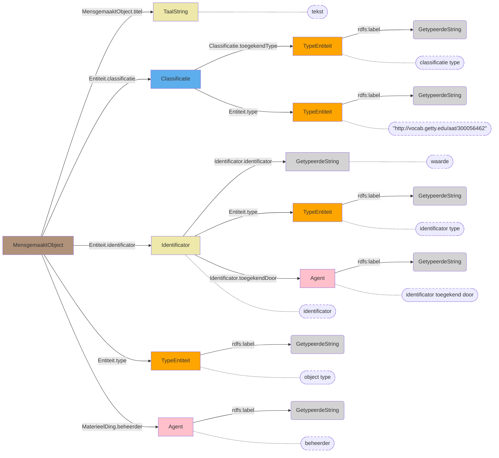

```mermaid
graph LR
194[TypeEntiteit]-->|rdfs:label|195(GetypeerdeString)
22[MensgemaaktObject]-->|MensgemaaktObject.titel|83(TaalString)
24[Identificator]-->|Identificator.identificator|27(GetypeerdeString)
25[TypeEntiteit]-->|rdfs:label|26(GetypeerdeString)
28[Agent]-->|rdfs:label|29(GetypeerdeString)
31[TypeEntiteit]-->|rdfs:label|32(GetypeerdeString)
35[TypeEntiteit]-->|rdfs:label|36(GetypeerdeString)
38[Agent]-->|rdfs:label|39(GetypeerdeString)
22[MensgemaaktObject]-->|Entiteit.classificatie|30[Classificatie]
22[MensgemaaktObject]-->|Entiteit.identificator|24[Identificator]
22[MensgemaaktObject]-->|Entiteit.type|35[TypeEntiteit]
22[MensgemaaktObject]-->|MaterieelDing.beheerder|38[Agent]
24[Identificator]-->|Entiteit.type|25[TypeEntiteit]
24[Identificator]-->|Identificator.toegekendDoor|28[Agent]
30[Classificatie]-->|Classificatie.toegekendType|31[TypeEntiteit]
30[Classificatie]-->|Entiteit.type|194[TypeEntiteit]
style 24_s stroke-dasharray: 5
style 35_s stroke-dasharray: 5
style 38_s stroke-dasharray: 5
style 83_s stroke-dasharray: 5
style 25_s stroke-dasharray: 5
style 27_s stroke-dasharray: 5
style 28_s stroke-dasharray: 5
style 31_s stroke-dasharray: 5
style 194_s stroke-dasharray: 5
24[Identificator]-.-24_s([identificator])
35[TypeEntiteit]-.-35_s([object type])
38[Agent]-.-38_s([beheerder])
83[TaalString]-.-83_s([tekst])
25[TypeEntiteit]-.-25_s([identificator type])
27[GetypeerdeString]-.-27_s([waarde])
28[Agent]-.-28_s([identificator toegekend door])
31[TypeEntiteit]-.-31_s([classificatie type])
194[TypeEntiteit]-.-194_s([''http://vocab.getty.edu/aat/300056462''])
style 194 fill:#ffa500
style 195 fill:#D3D3D3
style 22 fill:#B0927A
style 24 fill:#EEE8AA
style 25 fill:#ffa500
style 26 fill:#D3D3D3
style 27 fill:#D3D3D3
style 28 fill:#ffc0cb
style 29 fill:#D3D3D3
style 30 fill:#5DAEEC
style 31 fill:#ffa500
style 32 fill:#D3D3D3
style 35 fill:#ffa500
style 36 fill:#D3D3D3
style 38 fill:#ffc0cb
style 39 fill:#D3D3D3
style 83 fill:#EEE8AA
```
