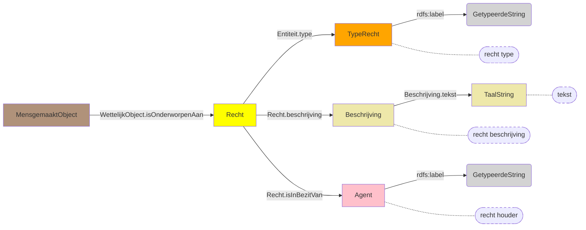

```mermaid
graph LR
85[Beschrijving]-->|Beschrijving.tekst|86(TaalString)
87[Agent]-->|rdfs:label|88(GetypeerdeString)
89[TypeRecht]-->|rdfs:label|90(GetypeerdeString)
22[MensgemaaktObject]-->|WettelijkObject.isOnderworpenAan|84[Recht]
84[Recht]-->|Entiteit.type|89[TypeRecht]
84[Recht]-->|Recht.beschrijving|85[Beschrijving]
84[Recht]-->|Recht.isInBezitVan|87[Agent]
89[TypeRecht]-.-89_s([recht type])
85[Beschrijving]-.-85_s([recht beschrijving])
87[Agent]-.-87_s([recht houder])
86[TaalString]-.-86_s([tekst])
style 89_s stroke-dasharray: 5
style 85_s stroke-dasharray: 5
style 87_s stroke-dasharray: 5
style 86_s stroke-dasharray: 5
style 22 fill:#B0927A
style 84 fill:#ffff00
style 85 fill:#EEE8AA
style 86 fill:#EEE8AA
style 87 fill:#ffc0cb
style 88 fill:#D3D3D3
style 89 fill:#ffa500
style 90 fill:#D3D3D3
```
