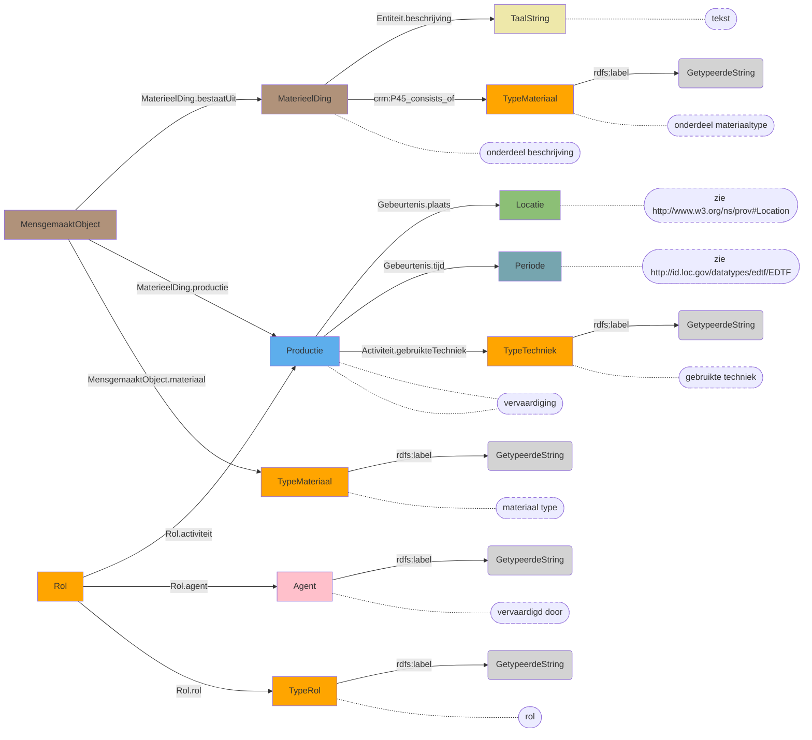

```mermaid
graph LR
215[TypeMateriaal]-->|rdfs:label|216(GetypeerdeString)
40[MaterieelDing]-->|Entiteit.beschrijving|217(TaalString)
56[Productie]-->|Gebeurtenis.plaats|59(Locatie)
56[Productie]-->|Gebeurtenis.tijd|60(Periode)
57[TypeTechniek]-->|rdfs:label|58(GetypeerdeString)
62[Agent]-->|rdfs:label|63(GetypeerdeString)
64[TypeRol]-->|rdfs:label|65(GetypeerdeString)
81[TypeMateriaal]-->|rdfs:label|82(GetypeerdeString)
22[MensgemaaktObject]-->|MaterieelDing.bestaatUit|40[MaterieelDing]
22[MensgemaaktObject]-->|MaterieelDing.productie|56[Productie]
22[MensgemaaktObject]-->|MensgemaaktObject.materiaal|81[TypeMateriaal]
40[MaterieelDing]-->|crm:P45_consists_of|215[TypeMateriaal]
56[Productie]-->|Activiteit.gebruikteTechniek|57[TypeTechniek]
61[Rol]-->|Rol.activiteit|56[Productie]
61[Rol]-->|Rol.agent|62[Agent]
61[Rol]-->|Rol.rol|64[TypeRol]
40[MaterieelDing]-.-40_s([onderdeel beschrijving])
56[Productie]-.-56_s([vervaardiging])
81[TypeMateriaal]-.-81_s([materiaal type])
215[TypeMateriaal]-.-215_s([onderdeel materiaaltype])
217[TaalString]-.-217_s([tekst])
57[TypeTechniek]-.-57_s([gebruikte techniek])
59[Locatie]-.-59_s([zie http://www.w3.org/ns/prov#Location])
60[Periode]-.-60_s([zie http://id.loc.gov/datatypes/edtf/EDTF])
56[Productie]-.-56_s([vervaardiging])
62[Agent]-.-62_s([vervaardigd door])
64[TypeRol]-.-64_s([rol])
style 40_s stroke-dasharray: 5
style 56_s stroke-dasharray: 5
style 81_s stroke-dasharray: 5
style 215_s stroke-dasharray: 5
style 217_s stroke-dasharray: 5
style 57_s stroke-dasharray: 5
style 59_s stroke-dasharray: 5
style 60_s stroke-dasharray: 5
style 56_s stroke-dasharray: 5
style 62_s stroke-dasharray: 5
style 64_s stroke-dasharray: 5
style 215 fill:#ffa500
style 216 fill:#D3D3D3
style 217 fill:#EEE8AA
style 22 fill:#B0927A
style 40 fill:#B0927A
style 56 fill:#5DAEEC
style 57 fill:#ffa500
style 58 fill:#D3D3D3
style 59 fill:#8CBF76
style 60 fill:#76A5AF
style 61 fill:#ffa500
style 62 fill:#ffc0cb
style 63 fill:#D3D3D3
style 64 fill:#ffa500
style 65 fill:#D3D3D3
style 81 fill:#ffa500
style 82 fill:#D3D3D3
```
