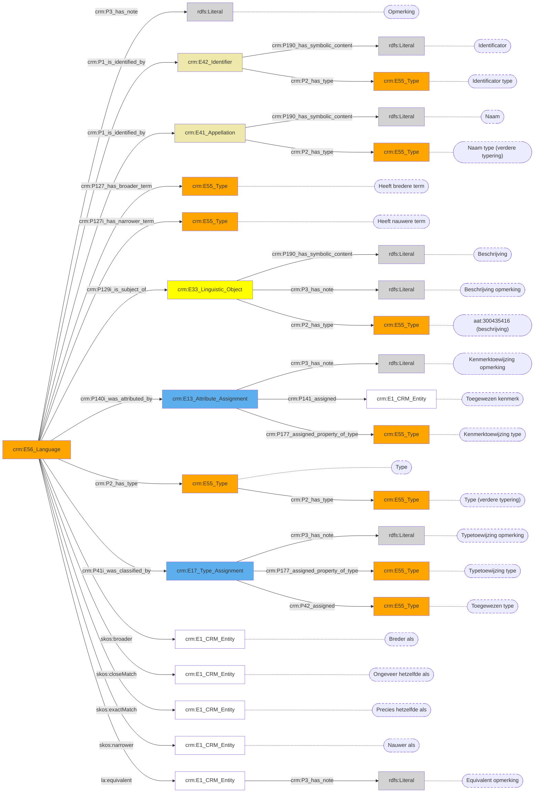

```mermaid
graph LR
style 0275f737-18ee-11ef-83e3-960002548b4f fill:#ffff00
style 0275fd06-18ee-11ef-b319-960002548b4f fill:#D3D3D3
style 02760132-18ee-11ef-b971-960002548b4f fill:#D3D3D3
style 027603e4-18ee-11ef-8d1e-960002548b4f fill:#ffa500
style 0ef48bbc-18ee-11ef-ba90-960002548b4f fill:#ffffff
style 0ef490e1-18ee-11ef-a249-960002548b4f fill:#D3D3D3
style 289734cc-18ee-11ef-b707-960002548b4f fill:#ffa500
style 35287d78-18ee-11ef-92f5-960002548b4f fill:#ffa500
style 44b9c847-18ee-11ef-a4fa-960002548b4f fill:#EEE8AA
style 44b9cee4-18ee-11ef-a0de-960002548b4f fill:#D3D3D3
style 44b9d02b-18ee-11ef-ba7a-960002548b4f fill:#ffa500
style 662b231d-1dad-11ef-ba66-960002548b4f fill:#ffffff
style 6ba83df2-1dad-11ef-99a0-960002548b4f fill:#ffffff
style 7160eb03-1dad-11ef-9762-960002548b4f fill:#ffffff
style 76b91881-1dad-11ef-8d46-960002548b4f fill:#ffffff
style 9bf699db-18ee-11ef-b4cc-960002548b4f fill:#EEE8AA
style 9bf69ed1-18ee-11ef-a688-960002548b4f fill:#ffa500
style 9bf6a1b0-18ee-11ef-bf45-960002548b4f fill:#D3D3D3
style aada9bca-18ee-11ef-bd4d-960002548b4f fill:#D3D3D3
style bb741c36-18ee-11ef-b723-960002548b4f fill:#ffa500
style bb742127-18ee-11ef-83cc-960002548b4f fill:#ffa500
style c8c0f669-18ee-11ef-ad4c-960002548b4f fill:#5DAEEC
style c8c0fbba-18ee-11ef-b9ff-960002548b4f fill:#ffa500
style c8c0fd55-18ee-11ef-b4c3-960002548b4f fill:#ffa500
style c8c100c4-18ee-11ef-83ff-960002548b4f fill:#D3D3D3
style d0c72e15-18ed-11ef-aa8b-960002548b4f fill:#ffa500
style ea172265-18ed-11ef-b3ab-960002548b4f fill:#5DAEEC
style ea17281a-18ed-11ef-89ae-960002548b4f fill:#ffa500
style ea1729bd-18ed-11ef-923e-960002548b4f fill:#ffffff
style ea172b0d-18ed-11ef-9ac2-960002548b4f fill:#D3D3D3
0275f737-18ee-11ef-83e3-960002548b4f["crm:E33_Linguistic_Object"]-->|"crm:P190_has_symbolic_content"|02760132-18ee-11ef-b971-960002548b4f(rdfs:Literal)
0275f737-18ee-11ef-83e3-960002548b4f["crm:E33_Linguistic_Object"]-->|"crm:P3_has_note"|0275fd06-18ee-11ef-b319-960002548b4f(rdfs:Literal)
0ef48bbc-18ee-11ef-ba90-960002548b4f["crm:E1_CRM_Entity"]-->|"crm:P3_has_note"|0ef490e1-18ee-11ef-a249-960002548b4f(rdfs:Literal)
44b9c847-18ee-11ef-a4fa-960002548b4f["crm:E42_Identifier"]-->|"crm:P190_has_symbolic_content"|44b9cee4-18ee-11ef-a0de-960002548b4f(rdfs:Literal)
9bf699db-18ee-11ef-b4cc-960002548b4f["crm:E41_Appellation"]-->|"crm:P190_has_symbolic_content"|9bf6a1b0-18ee-11ef-bf45-960002548b4f(rdfs:Literal)
c8c0f669-18ee-11ef-ad4c-960002548b4f["crm:E17_Type_Assignment"]-->|"crm:P3_has_note"|c8c100c4-18ee-11ef-83ff-960002548b4f(rdfs:Literal)
d0c72e15-18ed-11ef-aa8b-960002548b4f["crm:E56_Language"]-->|"crm:P3_has_note"|aada9bca-18ee-11ef-bd4d-960002548b4f(rdfs:Literal)
ea172265-18ed-11ef-b3ab-960002548b4f["crm:E13_Attribute_Assignment"]-->|"crm:P3_has_note"|ea172b0d-18ed-11ef-9ac2-960002548b4f(rdfs:Literal)
02760132-18ee-11ef-b971-960002548b4f["rdfs:Literal"]-.-02760132-18ee-11ef-b971-960002548b4f_s(["Beschrijving"])
027603e4-18ee-11ef-8d1e-960002548b4f["crm:E55_Type"]-.-027603e4-18ee-11ef-8d1e-960002548b4f_s(["aat:300435416 (beschrijving)"])
0275fd06-18ee-11ef-b319-960002548b4f["rdfs:Literal"]-.-0275fd06-18ee-11ef-b319-960002548b4f_s(["Beschrijving opmerking"])
0ef490e1-18ee-11ef-a249-960002548b4f["rdfs:Literal"]-.-0ef490e1-18ee-11ef-a249-960002548b4f_s(["Equivalent opmerking"])
44b9cee4-18ee-11ef-a0de-960002548b4f["rdfs:Literal"]-.-44b9cee4-18ee-11ef-a0de-960002548b4f_s(["Identificator"])
44b9d02b-18ee-11ef-ba7a-960002548b4f["crm:E55_Type"]-.-44b9d02b-18ee-11ef-ba7a-960002548b4f_s(["Identificator type"])
9bf6a1b0-18ee-11ef-bf45-960002548b4f["rdfs:Literal"]-.-9bf6a1b0-18ee-11ef-bf45-960002548b4f_s(["Naam"])
9bf69ed1-18ee-11ef-a688-960002548b4f["crm:E55_Type"]-.-9bf69ed1-18ee-11ef-a688-960002548b4f_s(["Naam type (verdere typering)"])
bb742127-18ee-11ef-83cc-960002548b4f["crm:E55_Type"]-.-bb742127-18ee-11ef-83cc-960002548b4f_s(["Type (verdere typering)"])
c8c0fbba-18ee-11ef-b9ff-960002548b4f["crm:E55_Type"]-.-c8c0fbba-18ee-11ef-b9ff-960002548b4f_s(["Typetoewijzing type"])
c8c100c4-18ee-11ef-83ff-960002548b4f["rdfs:Literal"]-.-c8c100c4-18ee-11ef-83ff-960002548b4f_s(["Typetoewijzing opmerking"])
c8c0fd55-18ee-11ef-b4c3-960002548b4f["crm:E55_Type"]-.-c8c0fd55-18ee-11ef-b4c3-960002548b4f_s(["Toegewezen type"])
289734cc-18ee-11ef-b707-960002548b4f["crm:E55_Type"]-.-289734cc-18ee-11ef-b707-960002548b4f_s(["Heeft bredere term"])
35287d78-18ee-11ef-92f5-960002548b4f["crm:E55_Type"]-.-35287d78-18ee-11ef-92f5-960002548b4f_s(["Heeft nauwere term"])
bb741c36-18ee-11ef-b723-960002548b4f["crm:E55_Type"]-.-bb741c36-18ee-11ef-b723-960002548b4f_s(["Type"])
aada9bca-18ee-11ef-bd4d-960002548b4f["rdfs:Literal"]-.-aada9bca-18ee-11ef-bd4d-960002548b4f_s(["Opmerking"])
662b231d-1dad-11ef-ba66-960002548b4f["crm:E1_CRM_Entity"]-.-662b231d-1dad-11ef-ba66-960002548b4f_s(["Breder als"])
6ba83df2-1dad-11ef-99a0-960002548b4f["crm:E1_CRM_Entity"]-.-6ba83df2-1dad-11ef-99a0-960002548b4f_s(["Ongeveer hetzelfde als"])
7160eb03-1dad-11ef-9762-960002548b4f["crm:E1_CRM_Entity"]-.-7160eb03-1dad-11ef-9762-960002548b4f_s(["Precies hetzelfde als"])
76b91881-1dad-11ef-8d46-960002548b4f["crm:E1_CRM_Entity"]-.-76b91881-1dad-11ef-8d46-960002548b4f_s(["Nauwer als"])
ea1729bd-18ed-11ef-923e-960002548b4f["crm:E1_CRM_Entity"]-.-ea1729bd-18ed-11ef-923e-960002548b4f_s(["Toegewezen kenmerk"])
ea17281a-18ed-11ef-89ae-960002548b4f["crm:E55_Type"]-.-ea17281a-18ed-11ef-89ae-960002548b4f_s(["Kenmerktoewijzing type"])
ea172b0d-18ed-11ef-9ac2-960002548b4f["rdfs:Literal"]-.-ea172b0d-18ed-11ef-9ac2-960002548b4f_s(["Kenmerktoewijzing opmerking"])
0275f737-18ee-11ef-83e3-960002548b4f["crm:E33_Linguistic_Object"]-->|"crm:P2_has_type"|027603e4-18ee-11ef-8d1e-960002548b4f["crm:E55_Type"]
44b9c847-18ee-11ef-a4fa-960002548b4f["crm:E42_Identifier"]-->|"crm:P2_has_type"|44b9d02b-18ee-11ef-ba7a-960002548b4f["crm:E55_Type"]
9bf699db-18ee-11ef-b4cc-960002548b4f["crm:E41_Appellation"]-->|"crm:P2_has_type"|9bf69ed1-18ee-11ef-a688-960002548b4f["crm:E55_Type"]
bb741c36-18ee-11ef-b723-960002548b4f["crm:E55_Type"]-->|"crm:P2_has_type"|bb742127-18ee-11ef-83cc-960002548b4f["crm:E55_Type"]
c8c0f669-18ee-11ef-ad4c-960002548b4f["crm:E17_Type_Assignment"]-->|"crm:P177_assigned_property_of_type"|c8c0fbba-18ee-11ef-b9ff-960002548b4f["crm:E55_Type"]
c8c0f669-18ee-11ef-ad4c-960002548b4f["crm:E17_Type_Assignment"]-->|"crm:P42_assigned"|c8c0fd55-18ee-11ef-b4c3-960002548b4f["crm:E55_Type"]
d0c72e15-18ed-11ef-aa8b-960002548b4f["crm:E56_Language"]-->|"crm:P1_is_identified_by"|44b9c847-18ee-11ef-a4fa-960002548b4f["crm:E42_Identifier"]
d0c72e15-18ed-11ef-aa8b-960002548b4f["crm:E56_Language"]-->|"crm:P1_is_identified_by"|9bf699db-18ee-11ef-b4cc-960002548b4f["crm:E41_Appellation"]
d0c72e15-18ed-11ef-aa8b-960002548b4f["crm:E56_Language"]-->|"crm:P127_has_broader_term"|289734cc-18ee-11ef-b707-960002548b4f["crm:E55_Type"]
d0c72e15-18ed-11ef-aa8b-960002548b4f["crm:E56_Language"]-->|"crm:P127i_has_narrower_term"|35287d78-18ee-11ef-92f5-960002548b4f["crm:E55_Type"]
d0c72e15-18ed-11ef-aa8b-960002548b4f["crm:E56_Language"]-->|"crm:P129i_is_subject_of"|0275f737-18ee-11ef-83e3-960002548b4f["crm:E33_Linguistic_Object"]
d0c72e15-18ed-11ef-aa8b-960002548b4f["crm:E56_Language"]-->|"crm:P140i_was_attributed_by"|ea172265-18ed-11ef-b3ab-960002548b4f["crm:E13_Attribute_Assignment"]
d0c72e15-18ed-11ef-aa8b-960002548b4f["crm:E56_Language"]-->|"crm:P2_has_type"|bb741c36-18ee-11ef-b723-960002548b4f["crm:E55_Type"]
d0c72e15-18ed-11ef-aa8b-960002548b4f["crm:E56_Language"]-->|"crm:P41i_was_classified_by"|c8c0f669-18ee-11ef-ad4c-960002548b4f["crm:E17_Type_Assignment"]
d0c72e15-18ed-11ef-aa8b-960002548b4f["crm:E56_Language"]-->|"skos:broader"|662b231d-1dad-11ef-ba66-960002548b4f["crm:E1_CRM_Entity"]
d0c72e15-18ed-11ef-aa8b-960002548b4f["crm:E56_Language"]-->|"skos:closeMatch"|6ba83df2-1dad-11ef-99a0-960002548b4f["crm:E1_CRM_Entity"]
d0c72e15-18ed-11ef-aa8b-960002548b4f["crm:E56_Language"]-->|"skos:exactMatch"|7160eb03-1dad-11ef-9762-960002548b4f["crm:E1_CRM_Entity"]
d0c72e15-18ed-11ef-aa8b-960002548b4f["crm:E56_Language"]-->|"skos:narrower"|76b91881-1dad-11ef-8d46-960002548b4f["crm:E1_CRM_Entity"]
d0c72e15-18ed-11ef-aa8b-960002548b4f["crm:E56_Language"]-->|"la:equivalent"|0ef48bbc-18ee-11ef-ba90-960002548b4f["crm:E1_CRM_Entity"]
ea172265-18ed-11ef-b3ab-960002548b4f["crm:E13_Attribute_Assignment"]-->|"crm:P141_assigned"|ea1729bd-18ed-11ef-923e-960002548b4f["crm:E1_CRM_Entity"]
ea172265-18ed-11ef-b3ab-960002548b4f["crm:E13_Attribute_Assignment"]-->|"crm:P177_assigned_property_of_type"|ea17281a-18ed-11ef-89ae-960002548b4f["crm:E55_Type"]
style 02760132-18ee-11ef-b971-960002548b4f_s stroke-dasharray: 5
style 027603e4-18ee-11ef-8d1e-960002548b4f_s stroke-dasharray: 5
style 0275fd06-18ee-11ef-b319-960002548b4f_s stroke-dasharray: 5
style 0ef490e1-18ee-11ef-a249-960002548b4f_s stroke-dasharray: 5
style 44b9cee4-18ee-11ef-a0de-960002548b4f_s stroke-dasharray: 5
style 44b9d02b-18ee-11ef-ba7a-960002548b4f_s stroke-dasharray: 5
style 9bf6a1b0-18ee-11ef-bf45-960002548b4f_s stroke-dasharray: 5
style 9bf69ed1-18ee-11ef-a688-960002548b4f_s stroke-dasharray: 5
style bb742127-18ee-11ef-83cc-960002548b4f_s stroke-dasharray: 5
style c8c0fbba-18ee-11ef-b9ff-960002548b4f_s stroke-dasharray: 5
style c8c100c4-18ee-11ef-83ff-960002548b4f_s stroke-dasharray: 5
style c8c0fd55-18ee-11ef-b4c3-960002548b4f_s stroke-dasharray: 5
style 289734cc-18ee-11ef-b707-960002548b4f_s stroke-dasharray: 5
style 35287d78-18ee-11ef-92f5-960002548b4f_s stroke-dasharray: 5
style bb741c36-18ee-11ef-b723-960002548b4f_s stroke-dasharray: 5
style aada9bca-18ee-11ef-bd4d-960002548b4f_s stroke-dasharray: 5
style 662b231d-1dad-11ef-ba66-960002548b4f_s stroke-dasharray: 5
style 6ba83df2-1dad-11ef-99a0-960002548b4f_s stroke-dasharray: 5
style 7160eb03-1dad-11ef-9762-960002548b4f_s stroke-dasharray: 5
style 76b91881-1dad-11ef-8d46-960002548b4f_s stroke-dasharray: 5
style ea1729bd-18ed-11ef-923e-960002548b4f_s stroke-dasharray: 5
style ea17281a-18ed-11ef-89ae-960002548b4f_s stroke-dasharray: 5
style ea172b0d-18ed-11ef-9ac2-960002548b4f_s stroke-dasharray: 5
```
