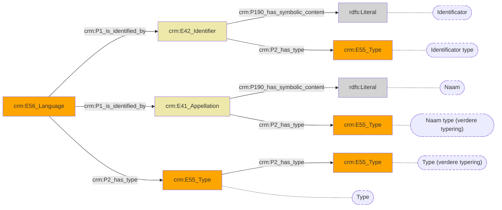

```mermaid
graph LR
style 44b9c847-18ee-11ef-a4fa-960002548b4f fill:#EEE8AA
style 44b9cee4-18ee-11ef-a0de-960002548b4f fill:#D3D3D3
style 44b9d02b-18ee-11ef-ba7a-960002548b4f fill:#ffa500
style 9bf699db-18ee-11ef-b4cc-960002548b4f fill:#EEE8AA
style 9bf69ed1-18ee-11ef-a688-960002548b4f fill:#ffa500
style 9bf6a1b0-18ee-11ef-bf45-960002548b4f fill:#D3D3D3
style bb741c36-18ee-11ef-b723-960002548b4f fill:#ffa500
style bb742127-18ee-11ef-83cc-960002548b4f fill:#ffa500
style d0c72e15-18ed-11ef-aa8b-960002548b4f fill:#ffa500
44b9c847-18ee-11ef-a4fa-960002548b4f["crm:E42_Identifier"]-->|"crm:P190_has_symbolic_content"|44b9cee4-18ee-11ef-a0de-960002548b4f(rdfs:Literal)
9bf699db-18ee-11ef-b4cc-960002548b4f["crm:E41_Appellation"]-->|"crm:P190_has_symbolic_content"|9bf6a1b0-18ee-11ef-bf45-960002548b4f(rdfs:Literal)
44b9c847-18ee-11ef-a4fa-960002548b4f["crm:E42_Identifier"]-->|"crm:P2_has_type"|44b9d02b-18ee-11ef-ba7a-960002548b4f["crm:E55_Type"]
9bf699db-18ee-11ef-b4cc-960002548b4f["crm:E41_Appellation"]-->|"crm:P2_has_type"|9bf69ed1-18ee-11ef-a688-960002548b4f["crm:E55_Type"]
bb741c36-18ee-11ef-b723-960002548b4f["crm:E55_Type"]-->|"crm:P2_has_type"|bb742127-18ee-11ef-83cc-960002548b4f["crm:E55_Type"]
d0c72e15-18ed-11ef-aa8b-960002548b4f["crm:E56_Language"]-->|"crm:P1_is_identified_by"|44b9c847-18ee-11ef-a4fa-960002548b4f["crm:E42_Identifier"]
d0c72e15-18ed-11ef-aa8b-960002548b4f["crm:E56_Language"]-->|"crm:P1_is_identified_by"|9bf699db-18ee-11ef-b4cc-960002548b4f["crm:E41_Appellation"]
d0c72e15-18ed-11ef-aa8b-960002548b4f["crm:E56_Language"]-->|"crm:P2_has_type"|bb741c36-18ee-11ef-b723-960002548b4f["crm:E55_Type"]
44b9cee4-18ee-11ef-a0de-960002548b4f["rdfs:Literal"]-.-44b9cee4-18ee-11ef-a0de-960002548b4f_s(["Identificator"])
44b9d02b-18ee-11ef-ba7a-960002548b4f["crm:E55_Type"]-.-44b9d02b-18ee-11ef-ba7a-960002548b4f_s(["Identificator type"])
9bf6a1b0-18ee-11ef-bf45-960002548b4f["rdfs:Literal"]-.-9bf6a1b0-18ee-11ef-bf45-960002548b4f_s(["Naam"])
9bf69ed1-18ee-11ef-a688-960002548b4f["crm:E55_Type"]-.-9bf69ed1-18ee-11ef-a688-960002548b4f_s(["Naam type (verdere typering)"])
bb742127-18ee-11ef-83cc-960002548b4f["crm:E55_Type"]-.-bb742127-18ee-11ef-83cc-960002548b4f_s(["Type (verdere typering)"])
bb741c36-18ee-11ef-b723-960002548b4f["crm:E55_Type"]-.-bb741c36-18ee-11ef-b723-960002548b4f_s(["Type"])
style 44b9cee4-18ee-11ef-a0de-960002548b4f_s stroke-dasharray: 5
style 44b9d02b-18ee-11ef-ba7a-960002548b4f_s stroke-dasharray: 5
style 9bf6a1b0-18ee-11ef-bf45-960002548b4f_s stroke-dasharray: 5
style 9bf69ed1-18ee-11ef-a688-960002548b4f_s stroke-dasharray: 5
style bb742127-18ee-11ef-83cc-960002548b4f_s stroke-dasharray: 5
style bb741c36-18ee-11ef-b723-960002548b4f_s stroke-dasharray: 5
```
