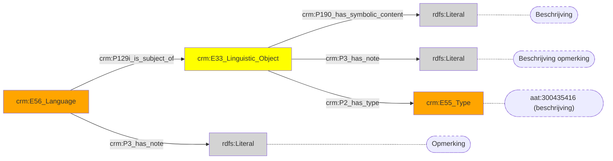

```mermaid
graph LR
style 0275f737-18ee-11ef-83e3-960002548b4f fill:#ffff00
style 0275fd06-18ee-11ef-b319-960002548b4f fill:#D3D3D3
style 02760132-18ee-11ef-b971-960002548b4f fill:#D3D3D3
style 027603e4-18ee-11ef-8d1e-960002548b4f fill:#ffa500
style aada9bca-18ee-11ef-bd4d-960002548b4f fill:#D3D3D3
style d0c72e15-18ed-11ef-aa8b-960002548b4f fill:#ffa500
0275f737-18ee-11ef-83e3-960002548b4f["crm:E33_Linguistic_Object"]-->|"crm:P190_has_symbolic_content"|02760132-18ee-11ef-b971-960002548b4f(rdfs:Literal)
0275f737-18ee-11ef-83e3-960002548b4f["crm:E33_Linguistic_Object"]-->|"crm:P3_has_note"|0275fd06-18ee-11ef-b319-960002548b4f(rdfs:Literal)
d0c72e15-18ed-11ef-aa8b-960002548b4f["crm:E56_Language"]-->|"crm:P3_has_note"|aada9bca-18ee-11ef-bd4d-960002548b4f(rdfs:Literal)
0275f737-18ee-11ef-83e3-960002548b4f["crm:E33_Linguistic_Object"]-->|"crm:P2_has_type"|027603e4-18ee-11ef-8d1e-960002548b4f["crm:E55_Type"]
d0c72e15-18ed-11ef-aa8b-960002548b4f["crm:E56_Language"]-->|"crm:P129i_is_subject_of"|0275f737-18ee-11ef-83e3-960002548b4f["crm:E33_Linguistic_Object"]
02760132-18ee-11ef-b971-960002548b4f["rdfs:Literal"]-.-02760132-18ee-11ef-b971-960002548b4f_s(["Beschrijving"])
027603e4-18ee-11ef-8d1e-960002548b4f["crm:E55_Type"]-.-027603e4-18ee-11ef-8d1e-960002548b4f_s(["aat:300435416 (beschrijving)"])
0275fd06-18ee-11ef-b319-960002548b4f["rdfs:Literal"]-.-0275fd06-18ee-11ef-b319-960002548b4f_s(["Beschrijving opmerking"])
aada9bca-18ee-11ef-bd4d-960002548b4f["rdfs:Literal"]-.-aada9bca-18ee-11ef-bd4d-960002548b4f_s(["Opmerking"])
style 02760132-18ee-11ef-b971-960002548b4f_s stroke-dasharray: 5
style 027603e4-18ee-11ef-8d1e-960002548b4f_s stroke-dasharray: 5
style 0275fd06-18ee-11ef-b319-960002548b4f_s stroke-dasharray: 5
style aada9bca-18ee-11ef-bd4d-960002548b4f_s stroke-dasharray: 5
```
