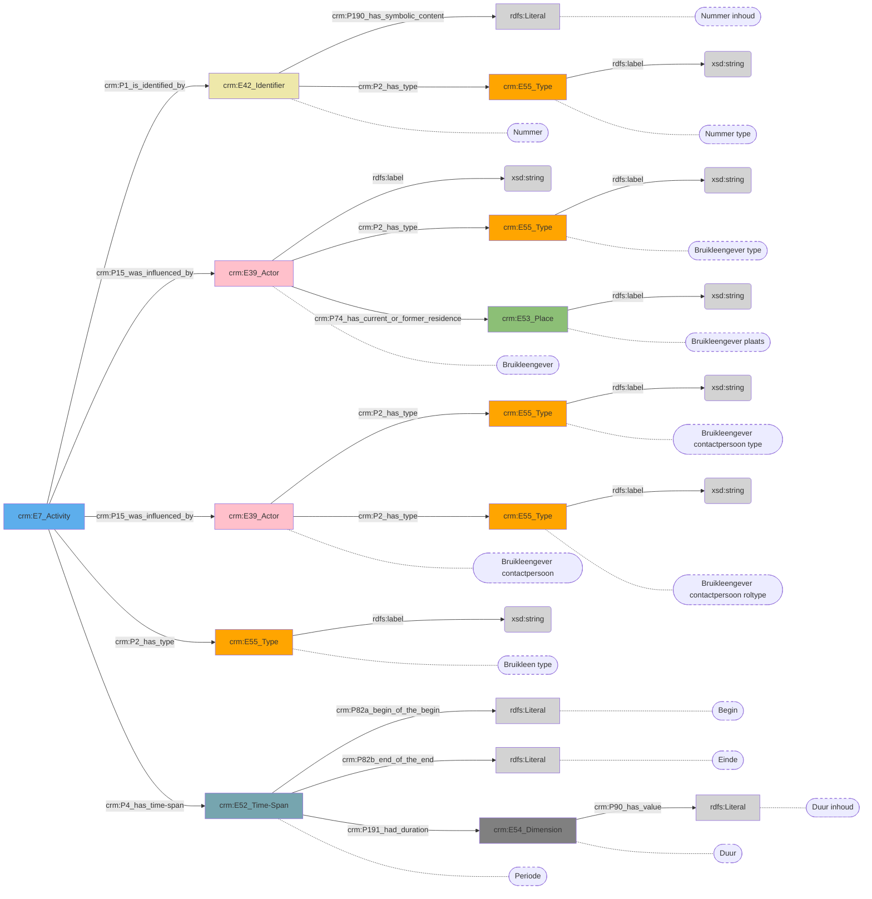

```mermaid
graph LR
33f35a42-edb1-11ee-9a85-960002548b4f["crm:E55_Type"]-->|"rdfs:label"|5aac7ff0-edb1-11ee-a0d6-960002548b4f(xsd:string)
46c13a89-cc07-11ee-a44e-960002548b4f["crm:E55_Type"]-->|"rdfs:label"|6bd1515d-cc07-11ee-8e80-960002548b4f(xsd:string)
55c27964-cc0f-11ee-a690-960002548b4f["crm:E39_Actor"]-->|"rdfs:label"|d9040c90-cc0f-11ee-8069-960002548b4f(xsd:string)
6ba70dc5-edb1-11ee-a9f2-960002548b4f["crm:E55_Type"]-->|"rdfs:label"|cc928ec1-edb1-11ee-941f-960002548b4f(xsd:string)
766c660f-cc0a-11ee-ae45-960002548b4f["crm:E54_Dimension"]-->|"crm:P90_has_value"|3fe22cb5-cc0b-11ee-a01f-960002548b4f(rdfs:Literal)
8d4c3532-cc06-11ee-a4fb-960002548b4f["crm:E42_Identifier"]-->|"crm:P190_has_symbolic_content"|22b2cb12-cc07-11ee-96f0-960002548b4f(rdfs:Literal)
91b0b823-cc0f-11ee-9776-960002548b4f["crm:E53_Place"]-->|"rdfs:label"|e3042575-cc0f-11ee-9554-960002548b4f(xsd:string)
a4c84153-cc09-11ee-9566-960002548b4f["crm:E52_Time-Span"]-->|"crm:P82a_begin_of_the_begin"|d141f43c-cc09-11ee-b1bf-960002548b4f(rdfs:Literal)
a4c84153-cc09-11ee-9566-960002548b4f["crm:E52_Time-Span"]-->|"crm:P82b_end_of_the_end"|eaa0353a-cc09-11ee-a158-960002548b4f(rdfs:Literal)
c810dd40-cc0e-11ee-b600-960002548b4f["crm:E55_Type"]-->|"rdfs:label"|e5a36bd2-d7a9-11ee-9996-960002548b4f(xsd:string)
d7fcd74d-e6cd-11ee-b069-960002548b4f["crm:E55_Type"]-->|"rdfs:label"|1d7cd614-e6ce-11ee-855a-960002548b4f(xsd:string)
55c27964-cc0f-11ee-a690-960002548b4f["crm:E39_Actor"]-->|"crm:P2_has_type"|d7fcd74d-e6cd-11ee-b069-960002548b4f["crm:E55_Type"]
55c27964-cc0f-11ee-a690-960002548b4f["crm:E39_Actor"]-->|"crm:P74_has_current_or_former_residence"|91b0b823-cc0f-11ee-9776-960002548b4f["crm:E53_Place"]
8d4c3532-cc06-11ee-a4fb-960002548b4f["crm:E42_Identifier"]-->|"crm:P2_has_type"|46c13a89-cc07-11ee-a44e-960002548b4f["crm:E55_Type"]
a4c84153-cc09-11ee-9566-960002548b4f["crm:E52_Time-Span"]-->|"crm:P191_had_duration"|766c660f-cc0a-11ee-ae45-960002548b4f["crm:E54_Dimension"]
c585cc26-cc05-11ee-876f-960002548b4f["crm:E7_Activity"]-->|"crm:P1_is_identified_by"|8d4c3532-cc06-11ee-a4fb-960002548b4f["crm:E42_Identifier"]
c585cc26-cc05-11ee-876f-960002548b4f["crm:E7_Activity"]-->|"crm:P15_was_influenced_by"|55c27964-cc0f-11ee-a690-960002548b4f["crm:E39_Actor"]
c585cc26-cc05-11ee-876f-960002548b4f["crm:E7_Activity"]-->|"crm:P15_was_influenced_by"|f417375a-edb0-11ee-9443-960002548b4f["crm:E39_Actor"]
c585cc26-cc05-11ee-876f-960002548b4f["crm:E7_Activity"]-->|"crm:P2_has_type"|c810dd40-cc0e-11ee-b600-960002548b4f["crm:E55_Type"]
c585cc26-cc05-11ee-876f-960002548b4f["crm:E7_Activity"]-->|"crm:P4_has_time-span"|a4c84153-cc09-11ee-9566-960002548b4f["crm:E52_Time-Span"]
f417375a-edb0-11ee-9443-960002548b4f["crm:E39_Actor"]-->|"crm:P2_has_type"|33f35a42-edb1-11ee-9a85-960002548b4f["crm:E55_Type"]
f417375a-edb0-11ee-9443-960002548b4f["crm:E39_Actor"]-->|"crm:P2_has_type"|6ba70dc5-edb1-11ee-a9f2-960002548b4f["crm:E55_Type"]
d7fcd74d-e6cd-11ee-b069-960002548b4f["crm:E55_Type"]-.-d7fcd74d-e6cd-11ee-b069-960002548b4f_s(["Bruikleengever type"])
91b0b823-cc0f-11ee-9776-960002548b4f["crm:E53_Place"]-.-91b0b823-cc0f-11ee-9776-960002548b4f_s(["Bruikleengever plaats"])
3fe22cb5-cc0b-11ee-a01f-960002548b4f["rdfs:Literal"]-.-3fe22cb5-cc0b-11ee-a01f-960002548b4f_s(["Duur inhoud"])
22b2cb12-cc07-11ee-96f0-960002548b4f["rdfs:Literal"]-.-22b2cb12-cc07-11ee-96f0-960002548b4f_s(["Nummer inhoud"])
46c13a89-cc07-11ee-a44e-960002548b4f["crm:E55_Type"]-.-46c13a89-cc07-11ee-a44e-960002548b4f_s(["Nummer type"])
766c660f-cc0a-11ee-ae45-960002548b4f["crm:E54_Dimension"]-.-766c660f-cc0a-11ee-ae45-960002548b4f_s(["Duur"])
d141f43c-cc09-11ee-b1bf-960002548b4f["rdfs:Literal"]-.-d141f43c-cc09-11ee-b1bf-960002548b4f_s(["Begin"])
eaa0353a-cc09-11ee-a158-960002548b4f["rdfs:Literal"]-.-eaa0353a-cc09-11ee-a158-960002548b4f_s(["Einde"])
8d4c3532-cc06-11ee-a4fb-960002548b4f["crm:E42_Identifier"]-.-8d4c3532-cc06-11ee-a4fb-960002548b4f_s(["Nummer"])
55c27964-cc0f-11ee-a690-960002548b4f["crm:E39_Actor"]-.-55c27964-cc0f-11ee-a690-960002548b4f_s(["Bruikleengever"])
f417375a-edb0-11ee-9443-960002548b4f["crm:E39_Actor"]-.-f417375a-edb0-11ee-9443-960002548b4f_s(["Bruikleengever contactpersoon"])
c810dd40-cc0e-11ee-b600-960002548b4f["crm:E55_Type"]-.-c810dd40-cc0e-11ee-b600-960002548b4f_s(["Bruikleen type"])
a4c84153-cc09-11ee-9566-960002548b4f["crm:E52_Time-Span"]-.-a4c84153-cc09-11ee-9566-960002548b4f_s(["Periode"])
33f35a42-edb1-11ee-9a85-960002548b4f["crm:E55_Type"]-.-33f35a42-edb1-11ee-9a85-960002548b4f_s(["Bruikleengever contactpersoon type"])
6ba70dc5-edb1-11ee-a9f2-960002548b4f["crm:E55_Type"]-.-6ba70dc5-edb1-11ee-a9f2-960002548b4f_s(["Bruikleengever contactpersoon roltype"])
style d7fcd74d-e6cd-11ee-b069-960002548b4f_s stroke-dasharray: 5
style 91b0b823-cc0f-11ee-9776-960002548b4f_s stroke-dasharray: 5
style 3fe22cb5-cc0b-11ee-a01f-960002548b4f_s stroke-dasharray: 5
style 22b2cb12-cc07-11ee-96f0-960002548b4f_s stroke-dasharray: 5
style 46c13a89-cc07-11ee-a44e-960002548b4f_s stroke-dasharray: 5
style 766c660f-cc0a-11ee-ae45-960002548b4f_s stroke-dasharray: 5
style d141f43c-cc09-11ee-b1bf-960002548b4f_s stroke-dasharray: 5
style eaa0353a-cc09-11ee-a158-960002548b4f_s stroke-dasharray: 5
style 8d4c3532-cc06-11ee-a4fb-960002548b4f_s stroke-dasharray: 5
style 55c27964-cc0f-11ee-a690-960002548b4f_s stroke-dasharray: 5
style f417375a-edb0-11ee-9443-960002548b4f_s stroke-dasharray: 5
style c810dd40-cc0e-11ee-b600-960002548b4f_s stroke-dasharray: 5
style a4c84153-cc09-11ee-9566-960002548b4f_s stroke-dasharray: 5
style 33f35a42-edb1-11ee-9a85-960002548b4f_s stroke-dasharray: 5
style 6ba70dc5-edb1-11ee-a9f2-960002548b4f_s stroke-dasharray: 5
style 1d7cd614-e6ce-11ee-855a-960002548b4f fill:#D3D3D3
style 22b2cb12-cc07-11ee-96f0-960002548b4f fill:#D3D3D3
style 33f35a42-edb1-11ee-9a85-960002548b4f fill:#ffa500
style 3fe22cb5-cc0b-11ee-a01f-960002548b4f fill:#D3D3D3
style 46c13a89-cc07-11ee-a44e-960002548b4f fill:#ffa500
style 55c27964-cc0f-11ee-a690-960002548b4f fill:#ffc0cb
style 5aac7ff0-edb1-11ee-a0d6-960002548b4f fill:#D3D3D3
style 6ba70dc5-edb1-11ee-a9f2-960002548b4f fill:#ffa500
style 6bd1515d-cc07-11ee-8e80-960002548b4f fill:#D3D3D3
style 766c660f-cc0a-11ee-ae45-960002548b4f fill:#808080
style 8d4c3532-cc06-11ee-a4fb-960002548b4f fill:#EEE8AA
style 91b0b823-cc0f-11ee-9776-960002548b4f fill:#8CBF76
style a4c84153-cc09-11ee-9566-960002548b4f fill:#76A5AF
style c585cc26-cc05-11ee-876f-960002548b4f fill:#5DAEEC
style c810dd40-cc0e-11ee-b600-960002548b4f fill:#ffa500
style cc928ec1-edb1-11ee-941f-960002548b4f fill:#D3D3D3
style d141f43c-cc09-11ee-b1bf-960002548b4f fill:#D3D3D3
style d7fcd74d-e6cd-11ee-b069-960002548b4f fill:#ffa500
style d9040c90-cc0f-11ee-8069-960002548b4f fill:#D3D3D3
style e3042575-cc0f-11ee-9554-960002548b4f fill:#D3D3D3
style e5a36bd2-d7a9-11ee-9996-960002548b4f fill:#D3D3D3
style eaa0353a-cc09-11ee-a158-960002548b4f fill:#D3D3D3
style f417375a-edb0-11ee-9443-960002548b4f fill:#ffc0cb
```
