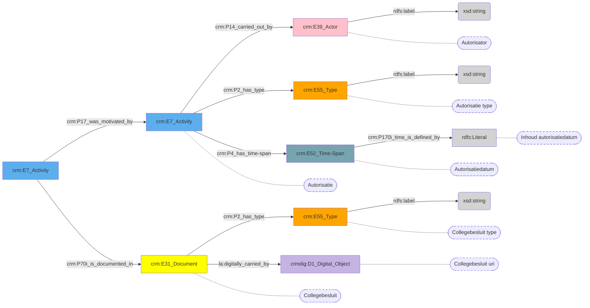

```mermaid
graph LR
06fbe301-f1b9-11ee-9f1c-960002548b4f["crm:E52_Time-Span"]-->|"crm:P170i_time_is_defined_by"|125fa348-f1b9-11ee-9b80-960002548b4f(rdfs:Literal)
36079316-edcd-11ee-956c-960002548b4f["crm:E55_Type"]-->|"rdfs:label"|470a6106-edcd-11ee-b18d-960002548b4f(xsd:string)
a09b43a7-f1b8-11ee-8578-960002548b4f["crm:E55_Type"]-->|"rdfs:label"|cdcac76f-f1b8-11ee-9cf9-960002548b4f(xsd:string)
de27a123-f1b8-11ee-a1b3-960002548b4f["crm:E39_Actor"]-->|"rdfs:label"|28e8ff25-f1b9-11ee-b585-960002548b4f(xsd:string)
7f915bae-f1b8-11ee-b67b-960002548b4f["crm:E7_Activity"]-->|"crm:P14_carried_out_by"|de27a123-f1b8-11ee-a1b3-960002548b4f["crm:E39_Actor"]
7f915bae-f1b8-11ee-b67b-960002548b4f["crm:E7_Activity"]-->|"crm:P2_has_type"|a09b43a7-f1b8-11ee-8578-960002548b4f["crm:E55_Type"]
7f915bae-f1b8-11ee-b67b-960002548b4f["crm:E7_Activity"]-->|"crm:P4_has_time-span"|06fbe301-f1b9-11ee-9f1c-960002548b4f["crm:E52_Time-Span"]
bf934d6a-d9fa-11ee-a30c-960002548b4f["crm:E31_Document"]-->|"crm:P2_has_type"|36079316-edcd-11ee-956c-960002548b4f["crm:E55_Type"]
bf934d6a-d9fa-11ee-a30c-960002548b4f["crm:E31_Document"]-->|"la:digitally_carried_by"|f7e178fc-d9fa-11ee-badf-960002548b4f["crmdig:D1_Digital_Object"]
c585cc26-cc05-11ee-876f-960002548b4f["crm:E7_Activity"]-->|"crm:P17_was_motivated_by"|7f915bae-f1b8-11ee-b67b-960002548b4f["crm:E7_Activity"]
c585cc26-cc05-11ee-876f-960002548b4f["crm:E7_Activity"]-->|"crm:P70i_is_documented_in"|bf934d6a-d9fa-11ee-a30c-960002548b4f["crm:E31_Document"]
125fa348-f1b9-11ee-9b80-960002548b4f["rdfs:Literal"]-.-125fa348-f1b9-11ee-9b80-960002548b4f_s(["Inhoud autorisatiedatum"])
de27a123-f1b8-11ee-a1b3-960002548b4f["crm:E39_Actor"]-.-de27a123-f1b8-11ee-a1b3-960002548b4f_s(["Autorisator"])
a09b43a7-f1b8-11ee-8578-960002548b4f["crm:E55_Type"]-.-a09b43a7-f1b8-11ee-8578-960002548b4f_s(["Autorisatie type"])
06fbe301-f1b9-11ee-9f1c-960002548b4f["crm:E52_Time-Span"]-.-06fbe301-f1b9-11ee-9f1c-960002548b4f_s(["Autorisatiedatum"])
36079316-edcd-11ee-956c-960002548b4f["crm:E55_Type"]-.-36079316-edcd-11ee-956c-960002548b4f_s(["Collegebesluit type"])
f7e178fc-d9fa-11ee-badf-960002548b4f["crmdig:D1_Digital_Object"]-.-f7e178fc-d9fa-11ee-badf-960002548b4f_s(["Collegebesluit uri"])
7f915bae-f1b8-11ee-b67b-960002548b4f["crm:E7_Activity"]-.-7f915bae-f1b8-11ee-b67b-960002548b4f_s(["Autorisatie"])
bf934d6a-d9fa-11ee-a30c-960002548b4f["crm:E31_Document"]-.-bf934d6a-d9fa-11ee-a30c-960002548b4f_s(["Collegebesluit"])
style 125fa348-f1b9-11ee-9b80-960002548b4f_s stroke-dasharray: 5
style de27a123-f1b8-11ee-a1b3-960002548b4f_s stroke-dasharray: 5
style a09b43a7-f1b8-11ee-8578-960002548b4f_s stroke-dasharray: 5
style 06fbe301-f1b9-11ee-9f1c-960002548b4f_s stroke-dasharray: 5
style 36079316-edcd-11ee-956c-960002548b4f_s stroke-dasharray: 5
style f7e178fc-d9fa-11ee-badf-960002548b4f_s stroke-dasharray: 5
style 7f915bae-f1b8-11ee-b67b-960002548b4f_s stroke-dasharray: 5
style bf934d6a-d9fa-11ee-a30c-960002548b4f_s stroke-dasharray: 5
style 06fbe301-f1b9-11ee-9f1c-960002548b4f fill:#76A5AF
style 125fa348-f1b9-11ee-9b80-960002548b4f fill:#D3D3D3
style 28e8ff25-f1b9-11ee-b585-960002548b4f fill:#D3D3D3
style 36079316-edcd-11ee-956c-960002548b4f fill:#ffa500
style 470a6106-edcd-11ee-b18d-960002548b4f fill:#D3D3D3
style 7f915bae-f1b8-11ee-b67b-960002548b4f fill:#5DAEEC
style a09b43a7-f1b8-11ee-8578-960002548b4f fill:#ffa500
style bf934d6a-d9fa-11ee-a30c-960002548b4f fill:#ffff00
style c585cc26-cc05-11ee-876f-960002548b4f fill:#5DAEEC
style cdcac76f-f1b8-11ee-9cf9-960002548b4f fill:#D3D3D3
style de27a123-f1b8-11ee-a1b3-960002548b4f fill:#ffc0cb
style f7e178fc-d9fa-11ee-badf-960002548b4f fill:#C5B4E3
```
