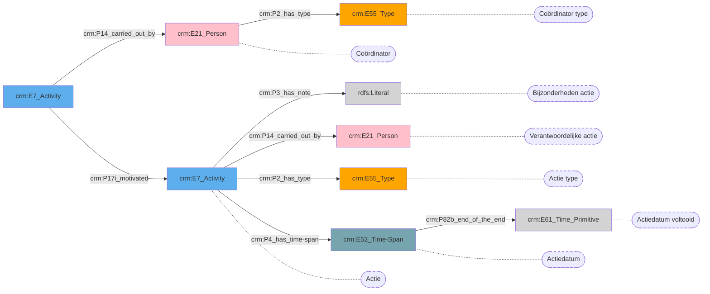

```mermaid
graph LR
style 39aecdfb-edce-11ee-bdf8-960002548b4f fill:#ffa500
style 417226f6-cc12-11ee-8447-960002548b4f fill:#ffc0cb
style 8e8a22eb-d631-11ee-b9e8-960002548b4f fill:#76A5AF
style 95c26b84-cfdc-11ee-8ffa-960002548b4f fill:#5DAEEC
style 9f2556d3-d632-11ee-ba81-960002548b4f fill:#D3D3D3
style b3e8a849-cfdc-11ee-98a4-960002548b4f fill:#D3D3D3
style c585cc26-cc05-11ee-876f-960002548b4f fill:#5DAEEC
style c7a02c01-cfdc-11ee-8e63-960002548b4f fill:#ffc0cb
style cd20228b-edcd-11ee-b592-960002548b4f fill:#ffa500
95c26b84-cfdc-11ee-8ffa-960002548b4f["crm:E7_Activity"]-->|"crm:P3_has_note"|b3e8a849-cfdc-11ee-98a4-960002548b4f(rdfs:Literal)
417226f6-cc12-11ee-8447-960002548b4f["crm:E21_Person"]-->|"crm:P2_has_type"|39aecdfb-edce-11ee-bdf8-960002548b4f["crm:E55_Type"]
8e8a22eb-d631-11ee-b9e8-960002548b4f["crm:E52_Time-Span"]-->|"crm:P82b_end_of_the_end"|9f2556d3-d632-11ee-ba81-960002548b4f["crm:E61_Time_Primitive"]
95c26b84-cfdc-11ee-8ffa-960002548b4f["crm:E7_Activity"]-->|"crm:P14_carried_out_by"|c7a02c01-cfdc-11ee-8e63-960002548b4f["crm:E21_Person"]
95c26b84-cfdc-11ee-8ffa-960002548b4f["crm:E7_Activity"]-->|"crm:P2_has_type"|cd20228b-edcd-11ee-b592-960002548b4f["crm:E55_Type"]
95c26b84-cfdc-11ee-8ffa-960002548b4f["crm:E7_Activity"]-->|"crm:P4_has_time-span"|8e8a22eb-d631-11ee-b9e8-960002548b4f["crm:E52_Time-Span"]
c585cc26-cc05-11ee-876f-960002548b4f["crm:E7_Activity"]-->|"crm:P14_carried_out_by"|417226f6-cc12-11ee-8447-960002548b4f["crm:E21_Person"]
c585cc26-cc05-11ee-876f-960002548b4f["crm:E7_Activity"]-->|"crm:P17i_motivated"|95c26b84-cfdc-11ee-8ffa-960002548b4f["crm:E7_Activity"]
style 39aecdfb-edce-11ee-bdf8-960002548b4f_s stroke-dasharray: 5
style 9f2556d3-d632-11ee-ba81-960002548b4f_s stroke-dasharray: 5
style c7a02c01-cfdc-11ee-8e63-960002548b4f_s stroke-dasharray: 5
style cd20228b-edcd-11ee-b592-960002548b4f_s stroke-dasharray: 5
style b3e8a849-cfdc-11ee-98a4-960002548b4f_s stroke-dasharray: 5
style 8e8a22eb-d631-11ee-b9e8-960002548b4f_s stroke-dasharray: 5
style 417226f6-cc12-11ee-8447-960002548b4f_s stroke-dasharray: 5
style 95c26b84-cfdc-11ee-8ffa-960002548b4f_s stroke-dasharray: 5
39aecdfb-edce-11ee-bdf8-960002548b4f["crm:E55_Type"]-.-39aecdfb-edce-11ee-bdf8-960002548b4f_s(["Coördinator type"])
9f2556d3-d632-11ee-ba81-960002548b4f["crm:E61_Time_Primitive"]-.-9f2556d3-d632-11ee-ba81-960002548b4f_s(["Actiedatum voltooid"])
c7a02c01-cfdc-11ee-8e63-960002548b4f["crm:E21_Person"]-.-c7a02c01-cfdc-11ee-8e63-960002548b4f_s(["Verantwoordelijke actie"])
cd20228b-edcd-11ee-b592-960002548b4f["crm:E55_Type"]-.-cd20228b-edcd-11ee-b592-960002548b4f_s(["Actie type"])
b3e8a849-cfdc-11ee-98a4-960002548b4f["rdfs:Literal"]-.-b3e8a849-cfdc-11ee-98a4-960002548b4f_s(["Bijzonderheden actie"])
8e8a22eb-d631-11ee-b9e8-960002548b4f["crm:E52_Time-Span"]-.-8e8a22eb-d631-11ee-b9e8-960002548b4f_s(["Actiedatum"])
417226f6-cc12-11ee-8447-960002548b4f["crm:E21_Person"]-.-417226f6-cc12-11ee-8447-960002548b4f_s(["Coördinator"])
95c26b84-cfdc-11ee-8ffa-960002548b4f["crm:E7_Activity"]-.-95c26b84-cfdc-11ee-8ffa-960002548b4f_s(["Actie"])
```
