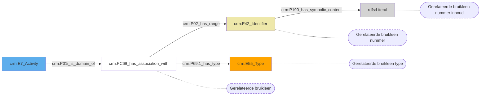

```mermaid
graph LR
style 1d1a6bd6-cc14-11ee-9527-960002548b4f fill:#ffffff
style 723e7d20-cc17-11ee-a479-960002548b4f fill:#EEE8AA
style 9ae1a30d-cc17-11ee-88a0-960002548b4f fill:#D3D3D3
style af0e411d-cc17-11ee-a45a-960002548b4f fill:#ffa500
style c585cc26-cc05-11ee-876f-960002548b4f fill:#5DAEEC
723e7d20-cc17-11ee-a479-960002548b4f["crm:E42_Identifier"]-->|"crm:P190_has_symbolic_content"|9ae1a30d-cc17-11ee-88a0-960002548b4f(rdfs:Literal)
1d1a6bd6-cc14-11ee-9527-960002548b4f["crm:PC69_has_association_with"]-->|"crm:P02_has_range"|723e7d20-cc17-11ee-a479-960002548b4f["crm:E42_Identifier"]
1d1a6bd6-cc14-11ee-9527-960002548b4f["crm:PC69_has_association_with"]-->|"crm:P69.1_has_type"|af0e411d-cc17-11ee-a45a-960002548b4f["crm:E55_Type"]
c585cc26-cc05-11ee-876f-960002548b4f["crm:E7_Activity"]-->|"crm:P01i_is_domain_of"|1d1a6bd6-cc14-11ee-9527-960002548b4f["crm:PC69_has_association_with"]
723e7d20-cc17-11ee-a479-960002548b4f["crm:E42_Identifier"]-.-723e7d20-cc17-11ee-a479-960002548b4f_s(["Gerelateerde bruikleen nummer"])
af0e411d-cc17-11ee-a45a-960002548b4f["crm:E55_Type"]-.-af0e411d-cc17-11ee-a45a-960002548b4f_s(["Gerelateerde bruikleen type"])
9ae1a30d-cc17-11ee-88a0-960002548b4f["rdfs:Literal"]-.-9ae1a30d-cc17-11ee-88a0-960002548b4f_s(["Gerelateerde bruikleen nummer inhoud"])
1d1a6bd6-cc14-11ee-9527-960002548b4f["crm:PC69_has_association_with"]-.-1d1a6bd6-cc14-11ee-9527-960002548b4f_s(["Gerelateerde bruikleen"])
style 723e7d20-cc17-11ee-a479-960002548b4f_s stroke-dasharray: 5
style af0e411d-cc17-11ee-a45a-960002548b4f_s stroke-dasharray: 5
style 9ae1a30d-cc17-11ee-88a0-960002548b4f_s stroke-dasharray: 5
style 1d1a6bd6-cc14-11ee-9527-960002548b4f_s stroke-dasharray: 5
```
