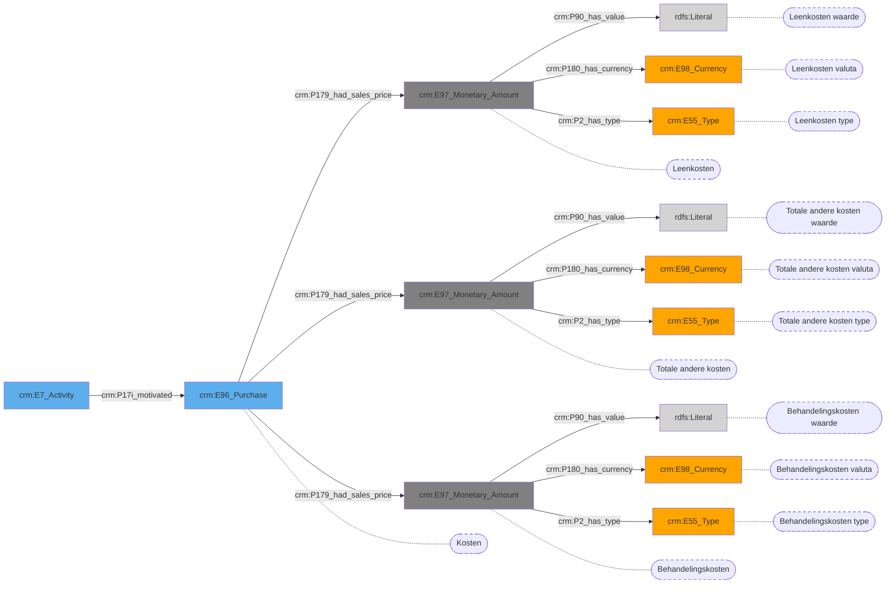

```mermaid
graph LR
style 312ac111-d7b7-11ee-8008-960002548b4f fill:#808080
style 356208ad-d7b8-11ee-ab26-960002548b4f fill:#808080
style 53826280-d7b8-11ee-8261-960002548b4f fill:#D3D3D3
style 6d43b669-d7b8-11ee-a743-960002548b4f fill:#ffa500
style 6eac09f6-edcd-11ee-ada0-960002548b4f fill:#ffa500
style 892e123a-edcd-11ee-83ca-960002548b4f fill:#ffa500
style 9ad2b7d8-d7b7-11ee-aa5b-960002548b4f fill:#D3D3D3
style a7565018-d7b7-11ee-bc9b-960002548b4f fill:#ffa500
style aa29c24e-edcd-11ee-99e6-960002548b4f fill:#ffa500
style c054c98e-cf26-11ee-bf82-960002548b4f fill:#5DAEEC
style c585cc26-cc05-11ee-876f-960002548b4f fill:#5DAEEC
style ca450f1b-d7b7-11ee-b164-960002548b4f fill:#808080
style d7fce329-d7b7-11ee-a8c4-960002548b4f fill:#D3D3D3
style e8dc46dd-d7b7-11ee-8ef9-960002548b4f fill:#ffa500
312ac111-d7b7-11ee-8008-960002548b4f["crm:E97_Monetary_Amount"]-->|"crm:P90_has_value"|9ad2b7d8-d7b7-11ee-aa5b-960002548b4f(rdfs:Literal)
356208ad-d7b8-11ee-ab26-960002548b4f["crm:E97_Monetary_Amount"]-->|"crm:P90_has_value"|53826280-d7b8-11ee-8261-960002548b4f(rdfs:Literal)
ca450f1b-d7b7-11ee-b164-960002548b4f["crm:E97_Monetary_Amount"]-->|"crm:P90_has_value"|d7fce329-d7b7-11ee-a8c4-960002548b4f(rdfs:Literal)
312ac111-d7b7-11ee-8008-960002548b4f["crm:E97_Monetary_Amount"]-->|"crm:P180_has_currency"|a7565018-d7b7-11ee-bc9b-960002548b4f["crm:E98_Currency"]
312ac111-d7b7-11ee-8008-960002548b4f["crm:E97_Monetary_Amount"]-->|"crm:P2_has_type"|6eac09f6-edcd-11ee-ada0-960002548b4f["crm:E55_Type"]
356208ad-d7b8-11ee-ab26-960002548b4f["crm:E97_Monetary_Amount"]-->|"crm:P180_has_currency"|6d43b669-d7b8-11ee-a743-960002548b4f["crm:E98_Currency"]
356208ad-d7b8-11ee-ab26-960002548b4f["crm:E97_Monetary_Amount"]-->|"crm:P2_has_type"|892e123a-edcd-11ee-83ca-960002548b4f["crm:E55_Type"]
c054c98e-cf26-11ee-bf82-960002548b4f["crm:E96_Purchase"]-->|"crm:P179_had_sales_price"|312ac111-d7b7-11ee-8008-960002548b4f["crm:E97_Monetary_Amount"]
c054c98e-cf26-11ee-bf82-960002548b4f["crm:E96_Purchase"]-->|"crm:P179_had_sales_price"|356208ad-d7b8-11ee-ab26-960002548b4f["crm:E97_Monetary_Amount"]
c054c98e-cf26-11ee-bf82-960002548b4f["crm:E96_Purchase"]-->|"crm:P179_had_sales_price"|ca450f1b-d7b7-11ee-b164-960002548b4f["crm:E97_Monetary_Amount"]
c585cc26-cc05-11ee-876f-960002548b4f["crm:E7_Activity"]-->|"crm:P17i_motivated"|c054c98e-cf26-11ee-bf82-960002548b4f["crm:E96_Purchase"]
ca450f1b-d7b7-11ee-b164-960002548b4f["crm:E97_Monetary_Amount"]-->|"crm:P180_has_currency"|e8dc46dd-d7b7-11ee-8ef9-960002548b4f["crm:E98_Currency"]
ca450f1b-d7b7-11ee-b164-960002548b4f["crm:E97_Monetary_Amount"]-->|"crm:P2_has_type"|aa29c24e-edcd-11ee-99e6-960002548b4f["crm:E55_Type"]
style a7565018-d7b7-11ee-bc9b-960002548b4f_s stroke-dasharray: 5
style 6eac09f6-edcd-11ee-ada0-960002548b4f_s stroke-dasharray: 5
style 9ad2b7d8-d7b7-11ee-aa5b-960002548b4f_s stroke-dasharray: 5
style 6d43b669-d7b8-11ee-a743-960002548b4f_s stroke-dasharray: 5
style 892e123a-edcd-11ee-83ca-960002548b4f_s stroke-dasharray: 5
style 53826280-d7b8-11ee-8261-960002548b4f_s stroke-dasharray: 5
style 312ac111-d7b7-11ee-8008-960002548b4f_s stroke-dasharray: 5
style 356208ad-d7b8-11ee-ab26-960002548b4f_s stroke-dasharray: 5
style ca450f1b-d7b7-11ee-b164-960002548b4f_s stroke-dasharray: 5
style c054c98e-cf26-11ee-bf82-960002548b4f_s stroke-dasharray: 5
style e8dc46dd-d7b7-11ee-8ef9-960002548b4f_s stroke-dasharray: 5
style aa29c24e-edcd-11ee-99e6-960002548b4f_s stroke-dasharray: 5
style d7fce329-d7b7-11ee-a8c4-960002548b4f_s stroke-dasharray: 5
a7565018-d7b7-11ee-bc9b-960002548b4f["crm:E98_Currency"]-.-a7565018-d7b7-11ee-bc9b-960002548b4f_s(["Leenkosten valuta"])
6eac09f6-edcd-11ee-ada0-960002548b4f["crm:E55_Type"]-.-6eac09f6-edcd-11ee-ada0-960002548b4f_s(["Leenkosten type"])
9ad2b7d8-d7b7-11ee-aa5b-960002548b4f["rdfs:Literal"]-.-9ad2b7d8-d7b7-11ee-aa5b-960002548b4f_s(["Leenkosten waarde"])
6d43b669-d7b8-11ee-a743-960002548b4f["crm:E98_Currency"]-.-6d43b669-d7b8-11ee-a743-960002548b4f_s(["Totale andere kosten valuta"])
892e123a-edcd-11ee-83ca-960002548b4f["crm:E55_Type"]-.-892e123a-edcd-11ee-83ca-960002548b4f_s(["Totale andere kosten type"])
53826280-d7b8-11ee-8261-960002548b4f["rdfs:Literal"]-.-53826280-d7b8-11ee-8261-960002548b4f_s(["Totale andere kosten waarde"])
312ac111-d7b7-11ee-8008-960002548b4f["crm:E97_Monetary_Amount"]-.-312ac111-d7b7-11ee-8008-960002548b4f_s(["Leenkosten"])
356208ad-d7b8-11ee-ab26-960002548b4f["crm:E97_Monetary_Amount"]-.-356208ad-d7b8-11ee-ab26-960002548b4f_s(["Totale andere kosten"])
ca450f1b-d7b7-11ee-b164-960002548b4f["crm:E97_Monetary_Amount"]-.-ca450f1b-d7b7-11ee-b164-960002548b4f_s(["Behandelingskosten"])
c054c98e-cf26-11ee-bf82-960002548b4f["crm:E96_Purchase"]-.-c054c98e-cf26-11ee-bf82-960002548b4f_s(["Kosten"])
e8dc46dd-d7b7-11ee-8ef9-960002548b4f["crm:E98_Currency"]-.-e8dc46dd-d7b7-11ee-8ef9-960002548b4f_s(["Behandelingskosten valuta"])
aa29c24e-edcd-11ee-99e6-960002548b4f["crm:E55_Type"]-.-aa29c24e-edcd-11ee-99e6-960002548b4f_s(["Behandelingskosten type"])
d7fce329-d7b7-11ee-a8c4-960002548b4f["rdfs:Literal"]-.-d7fce329-d7b7-11ee-a8c4-960002548b4f_s(["Behandelingskosten waarde"])
```
