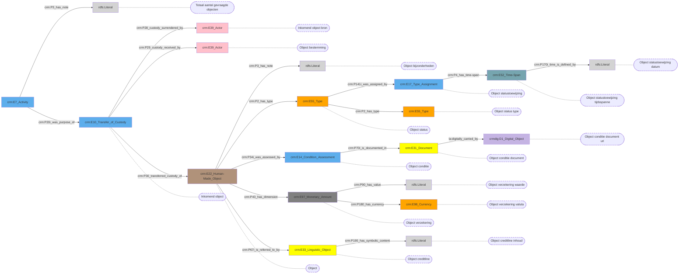

```mermaid
graph LR
style 014551c1-da02-11ee-b5bd-960002548b4f fill:#ffff00
style 09376bd6-d7ac-11ee-b04e-960002548b4f fill:#ffa500
style 0f69e5c3-da02-11ee-954a-960002548b4f fill:#C5B4E3
style 10aad216-cc13-11ee-abbb-960002548b4f fill:#B0927A
style 279b8940-e75f-11ee-80c2-960002548b4f fill:#5DAEEC
style 349d2e72-dd2f-11ee-b573-960002548b4f fill:#D3D3D3
style 366aef7d-da23-11ee-843a-960002548b4f fill:#D3D3D3
style 40512369-d625-11ee-be37-960002548b4f fill:#D3D3D3
style 450943b6-cf2b-11ee-81fa-960002548b4f fill:#ffc0cb
style 50a5e5ba-e75f-11ee-a628-960002548b4f fill:#76A5AF
style 6bc17b5c-e75f-11ee-8fe9-960002548b4f fill:#D3D3D3
style 7864a87e-cf2b-11ee-b2ce-960002548b4f fill:#ffc0cb
style 95874d6e-da22-11ee-91f4-960002548b4f fill:#ffff00
style 9e1673c6-dd2c-11ee-80ab-960002548b4f fill:#ffa500
style a2629122-d7ab-11ee-a1cd-960002548b4f fill:#808080
style c585cc26-cc05-11ee-876f-960002548b4f fill:#5DAEEC
style c80cb98b-da01-11ee-94fe-960002548b4f fill:#5DAEEC
style da1df108-cc12-11ee-aa62-960002548b4f fill:#5DAEEC
style ed647679-d7ab-11ee-8f64-960002548b4f fill:#D3D3D3
style ef4723f7-dd2c-11ee-9a94-960002548b4f fill:#ffa500
10aad216-cc13-11ee-abbb-960002548b4f["crm:E22_Human-Made_Object"]-->|"crm:P3_has_note"|349d2e72-dd2f-11ee-b573-960002548b4f(rdfs:Literal)
50a5e5ba-e75f-11ee-a628-960002548b4f["crm:E52_Time-Span"]-->|"crm:P170i_time_is_defined_by"|6bc17b5c-e75f-11ee-8fe9-960002548b4f(rdfs:Literal)
95874d6e-da22-11ee-91f4-960002548b4f["crm:E33_Linguistic_Object"]-->|"crm:P190_has_symbolic_content"|366aef7d-da23-11ee-843a-960002548b4f(rdfs:Literal)
a2629122-d7ab-11ee-a1cd-960002548b4f["crm:E97_Monetary_Amount"]-->|"crm:P90_has_value"|ed647679-d7ab-11ee-8f64-960002548b4f(rdfs:Literal)
c585cc26-cc05-11ee-876f-960002548b4f["crm:E7_Activity"]-->|"crm:P3_has_note"|40512369-d625-11ee-be37-960002548b4f(rdfs:Literal)
014551c1-da02-11ee-b5bd-960002548b4f["crm:E31_Document"]-->|"la:digitally_carried_by"|0f69e5c3-da02-11ee-954a-960002548b4f["crmdig:D1_Digital_Object"]
10aad216-cc13-11ee-abbb-960002548b4f["crm:E22_Human-Made_Object"]-->|"crm:P2_has_type"|9e1673c6-dd2c-11ee-80ab-960002548b4f["crm:E55_Type"]
10aad216-cc13-11ee-abbb-960002548b4f["crm:E22_Human-Made_Object"]-->|"crm:P34i_was_assessed_by"|c80cb98b-da01-11ee-94fe-960002548b4f["crm:E14_Condition_Assessment"]
10aad216-cc13-11ee-abbb-960002548b4f["crm:E22_Human-Made_Object"]-->|"crm:P43_has_dimension"|a2629122-d7ab-11ee-a1cd-960002548b4f["crm:E97_Monetary_Amount"]
10aad216-cc13-11ee-abbb-960002548b4f["crm:E22_Human-Made_Object"]-->|"crm:P67i_is_referred_to_by"|95874d6e-da22-11ee-91f4-960002548b4f["crm:E33_Linguistic_Object"]
279b8940-e75f-11ee-80c2-960002548b4f["crm:E17_Type_Assignment"]-->|"crm:P4_has_time-span"|50a5e5ba-e75f-11ee-a628-960002548b4f["crm:E52_Time-Span"]
9e1673c6-dd2c-11ee-80ab-960002548b4f["crm:E55_Type"]-->|"crm:P141i_was_assigned_by"|279b8940-e75f-11ee-80c2-960002548b4f["crm:E17_Type_Assignment"]
9e1673c6-dd2c-11ee-80ab-960002548b4f["crm:E55_Type"]-->|"crm:P2_has_type"|ef4723f7-dd2c-11ee-9a94-960002548b4f["crm:E55_Type"]
a2629122-d7ab-11ee-a1cd-960002548b4f["crm:E97_Monetary_Amount"]-->|"crm:P180_has_currency"|09376bd6-d7ac-11ee-b04e-960002548b4f["crm:E98_Currency"]
c585cc26-cc05-11ee-876f-960002548b4f["crm:E7_Activity"]-->|"crm:P20i_was_purpose_of"|da1df108-cc12-11ee-aa62-960002548b4f["crm:E10_Transfer_of_Custody"]
c80cb98b-da01-11ee-94fe-960002548b4f["crm:E14_Condition_Assessment"]-->|"crm:P70i_is_documented_in"|014551c1-da02-11ee-b5bd-960002548b4f["crm:E31_Document"]
da1df108-cc12-11ee-aa62-960002548b4f["crm:E10_Transfer_of_Custody"]-->|"crm:P28_custody_surrendered_by"|450943b6-cf2b-11ee-81fa-960002548b4f["crm:E39_Actor"]
da1df108-cc12-11ee-aa62-960002548b4f["crm:E10_Transfer_of_Custody"]-->|"crm:P29_custody_received_by"|7864a87e-cf2b-11ee-b2ce-960002548b4f["crm:E39_Actor"]
da1df108-cc12-11ee-aa62-960002548b4f["crm:E10_Transfer_of_Custody"]-->|"crm:P30_transferred_custody_of"|10aad216-cc13-11ee-abbb-960002548b4f["crm:E22_Human-Made_Object"]
style 0f69e5c3-da02-11ee-954a-960002548b4f_s stroke-dasharray: 5
style 9e1673c6-dd2c-11ee-80ab-960002548b4f_s stroke-dasharray: 5
style 349d2e72-dd2f-11ee-b573-960002548b4f_s stroke-dasharray: 5
style c80cb98b-da01-11ee-94fe-960002548b4f_s stroke-dasharray: 5
style a2629122-d7ab-11ee-a1cd-960002548b4f_s stroke-dasharray: 5
style 95874d6e-da22-11ee-91f4-960002548b4f_s stroke-dasharray: 5
style 50a5e5ba-e75f-11ee-a628-960002548b4f_s stroke-dasharray: 5
style 6bc17b5c-e75f-11ee-8fe9-960002548b4f_s stroke-dasharray: 5
style 366aef7d-da23-11ee-843a-960002548b4f_s stroke-dasharray: 5
style 279b8940-e75f-11ee-80c2-960002548b4f_s stroke-dasharray: 5
style ef4723f7-dd2c-11ee-9a94-960002548b4f_s stroke-dasharray: 5
style 09376bd6-d7ac-11ee-b04e-960002548b4f_s stroke-dasharray: 5
style ed647679-d7ab-11ee-8f64-960002548b4f_s stroke-dasharray: 5
style da1df108-cc12-11ee-aa62-960002548b4f_s stroke-dasharray: 5
style 40512369-d625-11ee-be37-960002548b4f_s stroke-dasharray: 5
style 014551c1-da02-11ee-b5bd-960002548b4f_s stroke-dasharray: 5
style 450943b6-cf2b-11ee-81fa-960002548b4f_s stroke-dasharray: 5
style 7864a87e-cf2b-11ee-b2ce-960002548b4f_s stroke-dasharray: 5
style 10aad216-cc13-11ee-abbb-960002548b4f_s stroke-dasharray: 5
0f69e5c3-da02-11ee-954a-960002548b4f["crmdig:D1_Digital_Object"]-.-0f69e5c3-da02-11ee-954a-960002548b4f_s(["Object conditie document uri"])
9e1673c6-dd2c-11ee-80ab-960002548b4f["crm:E55_Type"]-.-9e1673c6-dd2c-11ee-80ab-960002548b4f_s(["Object status"])
349d2e72-dd2f-11ee-b573-960002548b4f["rdfs:Literal"]-.-349d2e72-dd2f-11ee-b573-960002548b4f_s(["Object bijzonderheden"])
c80cb98b-da01-11ee-94fe-960002548b4f["crm:E14_Condition_Assessment"]-.-c80cb98b-da01-11ee-94fe-960002548b4f_s(["Object conditie"])
a2629122-d7ab-11ee-a1cd-960002548b4f["crm:E97_Monetary_Amount"]-.-a2629122-d7ab-11ee-a1cd-960002548b4f_s(["Object verzekering"])
95874d6e-da22-11ee-91f4-960002548b4f["crm:E33_Linguistic_Object"]-.-95874d6e-da22-11ee-91f4-960002548b4f_s(["Object creditline"])
50a5e5ba-e75f-11ee-a628-960002548b4f["crm:E52_Time-Span"]-.-50a5e5ba-e75f-11ee-a628-960002548b4f_s(["Object statustoewijzing tijdsspanne"])
6bc17b5c-e75f-11ee-8fe9-960002548b4f["rdfs:Literal"]-.-6bc17b5c-e75f-11ee-8fe9-960002548b4f_s(["Object statustoewijzing datum"])
366aef7d-da23-11ee-843a-960002548b4f["rdfs:Literal"]-.-366aef7d-da23-11ee-843a-960002548b4f_s(["Object creditline inhoud"])
279b8940-e75f-11ee-80c2-960002548b4f["crm:E17_Type_Assignment"]-.-279b8940-e75f-11ee-80c2-960002548b4f_s(["Object statustoewijzing"])
ef4723f7-dd2c-11ee-9a94-960002548b4f["crm:E55_Type"]-.-ef4723f7-dd2c-11ee-9a94-960002548b4f_s(["Object status type"])
09376bd6-d7ac-11ee-b04e-960002548b4f["crm:E98_Currency"]-.-09376bd6-d7ac-11ee-b04e-960002548b4f_s(["Object verzekering valuta"])
ed647679-d7ab-11ee-8f64-960002548b4f["rdfs:Literal"]-.-ed647679-d7ab-11ee-8f64-960002548b4f_s(["Object verzekering waarde"])
da1df108-cc12-11ee-aa62-960002548b4f["crm:E10_Transfer_of_Custody"]-.-da1df108-cc12-11ee-aa62-960002548b4f_s(["Inkomend object"])
40512369-d625-11ee-be37-960002548b4f["rdfs:Literal"]-.-40512369-d625-11ee-be37-960002548b4f_s(["Totaal aantal gevraagde objecten"])
014551c1-da02-11ee-b5bd-960002548b4f["crm:E31_Document"]-.-014551c1-da02-11ee-b5bd-960002548b4f_s(["Object conditie document"])
450943b6-cf2b-11ee-81fa-960002548b4f["crm:E39_Actor"]-.-450943b6-cf2b-11ee-81fa-960002548b4f_s(["Inkomend object bron"])
7864a87e-cf2b-11ee-b2ce-960002548b4f["crm:E39_Actor"]-.-7864a87e-cf2b-11ee-b2ce-960002548b4f_s(["Object bestemming"])
10aad216-cc13-11ee-abbb-960002548b4f["crm:E22_Human-Made_Object"]-.-10aad216-cc13-11ee-abbb-960002548b4f_s(["Object"])
```
