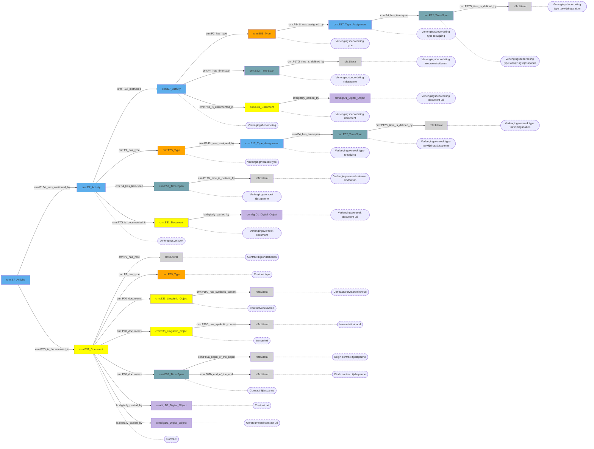

```mermaid
graph LR
style 034c11c9-edd1-11ee-93d0-960002548b4f fill:#76A5AF
style 0b08146c-edd0-11ee-9320-960002548b4f fill:#D3D3D3
style 0e151afa-edd1-11ee-9275-960002548b4f fill:#D3D3D3
style 156ba1a0-d7cd-11ee-91be-960002548b4f fill:#C5B4E3
style 23e4eb9c-d7d2-11ee-9c8e-960002548b4f fill:#D3D3D3
style 3979bed7-edd1-11ee-8ae6-960002548b4f fill:#ffa500
style 3bbecdd8-edb5-11ee-854f-960002548b4f fill:#ffa500
style 5ae77dfc-d7cc-11ee-a6a6-960002548b4f fill:#ffff00
style 5da1ed2f-d7cd-11ee-a715-960002548b4f fill:#D3D3D3
style 5e113378-edd1-11ee-acaa-960002548b4f fill:#ffff00
style 5fde700b-edcf-11ee-8d31-960002548b4f fill:#ffa500
style 60435eae-d7d3-11ee-b537-960002548b4f fill:#ffff00
style 6ccd13e5-edd1-11ee-b209-960002548b4f fill:#C5B4E3
style 6f7b22e1-d7d3-11ee-82d3-960002548b4f fill:#C5B4E3
style 7bc2b9e9-d7d1-11ee-b535-960002548b4f fill:#ffff00
style 87140935-edcf-11ee-8020-960002548b4f fill:#5DAEEC
style 8a3e1100-edd1-11ee-b825-960002548b4f fill:#76A5AF
style 92baaabb-d9f8-11ee-91ea-960002548b4f fill:#ffff00
style 942df705-d7d2-11ee-96fb-960002548b4f fill:#5DAEEC
style 9ccb6608-edd1-11ee-b1ea-960002548b4f fill:#D3D3D3
style ac5efedc-d7d0-11ee-b808-960002548b4f fill:#C5B4E3
style b7c9c9e8-d9f8-11ee-984f-960002548b4f fill:#D3D3D3
style bd86a4d9-edd1-11ee-b5f2-960002548b4f fill:#5DAEEC
style bde49fdf-d7ce-11ee-a596-960002548b4f fill:#76A5AF
style c585cc26-cc05-11ee-876f-960002548b4f fill:#5DAEEC
style d0cce7d8-edd1-11ee-87e9-960002548b4f fill:#76A5AF
style ddc8e25b-edd1-11ee-8789-960002548b4f fill:#D3D3D3
style e736e43c-edd0-11ee-ac25-960002548b4f fill:#5DAEEC
style ebb7c571-d7ce-11ee-ba33-960002548b4f fill:#D3D3D3
style f1a1d793-d7d2-11ee-88c3-960002548b4f fill:#76A5AF
style fc8f20ab-d7ce-11ee-bb90-960002548b4f fill:#D3D3D3
034c11c9-edd1-11ee-93d0-960002548b4f["crm:E52_Time-Span"]-->|"crm:P170i_time_is_defined_by"|0e151afa-edd1-11ee-9275-960002548b4f(rdfs:Literal)
5ae77dfc-d7cc-11ee-a6a6-960002548b4f["crm:E31_Document"]-->|"crm:P3_has_note"|5da1ed2f-d7cd-11ee-a715-960002548b4f(rdfs:Literal)
7bc2b9e9-d7d1-11ee-b535-960002548b4f["crm:E33_Linguistic_Object"]-->|"crm:P190_has_symbolic_content"|23e4eb9c-d7d2-11ee-9c8e-960002548b4f(rdfs:Literal)
8a3e1100-edd1-11ee-b825-960002548b4f["crm:E52_Time-Span"]-->|"crm:P170i_time_is_defined_by"|9ccb6608-edd1-11ee-b1ea-960002548b4f(rdfs:Literal)
92baaabb-d9f8-11ee-91ea-960002548b4f["crm:E33_Linguistic_Object"]-->|"crm:P190_has_symbolic_content"|b7c9c9e8-d9f8-11ee-984f-960002548b4f(rdfs:Literal)
bde49fdf-d7ce-11ee-a596-960002548b4f["crm:E52_Time-Span"]-->|"crm:P82a_begin_of_the_begin"|ebb7c571-d7ce-11ee-ba33-960002548b4f(rdfs:Literal)
bde49fdf-d7ce-11ee-a596-960002548b4f["crm:E52_Time-Span"]-->|"crm:P82b_end_of_the_end"|fc8f20ab-d7ce-11ee-bb90-960002548b4f(rdfs:Literal)
d0cce7d8-edd1-11ee-87e9-960002548b4f["crm:E52_Time-Span"]-->|"crm:P170i_time_is_defined_by"|ddc8e25b-edd1-11ee-8789-960002548b4f(rdfs:Literal)
f1a1d793-d7d2-11ee-88c3-960002548b4f["crm:E52_Time-Span"]-->|"crm:P170i_time_is_defined_by"|0b08146c-edd0-11ee-9320-960002548b4f(rdfs:Literal)
3979bed7-edd1-11ee-8ae6-960002548b4f["crm:E55_Type"]-->|"crm:P141i_was_assigned_by"|bd86a4d9-edd1-11ee-b5f2-960002548b4f["crm:E17_Type_Assignment"]
5ae77dfc-d7cc-11ee-a6a6-960002548b4f["crm:E31_Document"]-->|"crm:P2_has_type"|3bbecdd8-edb5-11ee-854f-960002548b4f["crm:E55_Type"]
5ae77dfc-d7cc-11ee-a6a6-960002548b4f["crm:E31_Document"]-->|"crm:P70_documents"|7bc2b9e9-d7d1-11ee-b535-960002548b4f["crm:E33_Linguistic_Object"]
5ae77dfc-d7cc-11ee-a6a6-960002548b4f["crm:E31_Document"]-->|"crm:P70_documents"|92baaabb-d9f8-11ee-91ea-960002548b4f["crm:E33_Linguistic_Object"]
5ae77dfc-d7cc-11ee-a6a6-960002548b4f["crm:E31_Document"]-->|"crm:P70_documents"|bde49fdf-d7ce-11ee-a596-960002548b4f["crm:E52_Time-Span"]
5ae77dfc-d7cc-11ee-a6a6-960002548b4f["crm:E31_Document"]-->|"la:digitally_carried_by"|156ba1a0-d7cd-11ee-91be-960002548b4f["crmdig:D1_Digital_Object"]
5ae77dfc-d7cc-11ee-a6a6-960002548b4f["crm:E31_Document"]-->|"la:digitally_carried_by"|ac5efedc-d7d0-11ee-b808-960002548b4f["crmdig:D1_Digital_Object"]
5e113378-edd1-11ee-acaa-960002548b4f["crm:E31_Document"]-->|"la:digitally_carried_by"|6ccd13e5-edd1-11ee-b209-960002548b4f["crmdig:D1_Digital_Object"]
5fde700b-edcf-11ee-8d31-960002548b4f["crm:E55_Type"]-->|"crm:P141i_was_assigned_by"|e736e43c-edd0-11ee-ac25-960002548b4f["crm:E17_Type_Assignment"]
60435eae-d7d3-11ee-b537-960002548b4f["crm:E31_Document"]-->|"la:digitally_carried_by"|6f7b22e1-d7d3-11ee-82d3-960002548b4f["crmdig:D1_Digital_Object"]
87140935-edcf-11ee-8020-960002548b4f["crm:E7_Activity"]-->|"crm:P2_has_type"|3979bed7-edd1-11ee-8ae6-960002548b4f["crm:E55_Type"]
87140935-edcf-11ee-8020-960002548b4f["crm:E7_Activity"]-->|"crm:P4_has_time-span"|8a3e1100-edd1-11ee-b825-960002548b4f["crm:E52_Time-Span"]
87140935-edcf-11ee-8020-960002548b4f["crm:E7_Activity"]-->|"crm:P70i_is_documented_in"|5e113378-edd1-11ee-acaa-960002548b4f["crm:E31_Document"]
942df705-d7d2-11ee-96fb-960002548b4f["crm:E7_Activity"]-->|"crm:P17i_motivated"|87140935-edcf-11ee-8020-960002548b4f["crm:E7_Activity"]
942df705-d7d2-11ee-96fb-960002548b4f["crm:E7_Activity"]-->|"crm:P2_has_type"|5fde700b-edcf-11ee-8d31-960002548b4f["crm:E55_Type"]
942df705-d7d2-11ee-96fb-960002548b4f["crm:E7_Activity"]-->|"crm:P4_has_time-span"|f1a1d793-d7d2-11ee-88c3-960002548b4f["crm:E52_Time-Span"]
942df705-d7d2-11ee-96fb-960002548b4f["crm:E7_Activity"]-->|"crm:P70i_is_documented_in"|60435eae-d7d3-11ee-b537-960002548b4f["crm:E31_Document"]
bd86a4d9-edd1-11ee-b5f2-960002548b4f["crm:E17_Type_Assignment"]-->|"crm:P4_has_time-span"|d0cce7d8-edd1-11ee-87e9-960002548b4f["crm:E52_Time-Span"]
c585cc26-cc05-11ee-876f-960002548b4f["crm:E7_Activity"]-->|"crm:P134i_was_continued_by"|942df705-d7d2-11ee-96fb-960002548b4f["crm:E7_Activity"]
c585cc26-cc05-11ee-876f-960002548b4f["crm:E7_Activity"]-->|"crm:P70i_is_documented_in"|5ae77dfc-d7cc-11ee-a6a6-960002548b4f["crm:E31_Document"]
e736e43c-edd0-11ee-ac25-960002548b4f["crm:E17_Type_Assignment"]-->|"crm:P4_has_time-span"|034c11c9-edd1-11ee-93d0-960002548b4f["crm:E52_Time-Span"]
style 0e151afa-edd1-11ee-9275-960002548b4f_s stroke-dasharray: 5
style bd86a4d9-edd1-11ee-b5f2-960002548b4f_s stroke-dasharray: 5
style 3bbecdd8-edb5-11ee-854f-960002548b4f_s stroke-dasharray: 5
style 5da1ed2f-d7cd-11ee-a715-960002548b4f_s stroke-dasharray: 5
style 7bc2b9e9-d7d1-11ee-b535-960002548b4f_s stroke-dasharray: 5
style 92baaabb-d9f8-11ee-91ea-960002548b4f_s stroke-dasharray: 5
style bde49fdf-d7ce-11ee-a596-960002548b4f_s stroke-dasharray: 5
style 156ba1a0-d7cd-11ee-91be-960002548b4f_s stroke-dasharray: 5
style ac5efedc-d7d0-11ee-b808-960002548b4f_s stroke-dasharray: 5
style 6ccd13e5-edd1-11ee-b209-960002548b4f_s stroke-dasharray: 5
style e736e43c-edd0-11ee-ac25-960002548b4f_s stroke-dasharray: 5
style 6f7b22e1-d7d3-11ee-82d3-960002548b4f_s stroke-dasharray: 5
style 23e4eb9c-d7d2-11ee-9c8e-960002548b4f_s stroke-dasharray: 5
style 3979bed7-edd1-11ee-8ae6-960002548b4f_s stroke-dasharray: 5
style 8a3e1100-edd1-11ee-b825-960002548b4f_s stroke-dasharray: 5
style 5e113378-edd1-11ee-acaa-960002548b4f_s stroke-dasharray: 5
style 9ccb6608-edd1-11ee-b1ea-960002548b4f_s stroke-dasharray: 5
style b7c9c9e8-d9f8-11ee-984f-960002548b4f_s stroke-dasharray: 5
style 87140935-edcf-11ee-8020-960002548b4f_s stroke-dasharray: 5
style 5fde700b-edcf-11ee-8d31-960002548b4f_s stroke-dasharray: 5
style f1a1d793-d7d2-11ee-88c3-960002548b4f_s stroke-dasharray: 5
style 60435eae-d7d3-11ee-b537-960002548b4f_s stroke-dasharray: 5
style d0cce7d8-edd1-11ee-87e9-960002548b4f_s stroke-dasharray: 5
style ebb7c571-d7ce-11ee-ba33-960002548b4f_s stroke-dasharray: 5
style fc8f20ab-d7ce-11ee-bb90-960002548b4f_s stroke-dasharray: 5
style 942df705-d7d2-11ee-96fb-960002548b4f_s stroke-dasharray: 5
style 5ae77dfc-d7cc-11ee-a6a6-960002548b4f_s stroke-dasharray: 5
style ddc8e25b-edd1-11ee-8789-960002548b4f_s stroke-dasharray: 5
style 034c11c9-edd1-11ee-93d0-960002548b4f_s stroke-dasharray: 5
style 0b08146c-edd0-11ee-9320-960002548b4f_s stroke-dasharray: 5
0e151afa-edd1-11ee-9275-960002548b4f["rdfs:Literal"]-.-0e151afa-edd1-11ee-9275-960002548b4f_s(["Verlengingsverzoek type toewijzingsdatum"])
bd86a4d9-edd1-11ee-b5f2-960002548b4f["crm:E17_Type_Assignment"]-.-bd86a4d9-edd1-11ee-b5f2-960002548b4f_s(["Verlengingsbeoordeling type toewijzing"])
3bbecdd8-edb5-11ee-854f-960002548b4f["crm:E55_Type"]-.-3bbecdd8-edb5-11ee-854f-960002548b4f_s(["Contract type"])
5da1ed2f-d7cd-11ee-a715-960002548b4f["rdfs:Literal"]-.-5da1ed2f-d7cd-11ee-a715-960002548b4f_s(["Contract bijzonderheden"])
7bc2b9e9-d7d1-11ee-b535-960002548b4f["crm:E33_Linguistic_Object"]-.-7bc2b9e9-d7d1-11ee-b535-960002548b4f_s(["Contractvoorwaarde"])
92baaabb-d9f8-11ee-91ea-960002548b4f["crm:E33_Linguistic_Object"]-.-92baaabb-d9f8-11ee-91ea-960002548b4f_s(["Immuniteit"])
bde49fdf-d7ce-11ee-a596-960002548b4f["crm:E52_Time-Span"]-.-bde49fdf-d7ce-11ee-a596-960002548b4f_s(["Contract tijdsspanne"])
156ba1a0-d7cd-11ee-91be-960002548b4f["crmdig:D1_Digital_Object"]-.-156ba1a0-d7cd-11ee-91be-960002548b4f_s(["Contract uri"])
ac5efedc-d7d0-11ee-b808-960002548b4f["crmdig:D1_Digital_Object"]-.-ac5efedc-d7d0-11ee-b808-960002548b4f_s(["Geretourneerd contract uri"])
6ccd13e5-edd1-11ee-b209-960002548b4f["crmdig:D1_Digital_Object"]-.-6ccd13e5-edd1-11ee-b209-960002548b4f_s(["Verlengingsbeoordeling document uri"])
e736e43c-edd0-11ee-ac25-960002548b4f["crm:E17_Type_Assignment"]-.-e736e43c-edd0-11ee-ac25-960002548b4f_s(["Verlengingsverzoek type toewijzing"])
6f7b22e1-d7d3-11ee-82d3-960002548b4f["crmdig:D1_Digital_Object"]-.-6f7b22e1-d7d3-11ee-82d3-960002548b4f_s(["Verlengingsverzoek document uri"])
23e4eb9c-d7d2-11ee-9c8e-960002548b4f["rdfs:Literal"]-.-23e4eb9c-d7d2-11ee-9c8e-960002548b4f_s(["Contractvoorwaarde inhoud"])
3979bed7-edd1-11ee-8ae6-960002548b4f["crm:E55_Type"]-.-3979bed7-edd1-11ee-8ae6-960002548b4f_s(["Verlengingsbeoordeling type"])
8a3e1100-edd1-11ee-b825-960002548b4f["crm:E52_Time-Span"]-.-8a3e1100-edd1-11ee-b825-960002548b4f_s(["Verlengingsbeoordeling tijdsspanne"])
5e113378-edd1-11ee-acaa-960002548b4f["crm:E31_Document"]-.-5e113378-edd1-11ee-acaa-960002548b4f_s(["Verlengingsbeoordeling document"])
9ccb6608-edd1-11ee-b1ea-960002548b4f["rdfs:Literal"]-.-9ccb6608-edd1-11ee-b1ea-960002548b4f_s(["Verlengingsbeoordeling nieuwe einddatum"])
b7c9c9e8-d9f8-11ee-984f-960002548b4f["rdfs:Literal"]-.-b7c9c9e8-d9f8-11ee-984f-960002548b4f_s(["Immuniteit inhoud"])
87140935-edcf-11ee-8020-960002548b4f["crm:E7_Activity"]-.-87140935-edcf-11ee-8020-960002548b4f_s(["Verlengingsbeoordeling"])
5fde700b-edcf-11ee-8d31-960002548b4f["crm:E55_Type"]-.-5fde700b-edcf-11ee-8d31-960002548b4f_s(["Verlengingsverzoek type"])
f1a1d793-d7d2-11ee-88c3-960002548b4f["crm:E52_Time-Span"]-.-f1a1d793-d7d2-11ee-88c3-960002548b4f_s(["Verlengingsverzoek tijdsspanne"])
60435eae-d7d3-11ee-b537-960002548b4f["crm:E31_Document"]-.-60435eae-d7d3-11ee-b537-960002548b4f_s(["Verlengingsverzoek document"])
d0cce7d8-edd1-11ee-87e9-960002548b4f["crm:E52_Time-Span"]-.-d0cce7d8-edd1-11ee-87e9-960002548b4f_s(["Verlengingsbeoordeling type toewijzingstijdsspanne"])
ebb7c571-d7ce-11ee-ba33-960002548b4f["rdfs:Literal"]-.-ebb7c571-d7ce-11ee-ba33-960002548b4f_s(["Begin contract tijdsspanne"])
fc8f20ab-d7ce-11ee-bb90-960002548b4f["rdfs:Literal"]-.-fc8f20ab-d7ce-11ee-bb90-960002548b4f_s(["Einde contract tijdsspanne"])
942df705-d7d2-11ee-96fb-960002548b4f["crm:E7_Activity"]-.-942df705-d7d2-11ee-96fb-960002548b4f_s(["Verlengingsverzoek"])
5ae77dfc-d7cc-11ee-a6a6-960002548b4f["crm:E31_Document"]-.-5ae77dfc-d7cc-11ee-a6a6-960002548b4f_s(["Contract"])
ddc8e25b-edd1-11ee-8789-960002548b4f["rdfs:Literal"]-.-ddc8e25b-edd1-11ee-8789-960002548b4f_s(["Verlengingsbeoordeling type toewijzingsdatum"])
034c11c9-edd1-11ee-93d0-960002548b4f["crm:E52_Time-Span"]-.-034c11c9-edd1-11ee-93d0-960002548b4f_s(["Verlengingsverzoek type toewijzingstijdsspanne"])
0b08146c-edd0-11ee-9320-960002548b4f["rdfs:Literal"]-.-0b08146c-edd0-11ee-9320-960002548b4f_s(["Verlengingsverzoek nieuwe einddatum"])
```
