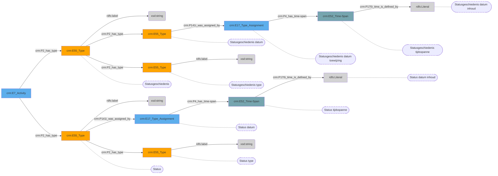

```mermaid
graph LR
248c0a58-dd34-11ee-96b6-960002548b4f["crm:E55_Type"]-->|"rdfs:label"|d1dacec5-e759-11ee-99a4-960002548b4f(xsd:string)
44aa15f1-e6ca-11ee-8692-960002548b4f["crm:E52_Time-Span"]-->|"crm:P170i_time_is_defined_by"|638ceb79-e6ca-11ee-b29a-960002548b4f(rdfs:Literal)
5a67bd0e-e75d-11ee-b8aa-960002548b4f["crm:E52_Time-Span"]-->|"crm:P170i_time_is_defined_by"|61ae3a04-e75d-11ee-af2b-960002548b4f(rdfs:Literal)
e5c31f83-dd36-11ee-a688-960002548b4f["crm:E55_Type"]-->|"rdfs:label"|ee3fdca2-e755-11ee-9f52-960002548b4f(xsd:string)
f89610b8-dd34-11ee-b12b-960002548b4f["crm:E55_Type"]-->|"rdfs:label"|e0e6f504-e759-11ee-860c-960002548b4f(xsd:string)
fc175863-dd36-11ee-8bcd-960002548b4f["crm:E55_Type"]-->|"rdfs:label"|f9ea68a6-e755-11ee-9d41-960002548b4f(xsd:string)
248c0a58-dd34-11ee-96b6-960002548b4f["crm:E55_Type"]-->|"crm:P2_has_type"|350de3c0-e75d-11ee-b98b-960002548b4f["crm:E55_Type"]
248c0a58-dd34-11ee-96b6-960002548b4f["crm:E55_Type"]-->|"crm:P2_has_type"|f89610b8-dd34-11ee-b12b-960002548b4f["crm:E55_Type"]
2e8f1a81-e6ca-11ee-889d-960002548b4f["crm:E17_Type_Assignment"]-->|"crm:P4_has_time-span"|44aa15f1-e6ca-11ee-8692-960002548b4f["crm:E52_Time-Span"]
350de3c0-e75d-11ee-b98b-960002548b4f["crm:E55_Type"]-->|"crm:P141i_was_assigned_by"|46f91387-e75d-11ee-9b3f-960002548b4f["crm:E17_Type_Assignment"]
46f91387-e75d-11ee-9b3f-960002548b4f["crm:E17_Type_Assignment"]-->|"crm:P4_has_time-span"|5a67bd0e-e75d-11ee-b8aa-960002548b4f["crm:E52_Time-Span"]
c585cc26-cc05-11ee-876f-960002548b4f["crm:E7_Activity"]-->|"crm:P2_has_type"|248c0a58-dd34-11ee-96b6-960002548b4f["crm:E55_Type"]
c585cc26-cc05-11ee-876f-960002548b4f["crm:E7_Activity"]-->|"crm:P2_has_type"|e5c31f83-dd36-11ee-a688-960002548b4f["crm:E55_Type"]
e5c31f83-dd36-11ee-a688-960002548b4f["crm:E55_Type"]-->|"crm:P141i_was_assigned_by"|2e8f1a81-e6ca-11ee-889d-960002548b4f["crm:E17_Type_Assignment"]
e5c31f83-dd36-11ee-a688-960002548b4f["crm:E55_Type"]-->|"crm:P2_has_type"|fc175863-dd36-11ee-8bcd-960002548b4f["crm:E55_Type"]
350de3c0-e75d-11ee-b98b-960002548b4f["crm:E55_Type"]-.-350de3c0-e75d-11ee-b98b-960002548b4f_s(["Statusgeschiedenis datum"])
f89610b8-dd34-11ee-b12b-960002548b4f["crm:E55_Type"]-.-f89610b8-dd34-11ee-b12b-960002548b4f_s(["Statusgeschiedenis type"])
44aa15f1-e6ca-11ee-8692-960002548b4f["crm:E52_Time-Span"]-.-44aa15f1-e6ca-11ee-8692-960002548b4f_s(["Status tijdsspanne"])
46f91387-e75d-11ee-9b3f-960002548b4f["crm:E17_Type_Assignment"]-.-46f91387-e75d-11ee-9b3f-960002548b4f_s(["Statusgeschiedenis datum toewijzing"])
638ceb79-e6ca-11ee-b29a-960002548b4f["rdfs:Literal"]-.-638ceb79-e6ca-11ee-b29a-960002548b4f_s(["Status datum inhoud"])
5a67bd0e-e75d-11ee-b8aa-960002548b4f["crm:E52_Time-Span"]-.-5a67bd0e-e75d-11ee-b8aa-960002548b4f_s(["Statusgeschiedenis tijdsspanne"])
61ae3a04-e75d-11ee-af2b-960002548b4f["rdfs:Literal"]-.-61ae3a04-e75d-11ee-af2b-960002548b4f_s(["Statusgeschiedenis datum inhoud"])
248c0a58-dd34-11ee-96b6-960002548b4f["crm:E55_Type"]-.-248c0a58-dd34-11ee-96b6-960002548b4f_s(["Statusgeschiedenis"])
e5c31f83-dd36-11ee-a688-960002548b4f["crm:E55_Type"]-.-e5c31f83-dd36-11ee-a688-960002548b4f_s(["Status"])
2e8f1a81-e6ca-11ee-889d-960002548b4f["crm:E17_Type_Assignment"]-.-2e8f1a81-e6ca-11ee-889d-960002548b4f_s(["Status datum"])
fc175863-dd36-11ee-8bcd-960002548b4f["crm:E55_Type"]-.-fc175863-dd36-11ee-8bcd-960002548b4f_s(["Status type"])
style 350de3c0-e75d-11ee-b98b-960002548b4f_s stroke-dasharray: 5
style f89610b8-dd34-11ee-b12b-960002548b4f_s stroke-dasharray: 5
style 44aa15f1-e6ca-11ee-8692-960002548b4f_s stroke-dasharray: 5
style 46f91387-e75d-11ee-9b3f-960002548b4f_s stroke-dasharray: 5
style 638ceb79-e6ca-11ee-b29a-960002548b4f_s stroke-dasharray: 5
style 5a67bd0e-e75d-11ee-b8aa-960002548b4f_s stroke-dasharray: 5
style 61ae3a04-e75d-11ee-af2b-960002548b4f_s stroke-dasharray: 5
style 248c0a58-dd34-11ee-96b6-960002548b4f_s stroke-dasharray: 5
style e5c31f83-dd36-11ee-a688-960002548b4f_s stroke-dasharray: 5
style 2e8f1a81-e6ca-11ee-889d-960002548b4f_s stroke-dasharray: 5
style fc175863-dd36-11ee-8bcd-960002548b4f_s stroke-dasharray: 5
style 248c0a58-dd34-11ee-96b6-960002548b4f fill:#ffa500
style 2e8f1a81-e6ca-11ee-889d-960002548b4f fill:#5DAEEC
style 350de3c0-e75d-11ee-b98b-960002548b4f fill:#ffa500
style 44aa15f1-e6ca-11ee-8692-960002548b4f fill:#76A5AF
style 46f91387-e75d-11ee-9b3f-960002548b4f fill:#5DAEEC
style 5a67bd0e-e75d-11ee-b8aa-960002548b4f fill:#76A5AF
style 61ae3a04-e75d-11ee-af2b-960002548b4f fill:#D3D3D3
style 638ceb79-e6ca-11ee-b29a-960002548b4f fill:#D3D3D3
style c585cc26-cc05-11ee-876f-960002548b4f fill:#5DAEEC
style d1dacec5-e759-11ee-99a4-960002548b4f fill:#D3D3D3
style e0e6f504-e759-11ee-860c-960002548b4f fill:#D3D3D3
style e5c31f83-dd36-11ee-a688-960002548b4f fill:#ffa500
style ee3fdca2-e755-11ee-9f52-960002548b4f fill:#D3D3D3
style f89610b8-dd34-11ee-b12b-960002548b4f fill:#ffa500
style f9ea68a6-e755-11ee-9d41-960002548b4f fill:#D3D3D3
style fc175863-dd36-11ee-8bcd-960002548b4f fill:#ffa500
```
