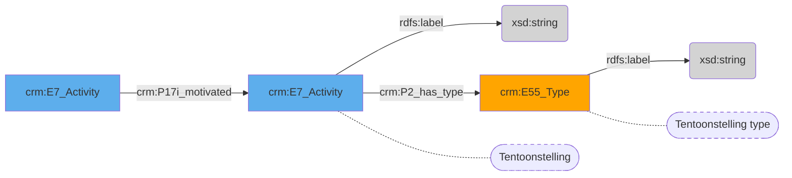

```mermaid
graph LR
82ff697e-cc11-11ee-a35c-960002548b4f["crm:E7_Activity"]-->|"rdfs:label"|d380a0a1-cc11-11ee-996f-960002548b4f(xsd:string)
9e1b8a96-edce-11ee-b71a-960002548b4f["crm:E55_Type"]-->|"rdfs:label"|afe177c9-edce-11ee-a1f2-960002548b4f(xsd:string)
82ff697e-cc11-11ee-a35c-960002548b4f["crm:E7_Activity"]-->|"crm:P2_has_type"|9e1b8a96-edce-11ee-b71a-960002548b4f["crm:E55_Type"]
c585cc26-cc05-11ee-876f-960002548b4f["crm:E7_Activity"]-->|"crm:P17i_motivated"|82ff697e-cc11-11ee-a35c-960002548b4f["crm:E7_Activity"]
9e1b8a96-edce-11ee-b71a-960002548b4f["crm:E55_Type"]-.-9e1b8a96-edce-11ee-b71a-960002548b4f_s(["Tentoonstelling type"])
82ff697e-cc11-11ee-a35c-960002548b4f["crm:E7_Activity"]-.-82ff697e-cc11-11ee-a35c-960002548b4f_s(["Tentoonstelling"])
style 9e1b8a96-edce-11ee-b71a-960002548b4f_s stroke-dasharray: 5
style 82ff697e-cc11-11ee-a35c-960002548b4f_s stroke-dasharray: 5
style 82ff697e-cc11-11ee-a35c-960002548b4f fill:#5DAEEC
style 9e1b8a96-edce-11ee-b71a-960002548b4f fill:#ffa500
style afe177c9-edce-11ee-a1f2-960002548b4f fill:#D3D3D3
style c585cc26-cc05-11ee-876f-960002548b4f fill:#5DAEEC
style d380a0a1-cc11-11ee-996f-960002548b4f fill:#D3D3D3
```
