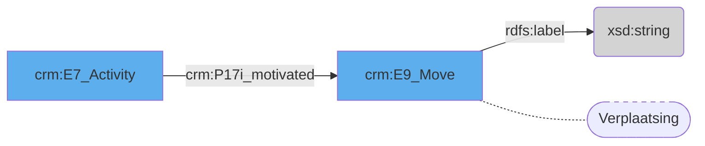

```mermaid
graph LR
20f53b6b-cf25-11ee-ac9b-960002548b4f["crm:E9_Move"]-->|"rdfs:label"|c868f461-edce-11ee-88e3-960002548b4f(xsd:string)
c585cc26-cc05-11ee-876f-960002548b4f["crm:E7_Activity"]-->|"crm:P17i_motivated"|20f53b6b-cf25-11ee-ac9b-960002548b4f["crm:E9_Move"]
20f53b6b-cf25-11ee-ac9b-960002548b4f["crm:E9_Move"]-.-20f53b6b-cf25-11ee-ac9b-960002548b4f_s(["Verplaatsing"])
style 20f53b6b-cf25-11ee-ac9b-960002548b4f_s stroke-dasharray: 5
style 20f53b6b-cf25-11ee-ac9b-960002548b4f fill:#5DAEEC
style c585cc26-cc05-11ee-876f-960002548b4f fill:#5DAEEC
style c868f461-edce-11ee-88e3-960002548b4f fill:#D3D3D3
```
