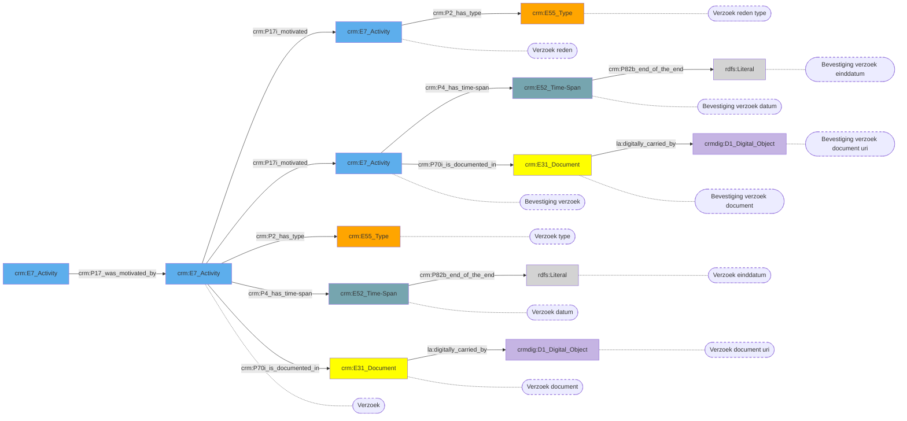

```mermaid
graph LR
style 0de21125-edcd-11ee-b6ec-960002548b4f fill:#ffa500
style 23bbf2df-d7c5-11ee-87c7-960002548b4f fill:#5DAEEC
style 3c375b91-d7c9-11ee-a9fb-960002548b4f fill:#76A5AF
style 3cad9490-d7c7-11ee-a3a3-960002548b4f fill:#5DAEEC
style 49c05ec7-d7c9-11ee-84bc-960002548b4f fill:#D3D3D3
style 63567555-cc10-11ee-9937-960002548b4f fill:#5DAEEC
style 65619c80-d7c7-11ee-9af0-960002548b4f fill:#ffff00
style 67bf14f7-d7c6-11ee-a3d7-960002548b4f fill:#ffa500
style 6b8b4891-d7c9-11ee-bc58-960002548b4f fill:#ffff00
style 7ad9f97f-d7c9-11ee-8f23-960002548b4f fill:#C5B4E3
style 8c64e97c-d7c7-11ee-856b-960002548b4f fill:#C5B4E3
style c585cc26-cc05-11ee-876f-960002548b4f fill:#5DAEEC
style e2fd7e6f-d7c7-11ee-8e64-960002548b4f fill:#76A5AF
style f2564375-d7c7-11ee-ba30-960002548b4f fill:#D3D3D3
3c375b91-d7c9-11ee-a9fb-960002548b4f["crm:E52_Time-Span"]-->|"crm:P82b_end_of_the_end"|49c05ec7-d7c9-11ee-84bc-960002548b4f(rdfs:Literal)
e2fd7e6f-d7c7-11ee-8e64-960002548b4f["crm:E52_Time-Span"]-->|"crm:P82b_end_of_the_end"|f2564375-d7c7-11ee-ba30-960002548b4f(rdfs:Literal)
23bbf2df-d7c5-11ee-87c7-960002548b4f["crm:E7_Activity"]-->|"crm:P2_has_type"|67bf14f7-d7c6-11ee-a3d7-960002548b4f["crm:E55_Type"]
3cad9490-d7c7-11ee-a3a3-960002548b4f["crm:E7_Activity"]-->|"crm:P4_has_time-span"|e2fd7e6f-d7c7-11ee-8e64-960002548b4f["crm:E52_Time-Span"]
3cad9490-d7c7-11ee-a3a3-960002548b4f["crm:E7_Activity"]-->|"crm:P70i_is_documented_in"|65619c80-d7c7-11ee-9af0-960002548b4f["crm:E31_Document"]
63567555-cc10-11ee-9937-960002548b4f["crm:E7_Activity"]-->|"crm:P17i_motivated"|23bbf2df-d7c5-11ee-87c7-960002548b4f["crm:E7_Activity"]
63567555-cc10-11ee-9937-960002548b4f["crm:E7_Activity"]-->|"crm:P17i_motivated"|3cad9490-d7c7-11ee-a3a3-960002548b4f["crm:E7_Activity"]
63567555-cc10-11ee-9937-960002548b4f["crm:E7_Activity"]-->|"crm:P2_has_type"|0de21125-edcd-11ee-b6ec-960002548b4f["crm:E55_Type"]
63567555-cc10-11ee-9937-960002548b4f["crm:E7_Activity"]-->|"crm:P4_has_time-span"|3c375b91-d7c9-11ee-a9fb-960002548b4f["crm:E52_Time-Span"]
63567555-cc10-11ee-9937-960002548b4f["crm:E7_Activity"]-->|"crm:P70i_is_documented_in"|6b8b4891-d7c9-11ee-bc58-960002548b4f["crm:E31_Document"]
65619c80-d7c7-11ee-9af0-960002548b4f["crm:E31_Document"]-->|"la:digitally_carried_by"|8c64e97c-d7c7-11ee-856b-960002548b4f["crmdig:D1_Digital_Object"]
6b8b4891-d7c9-11ee-bc58-960002548b4f["crm:E31_Document"]-->|"la:digitally_carried_by"|7ad9f97f-d7c9-11ee-8f23-960002548b4f["crmdig:D1_Digital_Object"]
c585cc26-cc05-11ee-876f-960002548b4f["crm:E7_Activity"]-->|"crm:P17_was_motivated_by"|63567555-cc10-11ee-9937-960002548b4f["crm:E7_Activity"]
style 67bf14f7-d7c6-11ee-a3d7-960002548b4f_s stroke-dasharray: 5
style 49c05ec7-d7c9-11ee-84bc-960002548b4f_s stroke-dasharray: 5
style e2fd7e6f-d7c7-11ee-8e64-960002548b4f_s stroke-dasharray: 5
style 65619c80-d7c7-11ee-9af0-960002548b4f_s stroke-dasharray: 5
style 23bbf2df-d7c5-11ee-87c7-960002548b4f_s stroke-dasharray: 5
style 3cad9490-d7c7-11ee-a3a3-960002548b4f_s stroke-dasharray: 5
style 0de21125-edcd-11ee-b6ec-960002548b4f_s stroke-dasharray: 5
style 3c375b91-d7c9-11ee-a9fb-960002548b4f_s stroke-dasharray: 5
style 6b8b4891-d7c9-11ee-bc58-960002548b4f_s stroke-dasharray: 5
style 8c64e97c-d7c7-11ee-856b-960002548b4f_s stroke-dasharray: 5
style 7ad9f97f-d7c9-11ee-8f23-960002548b4f_s stroke-dasharray: 5
style 63567555-cc10-11ee-9937-960002548b4f_s stroke-dasharray: 5
style f2564375-d7c7-11ee-ba30-960002548b4f_s stroke-dasharray: 5
67bf14f7-d7c6-11ee-a3d7-960002548b4f["crm:E55_Type"]-.-67bf14f7-d7c6-11ee-a3d7-960002548b4f_s(["Verzoek reden type"])
49c05ec7-d7c9-11ee-84bc-960002548b4f["rdfs:Literal"]-.-49c05ec7-d7c9-11ee-84bc-960002548b4f_s(["Verzoek einddatum"])
e2fd7e6f-d7c7-11ee-8e64-960002548b4f["crm:E52_Time-Span"]-.-e2fd7e6f-d7c7-11ee-8e64-960002548b4f_s(["Bevestiging verzoek datum"])
65619c80-d7c7-11ee-9af0-960002548b4f["crm:E31_Document"]-.-65619c80-d7c7-11ee-9af0-960002548b4f_s(["Bevestiging verzoek document"])
23bbf2df-d7c5-11ee-87c7-960002548b4f["crm:E7_Activity"]-.-23bbf2df-d7c5-11ee-87c7-960002548b4f_s(["Verzoek reden"])
3cad9490-d7c7-11ee-a3a3-960002548b4f["crm:E7_Activity"]-.-3cad9490-d7c7-11ee-a3a3-960002548b4f_s(["Bevestiging verzoek"])
0de21125-edcd-11ee-b6ec-960002548b4f["crm:E55_Type"]-.-0de21125-edcd-11ee-b6ec-960002548b4f_s(["Verzoek type"])
3c375b91-d7c9-11ee-a9fb-960002548b4f["crm:E52_Time-Span"]-.-3c375b91-d7c9-11ee-a9fb-960002548b4f_s(["Verzoek datum"])
6b8b4891-d7c9-11ee-bc58-960002548b4f["crm:E31_Document"]-.-6b8b4891-d7c9-11ee-bc58-960002548b4f_s(["Verzoek document"])
8c64e97c-d7c7-11ee-856b-960002548b4f["crmdig:D1_Digital_Object"]-.-8c64e97c-d7c7-11ee-856b-960002548b4f_s(["Bevestiging verzoek document uri"])
7ad9f97f-d7c9-11ee-8f23-960002548b4f["crmdig:D1_Digital_Object"]-.-7ad9f97f-d7c9-11ee-8f23-960002548b4f_s(["Verzoek document uri"])
63567555-cc10-11ee-9937-960002548b4f["crm:E7_Activity"]-.-63567555-cc10-11ee-9937-960002548b4f_s(["Verzoek"])
f2564375-d7c7-11ee-ba30-960002548b4f["rdfs:Literal"]-.-f2564375-d7c7-11ee-ba30-960002548b4f_s(["Bevestiging verzoek einddatum"])
```
