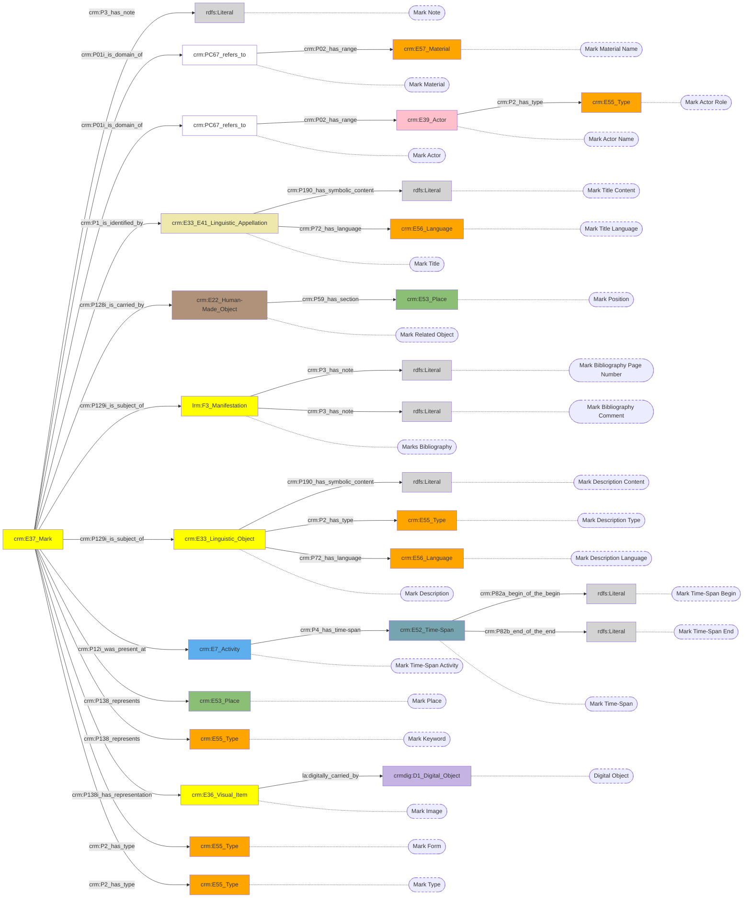

```mermaid
graph LR
style 0281cff0-ca70-11ee-8755-960002548b4f fill:#5DAEEC
style 082c17c3-ca76-11ee-99e6-960002548b4f fill:#ffffff
style 0cf41490-ca73-11ee-bf47-960002548b4f fill:#D3D3D3
style 1a770b2f-ca6a-11ee-8e0d-960002548b4f fill:#ffa500
style 21be6412-ca6b-11ee-be73-960002548b4f fill:#ffa500
style 2b2d0b1a-ca76-11ee-8eb3-960002548b4f fill:#ffa500
style 2ed5a590-ca6e-11ee-99ee-960002548b4f fill:#ffa500
style 4f528283-ca72-11ee-b40c-960002548b4f fill:#ffff00
style 5288cf65-ca6b-11ee-9862-960002548b4f fill:#B0927A
style 52918bea-ca69-11ee-b98e-960002548b4f fill:#ffff00
style 5772435f-ca71-11ee-a86e-960002548b4f fill:#8CBF76
style 58649504-ca73-11ee-a1ae-960002548b4f fill:#ffa500
style 5ae5240b-ca6a-11ee-a9a5-960002548b4f fill:#ffff00
style 7c1edcb3-ca6c-11ee-9280-960002548b4f fill:#ffffff
style 9cd1d5ef-ca6e-11ee-8557-960002548b4f fill:#ffa500
style a626ee40-ca6c-11ee-98e6-960002548b4f fill:#ffc0cb
style aa0d5d9c-ca69-11ee-b573-960002548b4f fill:#EEE8AA
style b4a2ba81-ca71-11ee-b3cf-960002548b4f fill:#ffff00
style b8df2b6b-ca70-11ee-a936-960002548b4f fill:#76A5AF
style bbb6ab27-ca6a-11ee-bb23-960002548b4f fill:#D3D3D3
style c5f9f36e-ca71-11ee-8e46-960002548b4f fill:#C5B4E3
style cca6c450-ca6b-11ee-bd41-960002548b4f fill:#8CBF76
style d729cdc3-ca6f-11ee-b8ca-960002548b4f fill:#D3D3D3
style daa0159b-ca6d-11ee-8620-960002548b4f fill:#ffa500
style dab5662f-ca72-11ee-a844-960002548b4f fill:#D3D3D3
style e9449c8d-ca6a-11ee-b0be-960002548b4f fill:#ffa500
style eaa66deb-ca70-11ee-9b97-960002548b4f fill:#D3D3D3
style ec77afd4-ca69-11ee-87d1-960002548b4f fill:#D3D3D3
style fde5e6e5-ca70-11ee-8e1b-960002548b4f fill:#D3D3D3
4f528283-ca72-11ee-b40c-960002548b4f["lrm:F3_Manifestation"]-->|"crm:P3_has_note"|0cf41490-ca73-11ee-bf47-960002548b4f(rdfs:Literal)
4f528283-ca72-11ee-b40c-960002548b4f["lrm:F3_Manifestation"]-->|"crm:P3_has_note"|dab5662f-ca72-11ee-a844-960002548b4f(rdfs:Literal)
52918bea-ca69-11ee-b98e-960002548b4f["crm:E37_Mark"]-->|"crm:P3_has_note"|d729cdc3-ca6f-11ee-b8ca-960002548b4f(rdfs:Literal)
5ae5240b-ca6a-11ee-a9a5-960002548b4f["crm:E33_Linguistic_Object"]-->|"crm:P190_has_symbolic_content"|bbb6ab27-ca6a-11ee-bb23-960002548b4f(rdfs:Literal)
aa0d5d9c-ca69-11ee-b573-960002548b4f["crm:E33_E41_Linguistic_Appellation"]-->|"crm:P190_has_symbolic_content"|ec77afd4-ca69-11ee-87d1-960002548b4f(rdfs:Literal)
b8df2b6b-ca70-11ee-a936-960002548b4f["crm:E52_Time-Span"]-->|"crm:P82a_begin_of_the_begin"|eaa66deb-ca70-11ee-9b97-960002548b4f(rdfs:Literal)
b8df2b6b-ca70-11ee-a936-960002548b4f["crm:E52_Time-Span"]-->|"crm:P82b_end_of_the_end"|fde5e6e5-ca70-11ee-8e1b-960002548b4f(rdfs:Literal)
0281cff0-ca70-11ee-8755-960002548b4f["crm:E7_Activity"]-->|"crm:P4_has_time-span"|b8df2b6b-ca70-11ee-a936-960002548b4f["crm:E52_Time-Span"]
082c17c3-ca76-11ee-99e6-960002548b4f["crm:PC67_refers_to"]-->|"crm:P02_has_range"|2b2d0b1a-ca76-11ee-8eb3-960002548b4f["crm:E57_Material"]
5288cf65-ca6b-11ee-9862-960002548b4f["crm:E22_Human-Made_Object"]-->|"crm:P59_has_section"|cca6c450-ca6b-11ee-bd41-960002548b4f["crm:E53_Place"]
52918bea-ca69-11ee-b98e-960002548b4f["crm:E37_Mark"]-->|"crm:P01i_is_domain_of"|082c17c3-ca76-11ee-99e6-960002548b4f["crm:PC67_refers_to"]
52918bea-ca69-11ee-b98e-960002548b4f["crm:E37_Mark"]-->|"crm:P01i_is_domain_of"|7c1edcb3-ca6c-11ee-9280-960002548b4f["crm:PC67_refers_to"]
52918bea-ca69-11ee-b98e-960002548b4f["crm:E37_Mark"]-->|"crm:P1_is_identified_by"|aa0d5d9c-ca69-11ee-b573-960002548b4f["crm:E33_E41_Linguistic_Appellation"]
52918bea-ca69-11ee-b98e-960002548b4f["crm:E37_Mark"]-->|"crm:P128i_is_carried_by"|5288cf65-ca6b-11ee-9862-960002548b4f["crm:E22_Human-Made_Object"]
52918bea-ca69-11ee-b98e-960002548b4f["crm:E37_Mark"]-->|"crm:P129i_is_subject_of"|4f528283-ca72-11ee-b40c-960002548b4f["lrm:F3_Manifestation"]
52918bea-ca69-11ee-b98e-960002548b4f["crm:E37_Mark"]-->|"crm:P129i_is_subject_of"|5ae5240b-ca6a-11ee-a9a5-960002548b4f["crm:E33_Linguistic_Object"]
52918bea-ca69-11ee-b98e-960002548b4f["crm:E37_Mark"]-->|"crm:P12i_was_present_at"|0281cff0-ca70-11ee-8755-960002548b4f["crm:E7_Activity"]
52918bea-ca69-11ee-b98e-960002548b4f["crm:E37_Mark"]-->|"crm:P138_represents"|5772435f-ca71-11ee-a86e-960002548b4f["crm:E53_Place"]
52918bea-ca69-11ee-b98e-960002548b4f["crm:E37_Mark"]-->|"crm:P138_represents"|9cd1d5ef-ca6e-11ee-8557-960002548b4f["crm:E55_Type"]
52918bea-ca69-11ee-b98e-960002548b4f["crm:E37_Mark"]-->|"crm:P138i_has_representation"|b4a2ba81-ca71-11ee-b3cf-960002548b4f["crm:E36_Visual_Item"]
52918bea-ca69-11ee-b98e-960002548b4f["crm:E37_Mark"]-->|"crm:P2_has_type"|2ed5a590-ca6e-11ee-99ee-960002548b4f["crm:E55_Type"]
52918bea-ca69-11ee-b98e-960002548b4f["crm:E37_Mark"]-->|"crm:P2_has_type"|daa0159b-ca6d-11ee-8620-960002548b4f["crm:E55_Type"]
5ae5240b-ca6a-11ee-a9a5-960002548b4f["crm:E33_Linguistic_Object"]-->|"crm:P2_has_type"|e9449c8d-ca6a-11ee-b0be-960002548b4f["crm:E55_Type"]
5ae5240b-ca6a-11ee-a9a5-960002548b4f["crm:E33_Linguistic_Object"]-->|"crm:P72_has_language"|21be6412-ca6b-11ee-be73-960002548b4f["crm:E56_Language"]
7c1edcb3-ca6c-11ee-9280-960002548b4f["crm:PC67_refers_to"]-->|"crm:P02_has_range"|a626ee40-ca6c-11ee-98e6-960002548b4f["crm:E39_Actor"]
a626ee40-ca6c-11ee-98e6-960002548b4f["crm:E39_Actor"]-->|"crm:P2_has_type"|58649504-ca73-11ee-a1ae-960002548b4f["crm:E55_Type"]
aa0d5d9c-ca69-11ee-b573-960002548b4f["crm:E33_E41_Linguistic_Appellation"]-->|"crm:P72_has_language"|1a770b2f-ca6a-11ee-8e0d-960002548b4f["crm:E56_Language"]
b4a2ba81-ca71-11ee-b3cf-960002548b4f["crm:E36_Visual_Item"]-->|"la:digitally_carried_by"|c5f9f36e-ca71-11ee-8e46-960002548b4f["crmdig:D1_Digital_Object"]
b8df2b6b-ca70-11ee-a936-960002548b4f["crm:E52_Time-Span"]-.-b8df2b6b-ca70-11ee-a936-960002548b4f_s(["Mark Time-Span"])
2b2d0b1a-ca76-11ee-8eb3-960002548b4f["crm:E57_Material"]-.-2b2d0b1a-ca76-11ee-8eb3-960002548b4f_s(["Mark Material Name"])
0cf41490-ca73-11ee-bf47-960002548b4f["rdfs:Literal"]-.-0cf41490-ca73-11ee-bf47-960002548b4f_s(["Mark Bibliography Page Number"])
dab5662f-ca72-11ee-a844-960002548b4f["rdfs:Literal"]-.-dab5662f-ca72-11ee-a844-960002548b4f_s(["Mark Bibliography Comment"])
cca6c450-ca6b-11ee-bd41-960002548b4f["crm:E53_Place"]-.-cca6c450-ca6b-11ee-bd41-960002548b4f_s(["Mark Position"])
082c17c3-ca76-11ee-99e6-960002548b4f["crm:PC67_refers_to"]-.-082c17c3-ca76-11ee-99e6-960002548b4f_s(["Mark Material"])
7c1edcb3-ca6c-11ee-9280-960002548b4f["crm:PC67_refers_to"]-.-7c1edcb3-ca6c-11ee-9280-960002548b4f_s(["Mark Actor"])
aa0d5d9c-ca69-11ee-b573-960002548b4f["crm:E33_E41_Linguistic_Appellation"]-.-aa0d5d9c-ca69-11ee-b573-960002548b4f_s(["Mark Title"])
5288cf65-ca6b-11ee-9862-960002548b4f["crm:E22_Human-Made_Object"]-.-5288cf65-ca6b-11ee-9862-960002548b4f_s(["Mark Related Object"])
4f528283-ca72-11ee-b40c-960002548b4f["lrm:F3_Manifestation"]-.-4f528283-ca72-11ee-b40c-960002548b4f_s(["Marks Bibliography"])
5ae5240b-ca6a-11ee-a9a5-960002548b4f["crm:E33_Linguistic_Object"]-.-5ae5240b-ca6a-11ee-a9a5-960002548b4f_s(["Mark Description"])
0281cff0-ca70-11ee-8755-960002548b4f["crm:E7_Activity"]-.-0281cff0-ca70-11ee-8755-960002548b4f_s(["Mark Time-Span Activity"])
5772435f-ca71-11ee-a86e-960002548b4f["crm:E53_Place"]-.-5772435f-ca71-11ee-a86e-960002548b4f_s(["Mark Place"])
9cd1d5ef-ca6e-11ee-8557-960002548b4f["crm:E55_Type"]-.-9cd1d5ef-ca6e-11ee-8557-960002548b4f_s(["Mark Keyword"])
b4a2ba81-ca71-11ee-b3cf-960002548b4f["crm:E36_Visual_Item"]-.-b4a2ba81-ca71-11ee-b3cf-960002548b4f_s(["Mark Image"])
2ed5a590-ca6e-11ee-99ee-960002548b4f["crm:E55_Type"]-.-2ed5a590-ca6e-11ee-99ee-960002548b4f_s(["Mark Form"])
daa0159b-ca6d-11ee-8620-960002548b4f["crm:E55_Type"]-.-daa0159b-ca6d-11ee-8620-960002548b4f_s(["Mark Type"])
d729cdc3-ca6f-11ee-b8ca-960002548b4f["rdfs:Literal"]-.-d729cdc3-ca6f-11ee-b8ca-960002548b4f_s(["Mark Note"])
bbb6ab27-ca6a-11ee-bb23-960002548b4f["rdfs:Literal"]-.-bbb6ab27-ca6a-11ee-bb23-960002548b4f_s(["Mark Description Content"])
e9449c8d-ca6a-11ee-b0be-960002548b4f["crm:E55_Type"]-.-e9449c8d-ca6a-11ee-b0be-960002548b4f_s(["Mark Description Type"])
21be6412-ca6b-11ee-be73-960002548b4f["crm:E56_Language"]-.-21be6412-ca6b-11ee-be73-960002548b4f_s(["Mark Description Language"])
a626ee40-ca6c-11ee-98e6-960002548b4f["crm:E39_Actor"]-.-a626ee40-ca6c-11ee-98e6-960002548b4f_s(["Mark Actor Name"])
58649504-ca73-11ee-a1ae-960002548b4f["crm:E55_Type"]-.-58649504-ca73-11ee-a1ae-960002548b4f_s(["Mark Actor Role"])
ec77afd4-ca69-11ee-87d1-960002548b4f["rdfs:Literal"]-.-ec77afd4-ca69-11ee-87d1-960002548b4f_s(["Mark Title Content"])
1a770b2f-ca6a-11ee-8e0d-960002548b4f["crm:E56_Language"]-.-1a770b2f-ca6a-11ee-8e0d-960002548b4f_s(["Mark Title Language"])
c5f9f36e-ca71-11ee-8e46-960002548b4f["crmdig:D1_Digital_Object"]-.-c5f9f36e-ca71-11ee-8e46-960002548b4f_s(["Digital Object"])
eaa66deb-ca70-11ee-9b97-960002548b4f["rdfs:Literal"]-.-eaa66deb-ca70-11ee-9b97-960002548b4f_s(["Mark Time-Span Begin"])
fde5e6e5-ca70-11ee-8e1b-960002548b4f["rdfs:Literal"]-.-fde5e6e5-ca70-11ee-8e1b-960002548b4f_s(["Mark Time-Span End"])
style b8df2b6b-ca70-11ee-a936-960002548b4f_s stroke-dasharray: 5
style 2b2d0b1a-ca76-11ee-8eb3-960002548b4f_s stroke-dasharray: 5
style 0cf41490-ca73-11ee-bf47-960002548b4f_s stroke-dasharray: 5
style dab5662f-ca72-11ee-a844-960002548b4f_s stroke-dasharray: 5
style cca6c450-ca6b-11ee-bd41-960002548b4f_s stroke-dasharray: 5
style 082c17c3-ca76-11ee-99e6-960002548b4f_s stroke-dasharray: 5
style 7c1edcb3-ca6c-11ee-9280-960002548b4f_s stroke-dasharray: 5
style aa0d5d9c-ca69-11ee-b573-960002548b4f_s stroke-dasharray: 5
style 5288cf65-ca6b-11ee-9862-960002548b4f_s stroke-dasharray: 5
style 4f528283-ca72-11ee-b40c-960002548b4f_s stroke-dasharray: 5
style 5ae5240b-ca6a-11ee-a9a5-960002548b4f_s stroke-dasharray: 5
style 0281cff0-ca70-11ee-8755-960002548b4f_s stroke-dasharray: 5
style 5772435f-ca71-11ee-a86e-960002548b4f_s stroke-dasharray: 5
style 9cd1d5ef-ca6e-11ee-8557-960002548b4f_s stroke-dasharray: 5
style b4a2ba81-ca71-11ee-b3cf-960002548b4f_s stroke-dasharray: 5
style 2ed5a590-ca6e-11ee-99ee-960002548b4f_s stroke-dasharray: 5
style daa0159b-ca6d-11ee-8620-960002548b4f_s stroke-dasharray: 5
style d729cdc3-ca6f-11ee-b8ca-960002548b4f_s stroke-dasharray: 5
style bbb6ab27-ca6a-11ee-bb23-960002548b4f_s stroke-dasharray: 5
style e9449c8d-ca6a-11ee-b0be-960002548b4f_s stroke-dasharray: 5
style 21be6412-ca6b-11ee-be73-960002548b4f_s stroke-dasharray: 5
style a626ee40-ca6c-11ee-98e6-960002548b4f_s stroke-dasharray: 5
style 58649504-ca73-11ee-a1ae-960002548b4f_s stroke-dasharray: 5
style ec77afd4-ca69-11ee-87d1-960002548b4f_s stroke-dasharray: 5
style 1a770b2f-ca6a-11ee-8e0d-960002548b4f_s stroke-dasharray: 5
style c5f9f36e-ca71-11ee-8e46-960002548b4f_s stroke-dasharray: 5
style eaa66deb-ca70-11ee-9b97-960002548b4f_s stroke-dasharray: 5
style fde5e6e5-ca70-11ee-8e1b-960002548b4f_s stroke-dasharray: 5
```
