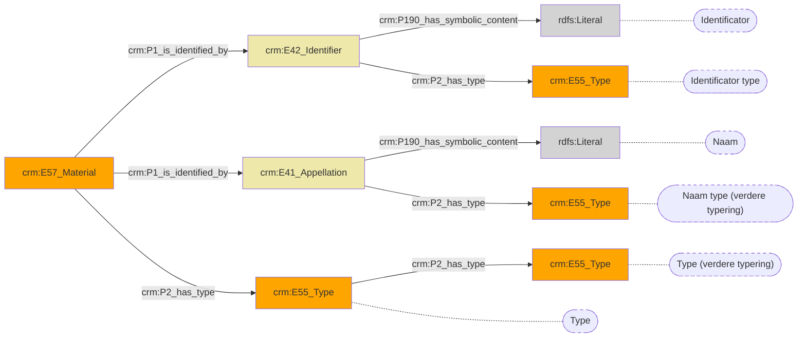

```mermaid
graph LR
style 275c6044-18ef-11ef-bd54-960002548b4f fill:#ffa500
style 987e07ec-18ef-11ef-9508-960002548b4f fill:#EEE8AA
style 987e0f99-18ef-11ef-a4de-960002548b4f fill:#D3D3D3
style 987e10df-18ef-11ef-b762-960002548b4f fill:#ffa500
style a5cbd1bf-18ef-11ef-afcd-960002548b4f fill:#EEE8AA
style a5cbd3df-18ef-11ef-ab89-960002548b4f fill:#ffa500
style a5cbd517-18ef-11ef-afb9-960002548b4f fill:#D3D3D3
style c4b4a9b4-18ef-11ef-98b2-960002548b4f fill:#ffa500
style c4b4adad-18ef-11ef-99aa-960002548b4f fill:#ffa500
987e07ec-18ef-11ef-9508-960002548b4f["crm:E42_Identifier"]-->|"crm:P190_has_symbolic_content"|987e0f99-18ef-11ef-a4de-960002548b4f(rdfs:Literal)
a5cbd1bf-18ef-11ef-afcd-960002548b4f["crm:E41_Appellation"]-->|"crm:P190_has_symbolic_content"|a5cbd517-18ef-11ef-afb9-960002548b4f(rdfs:Literal)
style c4b4a9b4-18ef-11ef-98b2-960002548b4f_s stroke-dasharray: 5
style 987e0f99-18ef-11ef-a4de-960002548b4f_s stroke-dasharray: 5
style 987e10df-18ef-11ef-b762-960002548b4f_s stroke-dasharray: 5
style a5cbd517-18ef-11ef-afb9-960002548b4f_s stroke-dasharray: 5
style a5cbd3df-18ef-11ef-ab89-960002548b4f_s stroke-dasharray: 5
style c4b4adad-18ef-11ef-99aa-960002548b4f_s stroke-dasharray: 5
c4b4a9b4-18ef-11ef-98b2-960002548b4f["crm:E55_Type"]-.-c4b4a9b4-18ef-11ef-98b2-960002548b4f_s(["Type"])
987e0f99-18ef-11ef-a4de-960002548b4f["rdfs:Literal"]-.-987e0f99-18ef-11ef-a4de-960002548b4f_s(["Identificator"])
987e10df-18ef-11ef-b762-960002548b4f["crm:E55_Type"]-.-987e10df-18ef-11ef-b762-960002548b4f_s(["Identificator type"])
a5cbd517-18ef-11ef-afb9-960002548b4f["rdfs:Literal"]-.-a5cbd517-18ef-11ef-afb9-960002548b4f_s(["Naam"])
a5cbd3df-18ef-11ef-ab89-960002548b4f["crm:E55_Type"]-.-a5cbd3df-18ef-11ef-ab89-960002548b4f_s(["Naam type (verdere typering)"])
c4b4adad-18ef-11ef-99aa-960002548b4f["crm:E55_Type"]-.-c4b4adad-18ef-11ef-99aa-960002548b4f_s(["Type (verdere typering)"])
275c6044-18ef-11ef-bd54-960002548b4f["crm:E57_Material"]-->|"crm:P1_is_identified_by"|987e07ec-18ef-11ef-9508-960002548b4f["crm:E42_Identifier"]
275c6044-18ef-11ef-bd54-960002548b4f["crm:E57_Material"]-->|"crm:P1_is_identified_by"|a5cbd1bf-18ef-11ef-afcd-960002548b4f["crm:E41_Appellation"]
275c6044-18ef-11ef-bd54-960002548b4f["crm:E57_Material"]-->|"crm:P2_has_type"|c4b4a9b4-18ef-11ef-98b2-960002548b4f["crm:E55_Type"]
987e07ec-18ef-11ef-9508-960002548b4f["crm:E42_Identifier"]-->|"crm:P2_has_type"|987e10df-18ef-11ef-b762-960002548b4f["crm:E55_Type"]
a5cbd1bf-18ef-11ef-afcd-960002548b4f["crm:E41_Appellation"]-->|"crm:P2_has_type"|a5cbd3df-18ef-11ef-ab89-960002548b4f["crm:E55_Type"]
c4b4a9b4-18ef-11ef-98b2-960002548b4f["crm:E55_Type"]-->|"crm:P2_has_type"|c4b4adad-18ef-11ef-99aa-960002548b4f["crm:E55_Type"]
```
