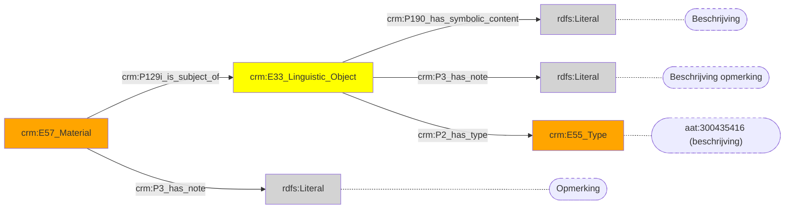

```mermaid
graph LR
style 275c6044-18ef-11ef-bd54-960002548b4f fill:#ffa500
style 4a515bd2-18ef-11ef-863f-960002548b4f fill:#ffff00
style 4a516111-18ef-11ef-b67e-960002548b4f fill:#D3D3D3
style 4a516548-18ef-11ef-b0a7-960002548b4f fill:#D3D3D3
style 4a5167fe-18ef-11ef-9567-960002548b4f fill:#ffa500
style b249c5d0-18ef-11ef-83f5-960002548b4f fill:#D3D3D3
275c6044-18ef-11ef-bd54-960002548b4f["crm:E57_Material"]-->|"crm:P3_has_note"|b249c5d0-18ef-11ef-83f5-960002548b4f(rdfs:Literal)
4a515bd2-18ef-11ef-863f-960002548b4f["crm:E33_Linguistic_Object"]-->|"crm:P190_has_symbolic_content"|4a516548-18ef-11ef-b0a7-960002548b4f(rdfs:Literal)
4a515bd2-18ef-11ef-863f-960002548b4f["crm:E33_Linguistic_Object"]-->|"crm:P3_has_note"|4a516111-18ef-11ef-b67e-960002548b4f(rdfs:Literal)
style b249c5d0-18ef-11ef-83f5-960002548b4f_s stroke-dasharray: 5
style 4a516548-18ef-11ef-b0a7-960002548b4f_s stroke-dasharray: 5
style 4a5167fe-18ef-11ef-9567-960002548b4f_s stroke-dasharray: 5
style 4a516111-18ef-11ef-b67e-960002548b4f_s stroke-dasharray: 5
b249c5d0-18ef-11ef-83f5-960002548b4f["rdfs:Literal"]-.-b249c5d0-18ef-11ef-83f5-960002548b4f_s(["Opmerking"])
4a516548-18ef-11ef-b0a7-960002548b4f["rdfs:Literal"]-.-4a516548-18ef-11ef-b0a7-960002548b4f_s(["Beschrijving"])
4a5167fe-18ef-11ef-9567-960002548b4f["crm:E55_Type"]-.-4a5167fe-18ef-11ef-9567-960002548b4f_s(["aat:300435416 (beschrijving)"])
4a516111-18ef-11ef-b67e-960002548b4f["rdfs:Literal"]-.-4a516111-18ef-11ef-b67e-960002548b4f_s(["Beschrijving opmerking"])
275c6044-18ef-11ef-bd54-960002548b4f["crm:E57_Material"]-->|"crm:P129i_is_subject_of"|4a515bd2-18ef-11ef-863f-960002548b4f["crm:E33_Linguistic_Object"]
4a515bd2-18ef-11ef-863f-960002548b4f["crm:E33_Linguistic_Object"]-->|"crm:P2_has_type"|4a5167fe-18ef-11ef-9567-960002548b4f["crm:E55_Type"]
```
