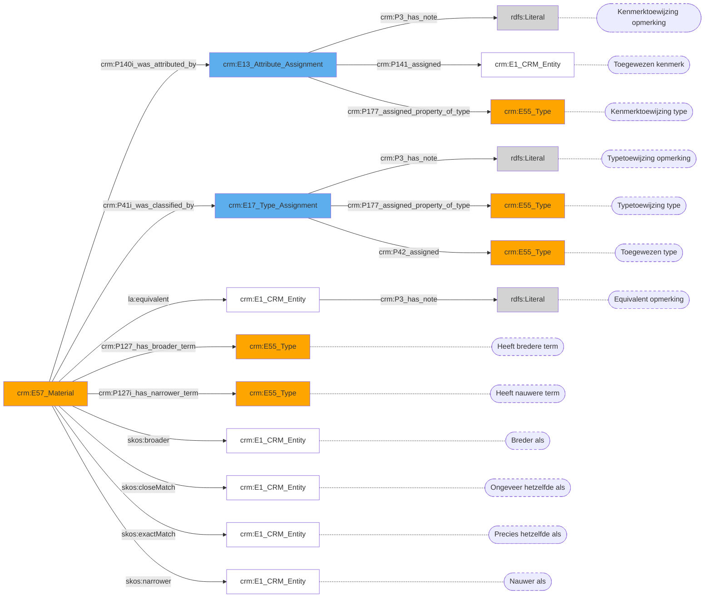

```mermaid
graph LR
style 275c6044-18ef-11ef-bd54-960002548b4f fill:#ffa500
style 39614b51-18ef-11ef-9a0b-960002548b4f fill:#5DAEEC
style 3961509a-18ef-11ef-8818-960002548b4f fill:#ffa500
style 39615232-18ef-11ef-8dd9-960002548b4f fill:#ffffff
style 39615379-18ef-11ef-826c-960002548b4f fill:#D3D3D3
style 571fa75e-18ef-11ef-9850-960002548b4f fill:#ffffff
style 571fac45-18ef-11ef-8e84-960002548b4f fill:#D3D3D3
style 6d2a9dcb-18ef-11ef-91db-960002548b4f fill:#ffa500
style 7833346e-18ef-11ef-90a5-960002548b4f fill:#ffa500
style 8672b0ee-1dad-11ef-8738-960002548b4f fill:#ffffff
style 8d709f84-1dad-11ef-a392-960002548b4f fill:#ffffff
style 9271a21e-1dad-11ef-928b-960002548b4f fill:#ffffff
style 97ccb9f3-1dad-11ef-8f43-960002548b4f fill:#ffffff
style d41d2e0e-18ef-11ef-9d29-960002548b4f fill:#5DAEEC
style d41d3386-18ef-11ef-8150-960002548b4f fill:#ffa500
style d41d3522-18ef-11ef-91ac-960002548b4f fill:#ffa500
style d41d38c7-18ef-11ef-a594-960002548b4f fill:#D3D3D3
39614b51-18ef-11ef-9a0b-960002548b4f["crm:E13_Attribute_Assignment"]-->|"crm:P3_has_note"|39615379-18ef-11ef-826c-960002548b4f(rdfs:Literal)
571fa75e-18ef-11ef-9850-960002548b4f["crm:E1_CRM_Entity"]-->|"crm:P3_has_note"|571fac45-18ef-11ef-8e84-960002548b4f(rdfs:Literal)
d41d2e0e-18ef-11ef-9d29-960002548b4f["crm:E17_Type_Assignment"]-->|"crm:P3_has_note"|d41d38c7-18ef-11ef-a594-960002548b4f(rdfs:Literal)
style 6d2a9dcb-18ef-11ef-91db-960002548b4f_s stroke-dasharray: 5
style 7833346e-18ef-11ef-90a5-960002548b4f_s stroke-dasharray: 5
style 8672b0ee-1dad-11ef-8738-960002548b4f_s stroke-dasharray: 5
style 8d709f84-1dad-11ef-a392-960002548b4f_s stroke-dasharray: 5
style 9271a21e-1dad-11ef-928b-960002548b4f_s stroke-dasharray: 5
style 97ccb9f3-1dad-11ef-8f43-960002548b4f_s stroke-dasharray: 5
style 39615232-18ef-11ef-8dd9-960002548b4f_s stroke-dasharray: 5
style 3961509a-18ef-11ef-8818-960002548b4f_s stroke-dasharray: 5
style 39615379-18ef-11ef-826c-960002548b4f_s stroke-dasharray: 5
style 571fac45-18ef-11ef-8e84-960002548b4f_s stroke-dasharray: 5
style d41d3386-18ef-11ef-8150-960002548b4f_s stroke-dasharray: 5
style d41d38c7-18ef-11ef-a594-960002548b4f_s stroke-dasharray: 5
style d41d3522-18ef-11ef-91ac-960002548b4f_s stroke-dasharray: 5
6d2a9dcb-18ef-11ef-91db-960002548b4f["crm:E55_Type"]-.-6d2a9dcb-18ef-11ef-91db-960002548b4f_s(["Heeft bredere term"])
7833346e-18ef-11ef-90a5-960002548b4f["crm:E55_Type"]-.-7833346e-18ef-11ef-90a5-960002548b4f_s(["Heeft nauwere term"])
8672b0ee-1dad-11ef-8738-960002548b4f["crm:E1_CRM_Entity"]-.-8672b0ee-1dad-11ef-8738-960002548b4f_s(["Breder als"])
8d709f84-1dad-11ef-a392-960002548b4f["crm:E1_CRM_Entity"]-.-8d709f84-1dad-11ef-a392-960002548b4f_s(["Ongeveer hetzelfde als"])
9271a21e-1dad-11ef-928b-960002548b4f["crm:E1_CRM_Entity"]-.-9271a21e-1dad-11ef-928b-960002548b4f_s(["Precies hetzelfde als"])
97ccb9f3-1dad-11ef-8f43-960002548b4f["crm:E1_CRM_Entity"]-.-97ccb9f3-1dad-11ef-8f43-960002548b4f_s(["Nauwer als"])
39615232-18ef-11ef-8dd9-960002548b4f["crm:E1_CRM_Entity"]-.-39615232-18ef-11ef-8dd9-960002548b4f_s(["Toegewezen kenmerk"])
3961509a-18ef-11ef-8818-960002548b4f["crm:E55_Type"]-.-3961509a-18ef-11ef-8818-960002548b4f_s(["Kenmerktoewijzing type"])
39615379-18ef-11ef-826c-960002548b4f["rdfs:Literal"]-.-39615379-18ef-11ef-826c-960002548b4f_s(["Kenmerktoewijzing opmerking"])
571fac45-18ef-11ef-8e84-960002548b4f["rdfs:Literal"]-.-571fac45-18ef-11ef-8e84-960002548b4f_s(["Equivalent opmerking"])
d41d3386-18ef-11ef-8150-960002548b4f["crm:E55_Type"]-.-d41d3386-18ef-11ef-8150-960002548b4f_s(["Typetoewijzing type"])
d41d38c7-18ef-11ef-a594-960002548b4f["rdfs:Literal"]-.-d41d38c7-18ef-11ef-a594-960002548b4f_s(["Typetoewijzing opmerking"])
d41d3522-18ef-11ef-91ac-960002548b4f["crm:E55_Type"]-.-d41d3522-18ef-11ef-91ac-960002548b4f_s(["Toegewezen type"])
275c6044-18ef-11ef-bd54-960002548b4f["crm:E57_Material"]-->|"crm:P127_has_broader_term"|6d2a9dcb-18ef-11ef-91db-960002548b4f["crm:E55_Type"]
275c6044-18ef-11ef-bd54-960002548b4f["crm:E57_Material"]-->|"crm:P127i_has_narrower_term"|7833346e-18ef-11ef-90a5-960002548b4f["crm:E55_Type"]
275c6044-18ef-11ef-bd54-960002548b4f["crm:E57_Material"]-->|"crm:P140i_was_attributed_by"|39614b51-18ef-11ef-9a0b-960002548b4f["crm:E13_Attribute_Assignment"]
275c6044-18ef-11ef-bd54-960002548b4f["crm:E57_Material"]-->|"crm:P41i_was_classified_by"|d41d2e0e-18ef-11ef-9d29-960002548b4f["crm:E17_Type_Assignment"]
275c6044-18ef-11ef-bd54-960002548b4f["crm:E57_Material"]-->|"skos:broader"|8672b0ee-1dad-11ef-8738-960002548b4f["crm:E1_CRM_Entity"]
275c6044-18ef-11ef-bd54-960002548b4f["crm:E57_Material"]-->|"skos:closeMatch"|8d709f84-1dad-11ef-a392-960002548b4f["crm:E1_CRM_Entity"]
275c6044-18ef-11ef-bd54-960002548b4f["crm:E57_Material"]-->|"skos:exactMatch"|9271a21e-1dad-11ef-928b-960002548b4f["crm:E1_CRM_Entity"]
275c6044-18ef-11ef-bd54-960002548b4f["crm:E57_Material"]-->|"skos:narrower"|97ccb9f3-1dad-11ef-8f43-960002548b4f["crm:E1_CRM_Entity"]
275c6044-18ef-11ef-bd54-960002548b4f["crm:E57_Material"]-->|"la:equivalent"|571fa75e-18ef-11ef-9850-960002548b4f["crm:E1_CRM_Entity"]
39614b51-18ef-11ef-9a0b-960002548b4f["crm:E13_Attribute_Assignment"]-->|"crm:P141_assigned"|39615232-18ef-11ef-8dd9-960002548b4f["crm:E1_CRM_Entity"]
39614b51-18ef-11ef-9a0b-960002548b4f["crm:E13_Attribute_Assignment"]-->|"crm:P177_assigned_property_of_type"|3961509a-18ef-11ef-8818-960002548b4f["crm:E55_Type"]
d41d2e0e-18ef-11ef-9d29-960002548b4f["crm:E17_Type_Assignment"]-->|"crm:P177_assigned_property_of_type"|d41d3386-18ef-11ef-8150-960002548b4f["crm:E55_Type"]
d41d2e0e-18ef-11ef-9d29-960002548b4f["crm:E17_Type_Assignment"]-->|"crm:P42_assigned"|d41d3522-18ef-11ef-91ac-960002548b4f["crm:E55_Type"]
```
