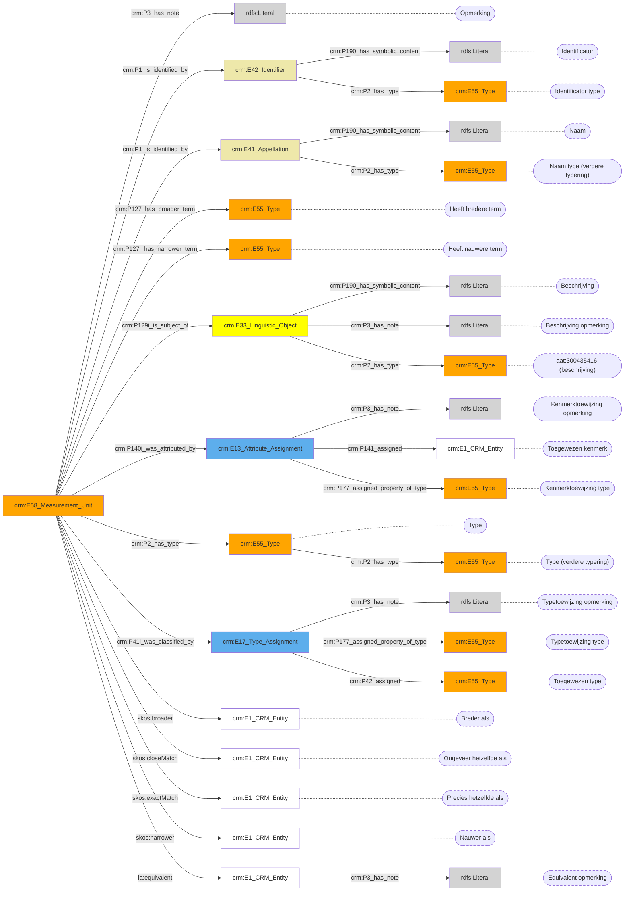

```mermaid
graph LR
style 02f17771-18f0-11ef-8d3e-960002548b4f fill:#5DAEEC
style 02f179b6-18f0-11ef-ba5a-960002548b4f fill:#ffa500
style 02f17a67-18f0-11ef-bd5d-960002548b4f fill:#ffffff
style 02f17ae9-18f0-11ef-a382-960002548b4f fill:#D3D3D3
style 0e843b38-18f0-11ef-abdd-960002548b4f fill:#ffff00
style 0e843f69-18f0-11ef-b4bb-960002548b4f fill:#D3D3D3
style 0e844266-18f0-11ef-ae9f-960002548b4f fill:#D3D3D3
style 0e84451d-18f0-11ef-a15b-960002548b4f fill:#ffa500
style 1d6b4373-18f0-11ef-a2b0-960002548b4f fill:#ffffff
style 1d6b487f-18f0-11ef-9efa-960002548b4f fill:#D3D3D3
style 2a793116-18f0-11ef-88ed-960002548b4f fill:#ffa500
style 359d2a74-18f0-11ef-b1b2-960002548b4f fill:#ffa500
style 441a8580-18f0-11ef-b810-960002548b4f fill:#EEE8AA
style 441a8e18-18f0-11ef-a633-960002548b4f fill:#D3D3D3
style 441a8f6f-18f0-11ef-8d92-960002548b4f fill:#ffa500
style 50395e77-18f0-11ef-9ad4-960002548b4f fill:#EEE8AA
style 5039637c-18f0-11ef-9413-960002548b4f fill:#ffa500
style 503966c6-18f0-11ef-be52-960002548b4f fill:#D3D3D3
style 5ee1afcd-18f0-11ef-9c71-960002548b4f fill:#D3D3D3
style 6ad9d7ca-18f0-11ef-a250-960002548b4f fill:#ffa500
style 6ad9dbfe-18f0-11ef-91f5-960002548b4f fill:#ffa500
style 7e5f262d-18f0-11ef-a7ae-960002548b4f fill:#5DAEEC
style 7e5f29f7-18f0-11ef-97be-960002548b4f fill:#ffa500
style 7e5f2b37-18f0-11ef-ab0d-960002548b4f fill:#ffa500
style 7e5f2e2b-18f0-11ef-aefc-960002548b4f fill:#D3D3D3
style a71d2ee1-1dad-11ef-9cdc-960002548b4f fill:#ffffff
style aea3ba60-1dad-11ef-8eee-960002548b4f fill:#ffffff
style b7e9c426-1dad-11ef-8191-960002548b4f fill:#ffffff
style c3be61b4-1dad-11ef-a8d1-960002548b4f fill:#ffffff
style e890e761-18ef-11ef-9a15-960002548b4f fill:#ffa500
02f17771-18f0-11ef-8d3e-960002548b4f["crm:E13_Attribute_Assignment"]-->|"crm:P3_has_note"|02f17ae9-18f0-11ef-a382-960002548b4f(rdfs:Literal)
0e843b38-18f0-11ef-abdd-960002548b4f["crm:E33_Linguistic_Object"]-->|"crm:P190_has_symbolic_content"|0e844266-18f0-11ef-ae9f-960002548b4f(rdfs:Literal)
0e843b38-18f0-11ef-abdd-960002548b4f["crm:E33_Linguistic_Object"]-->|"crm:P3_has_note"|0e843f69-18f0-11ef-b4bb-960002548b4f(rdfs:Literal)
1d6b4373-18f0-11ef-a2b0-960002548b4f["crm:E1_CRM_Entity"]-->|"crm:P3_has_note"|1d6b487f-18f0-11ef-9efa-960002548b4f(rdfs:Literal)
441a8580-18f0-11ef-b810-960002548b4f["crm:E42_Identifier"]-->|"crm:P190_has_symbolic_content"|441a8e18-18f0-11ef-a633-960002548b4f(rdfs:Literal)
50395e77-18f0-11ef-9ad4-960002548b4f["crm:E41_Appellation"]-->|"crm:P190_has_symbolic_content"|503966c6-18f0-11ef-be52-960002548b4f(rdfs:Literal)
7e5f262d-18f0-11ef-a7ae-960002548b4f["crm:E17_Type_Assignment"]-->|"crm:P3_has_note"|7e5f2e2b-18f0-11ef-aefc-960002548b4f(rdfs:Literal)
e890e761-18ef-11ef-9a15-960002548b4f["crm:E58_Measurement_Unit"]-->|"crm:P3_has_note"|5ee1afcd-18f0-11ef-9c71-960002548b4f(rdfs:Literal)
02f17a67-18f0-11ef-bd5d-960002548b4f["crm:E1_CRM_Entity"]-.-02f17a67-18f0-11ef-bd5d-960002548b4f_s(["Toegewezen kenmerk"])
02f179b6-18f0-11ef-ba5a-960002548b4f["crm:E55_Type"]-.-02f179b6-18f0-11ef-ba5a-960002548b4f_s(["Kenmerktoewijzing type"])
02f17ae9-18f0-11ef-a382-960002548b4f["rdfs:Literal"]-.-02f17ae9-18f0-11ef-a382-960002548b4f_s(["Kenmerktoewijzing opmerking"])
0e844266-18f0-11ef-ae9f-960002548b4f["rdfs:Literal"]-.-0e844266-18f0-11ef-ae9f-960002548b4f_s(["Beschrijving"])
0e84451d-18f0-11ef-a15b-960002548b4f["crm:E55_Type"]-.-0e84451d-18f0-11ef-a15b-960002548b4f_s(["aat:300435416 (beschrijving)"])
0e843f69-18f0-11ef-b4bb-960002548b4f["rdfs:Literal"]-.-0e843f69-18f0-11ef-b4bb-960002548b4f_s(["Beschrijving opmerking"])
1d6b487f-18f0-11ef-9efa-960002548b4f["rdfs:Literal"]-.-1d6b487f-18f0-11ef-9efa-960002548b4f_s(["Equivalent opmerking"])
441a8e18-18f0-11ef-a633-960002548b4f["rdfs:Literal"]-.-441a8e18-18f0-11ef-a633-960002548b4f_s(["Identificator"])
441a8f6f-18f0-11ef-8d92-960002548b4f["crm:E55_Type"]-.-441a8f6f-18f0-11ef-8d92-960002548b4f_s(["Identificator type"])
503966c6-18f0-11ef-be52-960002548b4f["rdfs:Literal"]-.-503966c6-18f0-11ef-be52-960002548b4f_s(["Naam"])
5039637c-18f0-11ef-9413-960002548b4f["crm:E55_Type"]-.-5039637c-18f0-11ef-9413-960002548b4f_s(["Naam type (verdere typering)"])
6ad9dbfe-18f0-11ef-91f5-960002548b4f["crm:E55_Type"]-.-6ad9dbfe-18f0-11ef-91f5-960002548b4f_s(["Type (verdere typering)"])
7e5f29f7-18f0-11ef-97be-960002548b4f["crm:E55_Type"]-.-7e5f29f7-18f0-11ef-97be-960002548b4f_s(["Typetoewijzing type"])
7e5f2e2b-18f0-11ef-aefc-960002548b4f["rdfs:Literal"]-.-7e5f2e2b-18f0-11ef-aefc-960002548b4f_s(["Typetoewijzing opmerking"])
7e5f2b37-18f0-11ef-ab0d-960002548b4f["crm:E55_Type"]-.-7e5f2b37-18f0-11ef-ab0d-960002548b4f_s(["Toegewezen type"])
2a793116-18f0-11ef-88ed-960002548b4f["crm:E55_Type"]-.-2a793116-18f0-11ef-88ed-960002548b4f_s(["Heeft bredere term"])
359d2a74-18f0-11ef-b1b2-960002548b4f["crm:E55_Type"]-.-359d2a74-18f0-11ef-b1b2-960002548b4f_s(["Heeft nauwere term"])
6ad9d7ca-18f0-11ef-a250-960002548b4f["crm:E55_Type"]-.-6ad9d7ca-18f0-11ef-a250-960002548b4f_s(["Type"])
5ee1afcd-18f0-11ef-9c71-960002548b4f["rdfs:Literal"]-.-5ee1afcd-18f0-11ef-9c71-960002548b4f_s(["Opmerking"])
a71d2ee1-1dad-11ef-9cdc-960002548b4f["crm:E1_CRM_Entity"]-.-a71d2ee1-1dad-11ef-9cdc-960002548b4f_s(["Breder als"])
aea3ba60-1dad-11ef-8eee-960002548b4f["crm:E1_CRM_Entity"]-.-aea3ba60-1dad-11ef-8eee-960002548b4f_s(["Ongeveer hetzelfde als"])
b7e9c426-1dad-11ef-8191-960002548b4f["crm:E1_CRM_Entity"]-.-b7e9c426-1dad-11ef-8191-960002548b4f_s(["Precies hetzelfde als"])
c3be61b4-1dad-11ef-a8d1-960002548b4f["crm:E1_CRM_Entity"]-.-c3be61b4-1dad-11ef-a8d1-960002548b4f_s(["Nauwer als"])
02f17771-18f0-11ef-8d3e-960002548b4f["crm:E13_Attribute_Assignment"]-->|"crm:P141_assigned"|02f17a67-18f0-11ef-bd5d-960002548b4f["crm:E1_CRM_Entity"]
02f17771-18f0-11ef-8d3e-960002548b4f["crm:E13_Attribute_Assignment"]-->|"crm:P177_assigned_property_of_type"|02f179b6-18f0-11ef-ba5a-960002548b4f["crm:E55_Type"]
0e843b38-18f0-11ef-abdd-960002548b4f["crm:E33_Linguistic_Object"]-->|"crm:P2_has_type"|0e84451d-18f0-11ef-a15b-960002548b4f["crm:E55_Type"]
441a8580-18f0-11ef-b810-960002548b4f["crm:E42_Identifier"]-->|"crm:P2_has_type"|441a8f6f-18f0-11ef-8d92-960002548b4f["crm:E55_Type"]
50395e77-18f0-11ef-9ad4-960002548b4f["crm:E41_Appellation"]-->|"crm:P2_has_type"|5039637c-18f0-11ef-9413-960002548b4f["crm:E55_Type"]
6ad9d7ca-18f0-11ef-a250-960002548b4f["crm:E55_Type"]-->|"crm:P2_has_type"|6ad9dbfe-18f0-11ef-91f5-960002548b4f["crm:E55_Type"]
7e5f262d-18f0-11ef-a7ae-960002548b4f["crm:E17_Type_Assignment"]-->|"crm:P177_assigned_property_of_type"|7e5f29f7-18f0-11ef-97be-960002548b4f["crm:E55_Type"]
7e5f262d-18f0-11ef-a7ae-960002548b4f["crm:E17_Type_Assignment"]-->|"crm:P42_assigned"|7e5f2b37-18f0-11ef-ab0d-960002548b4f["crm:E55_Type"]
e890e761-18ef-11ef-9a15-960002548b4f["crm:E58_Measurement_Unit"]-->|"crm:P1_is_identified_by"|441a8580-18f0-11ef-b810-960002548b4f["crm:E42_Identifier"]
e890e761-18ef-11ef-9a15-960002548b4f["crm:E58_Measurement_Unit"]-->|"crm:P1_is_identified_by"|50395e77-18f0-11ef-9ad4-960002548b4f["crm:E41_Appellation"]
e890e761-18ef-11ef-9a15-960002548b4f["crm:E58_Measurement_Unit"]-->|"crm:P127_has_broader_term"|2a793116-18f0-11ef-88ed-960002548b4f["crm:E55_Type"]
e890e761-18ef-11ef-9a15-960002548b4f["crm:E58_Measurement_Unit"]-->|"crm:P127i_has_narrower_term"|359d2a74-18f0-11ef-b1b2-960002548b4f["crm:E55_Type"]
e890e761-18ef-11ef-9a15-960002548b4f["crm:E58_Measurement_Unit"]-->|"crm:P129i_is_subject_of"|0e843b38-18f0-11ef-abdd-960002548b4f["crm:E33_Linguistic_Object"]
e890e761-18ef-11ef-9a15-960002548b4f["crm:E58_Measurement_Unit"]-->|"crm:P140i_was_attributed_by"|02f17771-18f0-11ef-8d3e-960002548b4f["crm:E13_Attribute_Assignment"]
e890e761-18ef-11ef-9a15-960002548b4f["crm:E58_Measurement_Unit"]-->|"crm:P2_has_type"|6ad9d7ca-18f0-11ef-a250-960002548b4f["crm:E55_Type"]
e890e761-18ef-11ef-9a15-960002548b4f["crm:E58_Measurement_Unit"]-->|"crm:P41i_was_classified_by"|7e5f262d-18f0-11ef-a7ae-960002548b4f["crm:E17_Type_Assignment"]
e890e761-18ef-11ef-9a15-960002548b4f["crm:E58_Measurement_Unit"]-->|"skos:broader"|a71d2ee1-1dad-11ef-9cdc-960002548b4f["crm:E1_CRM_Entity"]
e890e761-18ef-11ef-9a15-960002548b4f["crm:E58_Measurement_Unit"]-->|"skos:closeMatch"|aea3ba60-1dad-11ef-8eee-960002548b4f["crm:E1_CRM_Entity"]
e890e761-18ef-11ef-9a15-960002548b4f["crm:E58_Measurement_Unit"]-->|"skos:exactMatch"|b7e9c426-1dad-11ef-8191-960002548b4f["crm:E1_CRM_Entity"]
e890e761-18ef-11ef-9a15-960002548b4f["crm:E58_Measurement_Unit"]-->|"skos:narrower"|c3be61b4-1dad-11ef-a8d1-960002548b4f["crm:E1_CRM_Entity"]
e890e761-18ef-11ef-9a15-960002548b4f["crm:E58_Measurement_Unit"]-->|"la:equivalent"|1d6b4373-18f0-11ef-a2b0-960002548b4f["crm:E1_CRM_Entity"]
style 02f17a67-18f0-11ef-bd5d-960002548b4f_s stroke-dasharray: 5
style 02f179b6-18f0-11ef-ba5a-960002548b4f_s stroke-dasharray: 5
style 02f17ae9-18f0-11ef-a382-960002548b4f_s stroke-dasharray: 5
style 0e844266-18f0-11ef-ae9f-960002548b4f_s stroke-dasharray: 5
style 0e84451d-18f0-11ef-a15b-960002548b4f_s stroke-dasharray: 5
style 0e843f69-18f0-11ef-b4bb-960002548b4f_s stroke-dasharray: 5
style 1d6b487f-18f0-11ef-9efa-960002548b4f_s stroke-dasharray: 5
style 441a8e18-18f0-11ef-a633-960002548b4f_s stroke-dasharray: 5
style 441a8f6f-18f0-11ef-8d92-960002548b4f_s stroke-dasharray: 5
style 503966c6-18f0-11ef-be52-960002548b4f_s stroke-dasharray: 5
style 5039637c-18f0-11ef-9413-960002548b4f_s stroke-dasharray: 5
style 6ad9dbfe-18f0-11ef-91f5-960002548b4f_s stroke-dasharray: 5
style 7e5f29f7-18f0-11ef-97be-960002548b4f_s stroke-dasharray: 5
style 7e5f2e2b-18f0-11ef-aefc-960002548b4f_s stroke-dasharray: 5
style 7e5f2b37-18f0-11ef-ab0d-960002548b4f_s stroke-dasharray: 5
style 2a793116-18f0-11ef-88ed-960002548b4f_s stroke-dasharray: 5
style 359d2a74-18f0-11ef-b1b2-960002548b4f_s stroke-dasharray: 5
style 6ad9d7ca-18f0-11ef-a250-960002548b4f_s stroke-dasharray: 5
style 5ee1afcd-18f0-11ef-9c71-960002548b4f_s stroke-dasharray: 5
style a71d2ee1-1dad-11ef-9cdc-960002548b4f_s stroke-dasharray: 5
style aea3ba60-1dad-11ef-8eee-960002548b4f_s stroke-dasharray: 5
style b7e9c426-1dad-11ef-8191-960002548b4f_s stroke-dasharray: 5
style c3be61b4-1dad-11ef-a8d1-960002548b4f_s stroke-dasharray: 5
```
