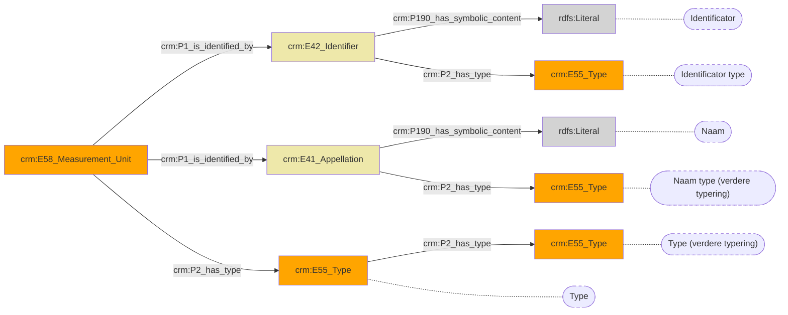

```mermaid
graph LR
style 441a8580-18f0-11ef-b810-960002548b4f fill:#EEE8AA
style 441a8e18-18f0-11ef-a633-960002548b4f fill:#D3D3D3
style 441a8f6f-18f0-11ef-8d92-960002548b4f fill:#ffa500
style 50395e77-18f0-11ef-9ad4-960002548b4f fill:#EEE8AA
style 5039637c-18f0-11ef-9413-960002548b4f fill:#ffa500
style 503966c6-18f0-11ef-be52-960002548b4f fill:#D3D3D3
style 6ad9d7ca-18f0-11ef-a250-960002548b4f fill:#ffa500
style 6ad9dbfe-18f0-11ef-91f5-960002548b4f fill:#ffa500
style e890e761-18ef-11ef-9a15-960002548b4f fill:#ffa500
441a8580-18f0-11ef-b810-960002548b4f["crm:E42_Identifier"]-->|"crm:P190_has_symbolic_content"|441a8e18-18f0-11ef-a633-960002548b4f(rdfs:Literal)
50395e77-18f0-11ef-9ad4-960002548b4f["crm:E41_Appellation"]-->|"crm:P190_has_symbolic_content"|503966c6-18f0-11ef-be52-960002548b4f(rdfs:Literal)
441a8580-18f0-11ef-b810-960002548b4f["crm:E42_Identifier"]-->|"crm:P2_has_type"|441a8f6f-18f0-11ef-8d92-960002548b4f["crm:E55_Type"]
50395e77-18f0-11ef-9ad4-960002548b4f["crm:E41_Appellation"]-->|"crm:P2_has_type"|5039637c-18f0-11ef-9413-960002548b4f["crm:E55_Type"]
6ad9d7ca-18f0-11ef-a250-960002548b4f["crm:E55_Type"]-->|"crm:P2_has_type"|6ad9dbfe-18f0-11ef-91f5-960002548b4f["crm:E55_Type"]
e890e761-18ef-11ef-9a15-960002548b4f["crm:E58_Measurement_Unit"]-->|"crm:P1_is_identified_by"|441a8580-18f0-11ef-b810-960002548b4f["crm:E42_Identifier"]
e890e761-18ef-11ef-9a15-960002548b4f["crm:E58_Measurement_Unit"]-->|"crm:P1_is_identified_by"|50395e77-18f0-11ef-9ad4-960002548b4f["crm:E41_Appellation"]
e890e761-18ef-11ef-9a15-960002548b4f["crm:E58_Measurement_Unit"]-->|"crm:P2_has_type"|6ad9d7ca-18f0-11ef-a250-960002548b4f["crm:E55_Type"]
441a8e18-18f0-11ef-a633-960002548b4f["rdfs:Literal"]-.-441a8e18-18f0-11ef-a633-960002548b4f_s(["Identificator"])
441a8f6f-18f0-11ef-8d92-960002548b4f["crm:E55_Type"]-.-441a8f6f-18f0-11ef-8d92-960002548b4f_s(["Identificator type"])
503966c6-18f0-11ef-be52-960002548b4f["rdfs:Literal"]-.-503966c6-18f0-11ef-be52-960002548b4f_s(["Naam"])
5039637c-18f0-11ef-9413-960002548b4f["crm:E55_Type"]-.-5039637c-18f0-11ef-9413-960002548b4f_s(["Naam type (verdere typering)"])
6ad9dbfe-18f0-11ef-91f5-960002548b4f["crm:E55_Type"]-.-6ad9dbfe-18f0-11ef-91f5-960002548b4f_s(["Type (verdere typering)"])
6ad9d7ca-18f0-11ef-a250-960002548b4f["crm:E55_Type"]-.-6ad9d7ca-18f0-11ef-a250-960002548b4f_s(["Type"])
style 441a8e18-18f0-11ef-a633-960002548b4f_s stroke-dasharray: 5
style 441a8f6f-18f0-11ef-8d92-960002548b4f_s stroke-dasharray: 5
style 503966c6-18f0-11ef-be52-960002548b4f_s stroke-dasharray: 5
style 5039637c-18f0-11ef-9413-960002548b4f_s stroke-dasharray: 5
style 6ad9dbfe-18f0-11ef-91f5-960002548b4f_s stroke-dasharray: 5
style 6ad9d7ca-18f0-11ef-a250-960002548b4f_s stroke-dasharray: 5
```
