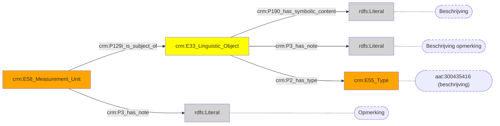

```mermaid
graph LR
style 0e843b38-18f0-11ef-abdd-960002548b4f fill:#ffff00
style 0e843f69-18f0-11ef-b4bb-960002548b4f fill:#D3D3D3
style 0e844266-18f0-11ef-ae9f-960002548b4f fill:#D3D3D3
style 0e84451d-18f0-11ef-a15b-960002548b4f fill:#ffa500
style 5ee1afcd-18f0-11ef-9c71-960002548b4f fill:#D3D3D3
style e890e761-18ef-11ef-9a15-960002548b4f fill:#ffa500
0e843b38-18f0-11ef-abdd-960002548b4f["crm:E33_Linguistic_Object"]-->|"crm:P190_has_symbolic_content"|0e844266-18f0-11ef-ae9f-960002548b4f(rdfs:Literal)
0e843b38-18f0-11ef-abdd-960002548b4f["crm:E33_Linguistic_Object"]-->|"crm:P3_has_note"|0e843f69-18f0-11ef-b4bb-960002548b4f(rdfs:Literal)
e890e761-18ef-11ef-9a15-960002548b4f["crm:E58_Measurement_Unit"]-->|"crm:P3_has_note"|5ee1afcd-18f0-11ef-9c71-960002548b4f(rdfs:Literal)
0e843b38-18f0-11ef-abdd-960002548b4f["crm:E33_Linguistic_Object"]-->|"crm:P2_has_type"|0e84451d-18f0-11ef-a15b-960002548b4f["crm:E55_Type"]
e890e761-18ef-11ef-9a15-960002548b4f["crm:E58_Measurement_Unit"]-->|"crm:P129i_is_subject_of"|0e843b38-18f0-11ef-abdd-960002548b4f["crm:E33_Linguistic_Object"]
style 0e844266-18f0-11ef-ae9f-960002548b4f_s stroke-dasharray: 5
style 0e84451d-18f0-11ef-a15b-960002548b4f_s stroke-dasharray: 5
style 0e843f69-18f0-11ef-b4bb-960002548b4f_s stroke-dasharray: 5
style 5ee1afcd-18f0-11ef-9c71-960002548b4f_s stroke-dasharray: 5
0e844266-18f0-11ef-ae9f-960002548b4f["rdfs:Literal"]-.-0e844266-18f0-11ef-ae9f-960002548b4f_s(["Beschrijving"])
0e84451d-18f0-11ef-a15b-960002548b4f["crm:E55_Type"]-.-0e84451d-18f0-11ef-a15b-960002548b4f_s(["aat:300435416 (beschrijving)"])
0e843f69-18f0-11ef-b4bb-960002548b4f["rdfs:Literal"]-.-0e843f69-18f0-11ef-b4bb-960002548b4f_s(["Beschrijving opmerking"])
5ee1afcd-18f0-11ef-9c71-960002548b4f["rdfs:Literal"]-.-5ee1afcd-18f0-11ef-9c71-960002548b4f_s(["Opmerking"])
```
