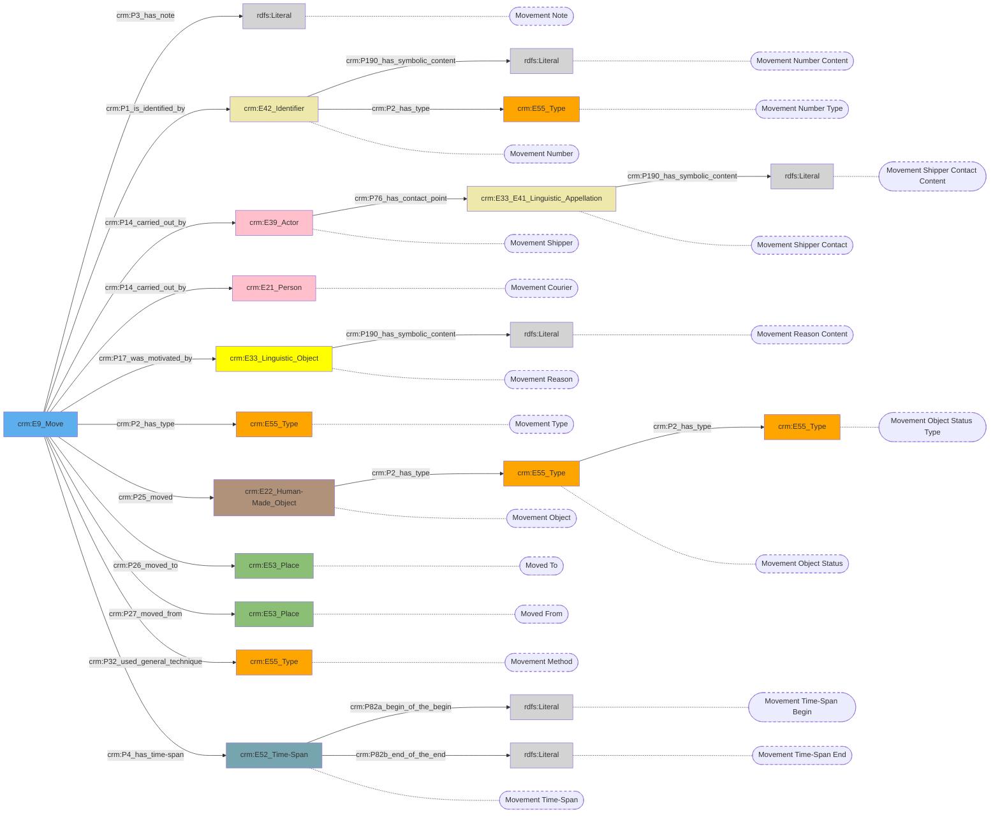

```mermaid
graph LR
style 0492bc97-df8b-11ee-ac5e-960002548b4f fill:#ffa500
style 05a5a5ec-df8c-11ee-9f73-960002548b4f fill:#D3D3D3
style 07fae66c-df8e-11ee-abef-960002548b4f fill:#B0927A
style 12c3f992-df90-11ee-938d-960002548b4f fill:#76A5AF
style 13479975-df8d-11ee-8fce-960002548b4f fill:#ffc0cb
style 5d94063c-df8b-11ee-b9bf-960002548b4f fill:#ffff00
style 65a45816-df8e-11ee-a924-960002548b4f fill:#D3D3D3
style 6f6fbd23-df90-11ee-ba62-960002548b4f fill:#D3D3D3
style 78217701-df8d-11ee-b91d-960002548b4f fill:#ffc0cb
style 7c123008-df91-11ee-acb5-960002548b4f fill:#ffa500
style 7cfe073d-df90-11ee-9e39-960002548b4f fill:#D3D3D3
style 81f7e559-df8a-11ee-ab4e-960002548b4f fill:#5DAEEC
style 90330924-df91-11ee-879a-960002548b4f fill:#ffa500
style a1816db6-df8e-11ee-a1bd-960002548b4f fill:#8CBF76
style afc75bdc-df8a-11ee-9ce2-960002548b4f fill:#EEE8AA
style c20a74b3-df8d-11ee-b48a-960002548b4f fill:#EEE8AA
style c3d55356-df8a-11ee-b5e0-960002548b4f fill:#D3D3D3
style d2e593ea-df8e-11ee-ab47-960002548b4f fill:#8CBF76
style d7e756ce-df8a-11ee-b2f4-960002548b4f fill:#ffa500
style d90ece0e-df90-11ee-8859-960002548b4f fill:#ffa500
style dc9c2b0f-df8d-11ee-8ba5-960002548b4f fill:#D3D3D3
12c3f992-df90-11ee-938d-960002548b4f["crm:E52_Time-Span"]-->|"crm:P82a_begin_of_the_begin"|6f6fbd23-df90-11ee-ba62-960002548b4f(rdfs:Literal)
12c3f992-df90-11ee-938d-960002548b4f["crm:E52_Time-Span"]-->|"crm:P82b_end_of_the_end"|7cfe073d-df90-11ee-9e39-960002548b4f(rdfs:Literal)
5d94063c-df8b-11ee-b9bf-960002548b4f["crm:E33_Linguistic_Object"]-->|"crm:P190_has_symbolic_content"|05a5a5ec-df8c-11ee-9f73-960002548b4f(rdfs:Literal)
81f7e559-df8a-11ee-ab4e-960002548b4f["crm:E9_Move"]-->|"crm:P3_has_note"|65a45816-df8e-11ee-a924-960002548b4f(rdfs:Literal)
afc75bdc-df8a-11ee-9ce2-960002548b4f["crm:E42_Identifier"]-->|"crm:P190_has_symbolic_content"|c3d55356-df8a-11ee-b5e0-960002548b4f(rdfs:Literal)
c20a74b3-df8d-11ee-b48a-960002548b4f["crm:E33_E41_Linguistic_Appellation"]-->|"crm:P190_has_symbolic_content"|dc9c2b0f-df8d-11ee-8ba5-960002548b4f(rdfs:Literal)
07fae66c-df8e-11ee-abef-960002548b4f["crm:E22_Human-Made_Object"]-->|"crm:P2_has_type"|7c123008-df91-11ee-acb5-960002548b4f["crm:E55_Type"]
13479975-df8d-11ee-8fce-960002548b4f["crm:E39_Actor"]-->|"crm:P76_has_contact_point"|c20a74b3-df8d-11ee-b48a-960002548b4f["crm:E33_E41_Linguistic_Appellation"]
7c123008-df91-11ee-acb5-960002548b4f["crm:E55_Type"]-->|"crm:P2_has_type"|90330924-df91-11ee-879a-960002548b4f["crm:E55_Type"]
81f7e559-df8a-11ee-ab4e-960002548b4f["crm:E9_Move"]-->|"crm:P1_is_identified_by"|afc75bdc-df8a-11ee-9ce2-960002548b4f["crm:E42_Identifier"]
81f7e559-df8a-11ee-ab4e-960002548b4f["crm:E9_Move"]-->|"crm:P14_carried_out_by"|13479975-df8d-11ee-8fce-960002548b4f["crm:E39_Actor"]
81f7e559-df8a-11ee-ab4e-960002548b4f["crm:E9_Move"]-->|"crm:P14_carried_out_by"|78217701-df8d-11ee-b91d-960002548b4f["crm:E21_Person"]
81f7e559-df8a-11ee-ab4e-960002548b4f["crm:E9_Move"]-->|"crm:P17_was_motivated_by"|5d94063c-df8b-11ee-b9bf-960002548b4f["crm:E33_Linguistic_Object"]
81f7e559-df8a-11ee-ab4e-960002548b4f["crm:E9_Move"]-->|"crm:P2_has_type"|d90ece0e-df90-11ee-8859-960002548b4f["crm:E55_Type"]
81f7e559-df8a-11ee-ab4e-960002548b4f["crm:E9_Move"]-->|"crm:P25_moved"|07fae66c-df8e-11ee-abef-960002548b4f["crm:E22_Human-Made_Object"]
81f7e559-df8a-11ee-ab4e-960002548b4f["crm:E9_Move"]-->|"crm:P26_moved_to"|d2e593ea-df8e-11ee-ab47-960002548b4f["crm:E53_Place"]
81f7e559-df8a-11ee-ab4e-960002548b4f["crm:E9_Move"]-->|"crm:P27_moved_from"|a1816db6-df8e-11ee-a1bd-960002548b4f["crm:E53_Place"]
81f7e559-df8a-11ee-ab4e-960002548b4f["crm:E9_Move"]-->|"crm:P32_used_general_technique"|0492bc97-df8b-11ee-ac5e-960002548b4f["crm:E55_Type"]
81f7e559-df8a-11ee-ab4e-960002548b4f["crm:E9_Move"]-->|"crm:P4_has_time-span"|12c3f992-df90-11ee-938d-960002548b4f["crm:E52_Time-Span"]
afc75bdc-df8a-11ee-9ce2-960002548b4f["crm:E42_Identifier"]-->|"crm:P2_has_type"|d7e756ce-df8a-11ee-b2f4-960002548b4f["crm:E55_Type"]
7c123008-df91-11ee-acb5-960002548b4f["crm:E55_Type"]-.-7c123008-df91-11ee-acb5-960002548b4f_s(["Movement Object Status"])
6f6fbd23-df90-11ee-ba62-960002548b4f["rdfs:Literal"]-.-6f6fbd23-df90-11ee-ba62-960002548b4f_s(["Movement Time-Span Begin"])
7cfe073d-df90-11ee-9e39-960002548b4f["rdfs:Literal"]-.-7cfe073d-df90-11ee-9e39-960002548b4f_s(["Movement Time-Span End"])
c20a74b3-df8d-11ee-b48a-960002548b4f["crm:E33_E41_Linguistic_Appellation"]-.-c20a74b3-df8d-11ee-b48a-960002548b4f_s(["Movement Shipper Contact"])
05a5a5ec-df8c-11ee-9f73-960002548b4f["rdfs:Literal"]-.-05a5a5ec-df8c-11ee-9f73-960002548b4f_s(["Movement Reason Content"])
90330924-df91-11ee-879a-960002548b4f["crm:E55_Type"]-.-90330924-df91-11ee-879a-960002548b4f_s(["Movement Object Status Type"])
afc75bdc-df8a-11ee-9ce2-960002548b4f["crm:E42_Identifier"]-.-afc75bdc-df8a-11ee-9ce2-960002548b4f_s(["Movement Number"])
13479975-df8d-11ee-8fce-960002548b4f["crm:E39_Actor"]-.-13479975-df8d-11ee-8fce-960002548b4f_s(["Movement Shipper"])
78217701-df8d-11ee-b91d-960002548b4f["crm:E21_Person"]-.-78217701-df8d-11ee-b91d-960002548b4f_s(["Movement Courier"])
5d94063c-df8b-11ee-b9bf-960002548b4f["crm:E33_Linguistic_Object"]-.-5d94063c-df8b-11ee-b9bf-960002548b4f_s(["Movement Reason"])
d90ece0e-df90-11ee-8859-960002548b4f["crm:E55_Type"]-.-d90ece0e-df90-11ee-8859-960002548b4f_s(["Movement Type"])
07fae66c-df8e-11ee-abef-960002548b4f["crm:E22_Human-Made_Object"]-.-07fae66c-df8e-11ee-abef-960002548b4f_s(["Movement Object"])
d2e593ea-df8e-11ee-ab47-960002548b4f["crm:E53_Place"]-.-d2e593ea-df8e-11ee-ab47-960002548b4f_s(["Moved To"])
a1816db6-df8e-11ee-a1bd-960002548b4f["crm:E53_Place"]-.-a1816db6-df8e-11ee-a1bd-960002548b4f_s(["Moved From"])
65a45816-df8e-11ee-a924-960002548b4f["rdfs:Literal"]-.-65a45816-df8e-11ee-a924-960002548b4f_s(["Movement Note"])
0492bc97-df8b-11ee-ac5e-960002548b4f["crm:E55_Type"]-.-0492bc97-df8b-11ee-ac5e-960002548b4f_s(["Movement Method"])
12c3f992-df90-11ee-938d-960002548b4f["crm:E52_Time-Span"]-.-12c3f992-df90-11ee-938d-960002548b4f_s(["Movement Time-Span"])
c3d55356-df8a-11ee-b5e0-960002548b4f["rdfs:Literal"]-.-c3d55356-df8a-11ee-b5e0-960002548b4f_s(["Movement Number Content"])
d7e756ce-df8a-11ee-b2f4-960002548b4f["crm:E55_Type"]-.-d7e756ce-df8a-11ee-b2f4-960002548b4f_s(["Movement Number Type"])
dc9c2b0f-df8d-11ee-8ba5-960002548b4f["rdfs:Literal"]-.-dc9c2b0f-df8d-11ee-8ba5-960002548b4f_s(["Movement Shipper Contact Content"])
style 7c123008-df91-11ee-acb5-960002548b4f_s stroke-dasharray: 5
style 6f6fbd23-df90-11ee-ba62-960002548b4f_s stroke-dasharray: 5
style 7cfe073d-df90-11ee-9e39-960002548b4f_s stroke-dasharray: 5
style c20a74b3-df8d-11ee-b48a-960002548b4f_s stroke-dasharray: 5
style 05a5a5ec-df8c-11ee-9f73-960002548b4f_s stroke-dasharray: 5
style 90330924-df91-11ee-879a-960002548b4f_s stroke-dasharray: 5
style afc75bdc-df8a-11ee-9ce2-960002548b4f_s stroke-dasharray: 5
style 13479975-df8d-11ee-8fce-960002548b4f_s stroke-dasharray: 5
style 78217701-df8d-11ee-b91d-960002548b4f_s stroke-dasharray: 5
style 5d94063c-df8b-11ee-b9bf-960002548b4f_s stroke-dasharray: 5
style d90ece0e-df90-11ee-8859-960002548b4f_s stroke-dasharray: 5
style 07fae66c-df8e-11ee-abef-960002548b4f_s stroke-dasharray: 5
style d2e593ea-df8e-11ee-ab47-960002548b4f_s stroke-dasharray: 5
style a1816db6-df8e-11ee-a1bd-960002548b4f_s stroke-dasharray: 5
style 65a45816-df8e-11ee-a924-960002548b4f_s stroke-dasharray: 5
style 0492bc97-df8b-11ee-ac5e-960002548b4f_s stroke-dasharray: 5
style 12c3f992-df90-11ee-938d-960002548b4f_s stroke-dasharray: 5
style c3d55356-df8a-11ee-b5e0-960002548b4f_s stroke-dasharray: 5
style d7e756ce-df8a-11ee-b2f4-960002548b4f_s stroke-dasharray: 5
style dc9c2b0f-df8d-11ee-8ba5-960002548b4f_s stroke-dasharray: 5
```
