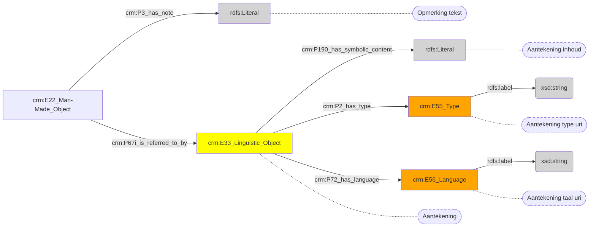

```mermaid
graph LR
5989fdd8-ee3b-11ed-9655-00163e71351b["crm:E33_Linguistic_Object"]-->|"crm:P190_has_symbolic_content"|598a0382-ee3b-11ed-9655-00163e71351b(rdfs:Literal)
598a0170-ee3b-11ed-9655-00163e71351b["crm:E55_Type"]-->|"rdfs:label"|598a054e-ee3b-11ed-9655-00163e71351b(xsd:string)
598a0292-ee3b-11ed-9655-00163e71351b["crm:E56_Language"]-->|"rdfs:label"|598a0468-ee3b-11ed-9655-00163e71351b(xsd:string)
fa95cea2-dd27-11ed-9655-00163e71351b["crm:E22_Man-Made_Object"]-->|"crm:P3_has_note"|f9afbb9e-eda1-11ed-9232-00163e71351b(rdfs:Literal)
5989fdd8-ee3b-11ed-9655-00163e71351b["crm:E33_Linguistic_Object"]-->|"crm:P2_has_type"|598a0170-ee3b-11ed-9655-00163e71351b["crm:E55_Type"]
5989fdd8-ee3b-11ed-9655-00163e71351b["crm:E33_Linguistic_Object"]-->|"crm:P72_has_language"|598a0292-ee3b-11ed-9655-00163e71351b["crm:E56_Language"]
fa95cea2-dd27-11ed-9655-00163e71351b["crm:E22_Man-Made_Object"]-->|"crm:P67i_is_referred_to_by"|5989fdd8-ee3b-11ed-9655-00163e71351b["crm:E33_Linguistic_Object"]
598a0382-ee3b-11ed-9655-00163e71351b["rdfs:Literal"]-.-598a0382-ee3b-11ed-9655-00163e71351b_s(["Aantekening inhoud"])
598a0170-ee3b-11ed-9655-00163e71351b["crm:E55_Type"]-.-598a0170-ee3b-11ed-9655-00163e71351b_s(["Aantekening type uri"])
598a0292-ee3b-11ed-9655-00163e71351b["crm:E56_Language"]-.-598a0292-ee3b-11ed-9655-00163e71351b_s(["Aantekening taal uri"])
f9afbb9e-eda1-11ed-9232-00163e71351b["rdfs:Literal"]-.-f9afbb9e-eda1-11ed-9232-00163e71351b_s(["Opmerking tekst"])
5989fdd8-ee3b-11ed-9655-00163e71351b["crm:E33_Linguistic_Object"]-.-5989fdd8-ee3b-11ed-9655-00163e71351b_s(["Aantekening"])
style 598a0382-ee3b-11ed-9655-00163e71351b_s stroke-dasharray: 5
style 598a0170-ee3b-11ed-9655-00163e71351b_s stroke-dasharray: 5
style 598a0292-ee3b-11ed-9655-00163e71351b_s stroke-dasharray: 5
style f9afbb9e-eda1-11ed-9232-00163e71351b_s stroke-dasharray: 5
style 5989fdd8-ee3b-11ed-9655-00163e71351b_s stroke-dasharray: 5
style 5989fdd8-ee3b-11ed-9655-00163e71351b fill:#ffff00
style 598a0170-ee3b-11ed-9655-00163e71351b fill:#ffa500
style 598a0292-ee3b-11ed-9655-00163e71351b fill:#ffa500
style 598a0382-ee3b-11ed-9655-00163e71351b fill:#D3D3D3
style 598a0468-ee3b-11ed-9655-00163e71351b fill:#D3D3D3
style 598a054e-ee3b-11ed-9655-00163e71351b fill:#D3D3D3
style f9afbb9e-eda1-11ed-9232-00163e71351b fill:#D3D3D3
```
