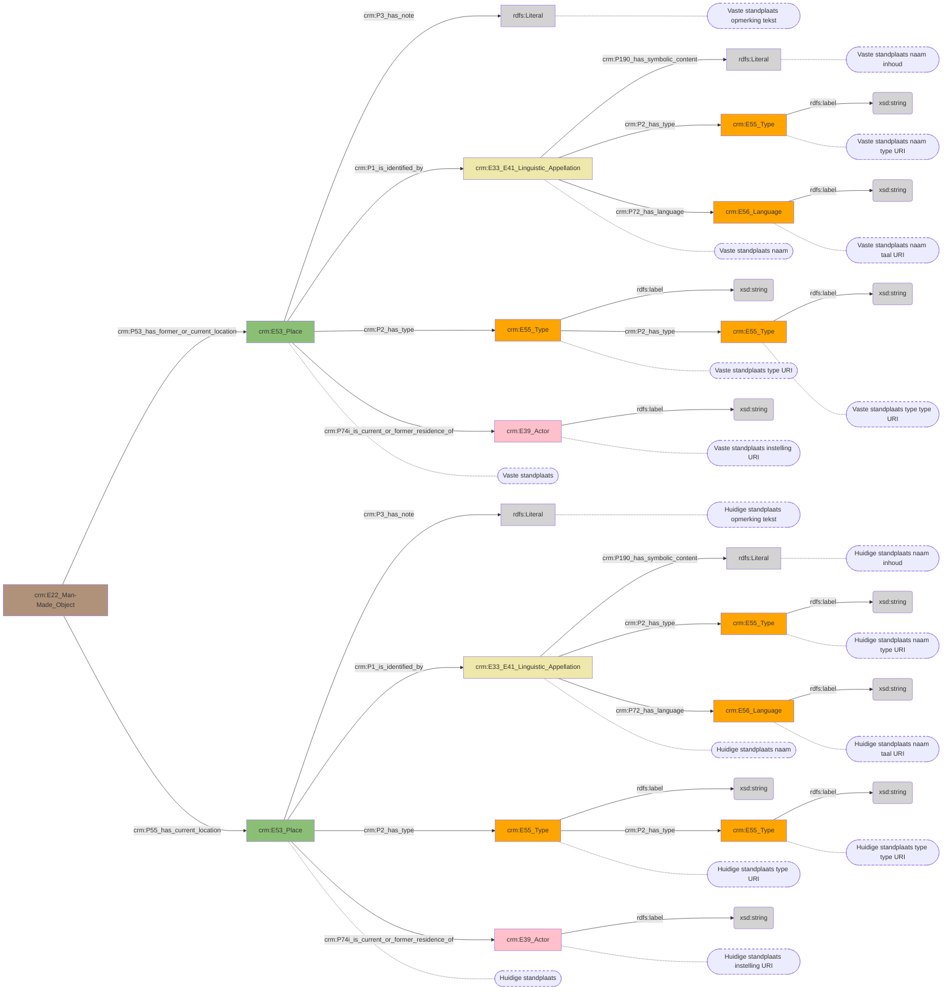

```mermaid
graph LR
5f44d5de-214b-11ee-b0c4-00163e71351b["crm:E55_Type"]-->|"rdfs:label"|5f44df20-214b-11ee-b0c4-00163e71351b(xsd:string)
5f44d9bc-214b-11ee-b0c4-00163e71351b["crm:E53_Place"]-->|"crm:P3_has_note"|5f44e678-214b-11ee-b0c4-00163e71351b(rdfs:Literal)
5f44dc82-214b-11ee-b0c4-00163e71351b["crm:E33_E41_Linguistic_Appellation"]-->|"crm:P190_has_symbolic_content"|5f44ebdc-214b-11ee-b0c4-00163e71351b(rdfs:Literal)
5f44e574-214b-11ee-b0c4-00163e71351b["crm:E55_Type"]-->|"rdfs:label"|5f44e83a-214b-11ee-b0c4-00163e71351b(xsd:string)
5f44e75e-214b-11ee-b0c4-00163e71351b["crm:E39_Actor"]-->|"rdfs:label"|5f44e920-214b-11ee-b0c4-00163e71351b(xsd:string)
5f44ecc2-214b-11ee-b0c4-00163e71351b["crm:E55_Type"]-->|"rdfs:label"|5f44ea10-214b-11ee-b0c4-00163e71351b(xsd:string)
5f44f2b2-214b-11ee-b0c4-00163e71351b["crm:E56_Language"]-->|"rdfs:label"|5f44ed9e-214b-11ee-b0c4-00163e71351b(xsd:string)
aea27566-2149-11ee-bc5c-00163e71351b["crm:E55_Type"]-->|"rdfs:label"|aea27eda-2149-11ee-bc5c-00163e71351b(xsd:string)
aea27944-2149-11ee-bc5c-00163e71351b["crm:E53_Place"]-->|"crm:P3_has_note"|aea280f6-2149-11ee-bc5c-00163e71351b(rdfs:Literal)
aea27c14-2149-11ee-bc5c-00163e71351b["crm:E33_E41_Linguistic_Appellation"]-->|"crm:P190_has_symbolic_content"|aea2865a-2149-11ee-bc5c-00163e71351b(rdfs:Literal)
aea28006-2149-11ee-bc5c-00163e71351b["crm:E55_Type"]-->|"rdfs:label"|aea282cc-2149-11ee-bc5c-00163e71351b(xsd:string)
aea281e6-2149-11ee-bc5c-00163e71351b["crm:E39_Actor"]-->|"rdfs:label"|aea283b2-2149-11ee-bc5c-00163e71351b(xsd:string)
aea28740-2149-11ee-bc5c-00163e71351b["crm:E55_Type"]-->|"rdfs:label"|aea28498-2149-11ee-bc5c-00163e71351b(xsd:string)
aea28d62-2149-11ee-bc5c-00163e71351b["crm:E56_Language"]-->|"rdfs:label"|aea28826-2149-11ee-bc5c-00163e71351b(xsd:string)
5f44d5de-214b-11ee-b0c4-00163e71351b["crm:E55_Type"]-->|"crm:P2_has_type"|5f44e574-214b-11ee-b0c4-00163e71351b["crm:E55_Type"]
5f44d9bc-214b-11ee-b0c4-00163e71351b["crm:E53_Place"]-->|"crm:P1_is_identified_by"|5f44dc82-214b-11ee-b0c4-00163e71351b["crm:E33_E41_Linguistic_Appellation"]
5f44d9bc-214b-11ee-b0c4-00163e71351b["crm:E53_Place"]-->|"crm:P2_has_type"|5f44d5de-214b-11ee-b0c4-00163e71351b["crm:E55_Type"]
5f44d9bc-214b-11ee-b0c4-00163e71351b["crm:E53_Place"]-->|"crm:P74i_is_current_or_former_residence_of"|5f44e75e-214b-11ee-b0c4-00163e71351b["crm:E39_Actor"]
5f44dc82-214b-11ee-b0c4-00163e71351b["crm:E33_E41_Linguistic_Appellation"]-->|"crm:P2_has_type"|5f44ecc2-214b-11ee-b0c4-00163e71351b["crm:E55_Type"]
5f44dc82-214b-11ee-b0c4-00163e71351b["crm:E33_E41_Linguistic_Appellation"]-->|"crm:P72_has_language"|5f44f2b2-214b-11ee-b0c4-00163e71351b["crm:E56_Language"]
aea27566-2149-11ee-bc5c-00163e71351b["crm:E55_Type"]-->|"crm:P2_has_type"|aea28006-2149-11ee-bc5c-00163e71351b["crm:E55_Type"]
aea27944-2149-11ee-bc5c-00163e71351b["crm:E53_Place"]-->|"crm:P1_is_identified_by"|aea27c14-2149-11ee-bc5c-00163e71351b["crm:E33_E41_Linguistic_Appellation"]
aea27944-2149-11ee-bc5c-00163e71351b["crm:E53_Place"]-->|"crm:P2_has_type"|aea27566-2149-11ee-bc5c-00163e71351b["crm:E55_Type"]
aea27944-2149-11ee-bc5c-00163e71351b["crm:E53_Place"]-->|"crm:P74i_is_current_or_former_residence_of"|aea281e6-2149-11ee-bc5c-00163e71351b["crm:E39_Actor"]
aea27c14-2149-11ee-bc5c-00163e71351b["crm:E33_E41_Linguistic_Appellation"]-->|"crm:P2_has_type"|aea28740-2149-11ee-bc5c-00163e71351b["crm:E55_Type"]
aea27c14-2149-11ee-bc5c-00163e71351b["crm:E33_E41_Linguistic_Appellation"]-->|"crm:P72_has_language"|aea28d62-2149-11ee-bc5c-00163e71351b["crm:E56_Language"]
fa95cea2-dd27-11ed-9655-00163e71351b["crm:E22_Man-Made_Object"]-->|"crm:P53_has_former_or_current_location"|aea27944-2149-11ee-bc5c-00163e71351b["crm:E53_Place"]
fa95cea2-dd27-11ed-9655-00163e71351b["crm:E22_Man-Made_Object"]-->|"crm:P55_has_current_location"|5f44d9bc-214b-11ee-b0c4-00163e71351b["crm:E53_Place"]
5f44e574-214b-11ee-b0c4-00163e71351b["crm:E55_Type"]-.-5f44e574-214b-11ee-b0c4-00163e71351b_s(["Huidige standplaats type type URI"])
5f44dc82-214b-11ee-b0c4-00163e71351b["crm:E33_E41_Linguistic_Appellation"]-.-5f44dc82-214b-11ee-b0c4-00163e71351b_s(["Huidige standplaats naam"])
5f44d5de-214b-11ee-b0c4-00163e71351b["crm:E55_Type"]-.-5f44d5de-214b-11ee-b0c4-00163e71351b_s(["Huidige standplaats type URI"])
5f44e678-214b-11ee-b0c4-00163e71351b["rdfs:Literal"]-.-5f44e678-214b-11ee-b0c4-00163e71351b_s(["Huidige standplaats opmerking tekst"])
5f44e75e-214b-11ee-b0c4-00163e71351b["crm:E39_Actor"]-.-5f44e75e-214b-11ee-b0c4-00163e71351b_s(["Huidige standplaats instelling URI"])
5f44ebdc-214b-11ee-b0c4-00163e71351b["rdfs:Literal"]-.-5f44ebdc-214b-11ee-b0c4-00163e71351b_s(["Huidige standplaats naam inhoud"])
5f44ecc2-214b-11ee-b0c4-00163e71351b["crm:E55_Type"]-.-5f44ecc2-214b-11ee-b0c4-00163e71351b_s(["Huidige standplaats naam type URI"])
5f44f2b2-214b-11ee-b0c4-00163e71351b["crm:E56_Language"]-.-5f44f2b2-214b-11ee-b0c4-00163e71351b_s(["Huidige standplaats naam taal URI"])
aea28006-2149-11ee-bc5c-00163e71351b["crm:E55_Type"]-.-aea28006-2149-11ee-bc5c-00163e71351b_s(["Vaste standplaats type type URI"])
aea27c14-2149-11ee-bc5c-00163e71351b["crm:E33_E41_Linguistic_Appellation"]-.-aea27c14-2149-11ee-bc5c-00163e71351b_s(["Vaste standplaats naam"])
aea27566-2149-11ee-bc5c-00163e71351b["crm:E55_Type"]-.-aea27566-2149-11ee-bc5c-00163e71351b_s(["Vaste standplaats type URI"])
aea280f6-2149-11ee-bc5c-00163e71351b["rdfs:Literal"]-.-aea280f6-2149-11ee-bc5c-00163e71351b_s(["Vaste standplaats opmerking tekst"])
aea281e6-2149-11ee-bc5c-00163e71351b["crm:E39_Actor"]-.-aea281e6-2149-11ee-bc5c-00163e71351b_s(["Vaste standplaats instelling URI"])
aea2865a-2149-11ee-bc5c-00163e71351b["rdfs:Literal"]-.-aea2865a-2149-11ee-bc5c-00163e71351b_s(["Vaste standplaats naam inhoud"])
aea28740-2149-11ee-bc5c-00163e71351b["crm:E55_Type"]-.-aea28740-2149-11ee-bc5c-00163e71351b_s(["Vaste standplaats naam type URI"])
aea28d62-2149-11ee-bc5c-00163e71351b["crm:E56_Language"]-.-aea28d62-2149-11ee-bc5c-00163e71351b_s(["Vaste standplaats naam taal URI"])
aea27944-2149-11ee-bc5c-00163e71351b["crm:E53_Place"]-.-aea27944-2149-11ee-bc5c-00163e71351b_s(["Vaste standplaats"])
5f44d9bc-214b-11ee-b0c4-00163e71351b["crm:E53_Place"]-.-5f44d9bc-214b-11ee-b0c4-00163e71351b_s(["Huidige standplaats"])
style 5f44e574-214b-11ee-b0c4-00163e71351b_s stroke-dasharray: 5
style 5f44dc82-214b-11ee-b0c4-00163e71351b_s stroke-dasharray: 5
style 5f44d5de-214b-11ee-b0c4-00163e71351b_s stroke-dasharray: 5
style 5f44e678-214b-11ee-b0c4-00163e71351b_s stroke-dasharray: 5
style 5f44e75e-214b-11ee-b0c4-00163e71351b_s stroke-dasharray: 5
style 5f44ebdc-214b-11ee-b0c4-00163e71351b_s stroke-dasharray: 5
style 5f44ecc2-214b-11ee-b0c4-00163e71351b_s stroke-dasharray: 5
style 5f44f2b2-214b-11ee-b0c4-00163e71351b_s stroke-dasharray: 5
style aea28006-2149-11ee-bc5c-00163e71351b_s stroke-dasharray: 5
style aea27c14-2149-11ee-bc5c-00163e71351b_s stroke-dasharray: 5
style aea27566-2149-11ee-bc5c-00163e71351b_s stroke-dasharray: 5
style aea280f6-2149-11ee-bc5c-00163e71351b_s stroke-dasharray: 5
style aea281e6-2149-11ee-bc5c-00163e71351b_s stroke-dasharray: 5
style aea2865a-2149-11ee-bc5c-00163e71351b_s stroke-dasharray: 5
style aea28740-2149-11ee-bc5c-00163e71351b_s stroke-dasharray: 5
style aea28d62-2149-11ee-bc5c-00163e71351b_s stroke-dasharray: 5
style aea27944-2149-11ee-bc5c-00163e71351b_s stroke-dasharray: 5
style 5f44d9bc-214b-11ee-b0c4-00163e71351b_s stroke-dasharray: 5
style 5f44d5de-214b-11ee-b0c4-00163e71351b fill:#ffa500
style 5f44d9bc-214b-11ee-b0c4-00163e71351b fill:#8CBF76
style 5f44dc82-214b-11ee-b0c4-00163e71351b fill:#EEE8AA
style 5f44df20-214b-11ee-b0c4-00163e71351b fill:#D3D3D3
style 5f44e574-214b-11ee-b0c4-00163e71351b fill:#ffa500
style 5f44e678-214b-11ee-b0c4-00163e71351b fill:#D3D3D3
style 5f44e75e-214b-11ee-b0c4-00163e71351b fill:#ffc0cb
style 5f44e83a-214b-11ee-b0c4-00163e71351b fill:#D3D3D3
style 5f44e920-214b-11ee-b0c4-00163e71351b fill:#D3D3D3
style 5f44ea10-214b-11ee-b0c4-00163e71351b fill:#D3D3D3
style 5f44ebdc-214b-11ee-b0c4-00163e71351b fill:#D3D3D3
style 5f44ecc2-214b-11ee-b0c4-00163e71351b fill:#ffa500
style 5f44ed9e-214b-11ee-b0c4-00163e71351b fill:#D3D3D3
style 5f44f2b2-214b-11ee-b0c4-00163e71351b fill:#ffa500
style aea27566-2149-11ee-bc5c-00163e71351b fill:#ffa500
style aea27944-2149-11ee-bc5c-00163e71351b fill:#8CBF76
style aea27c14-2149-11ee-bc5c-00163e71351b fill:#EEE8AA
style aea27eda-2149-11ee-bc5c-00163e71351b fill:#D3D3D3
style aea28006-2149-11ee-bc5c-00163e71351b fill:#ffa500
style aea280f6-2149-11ee-bc5c-00163e71351b fill:#D3D3D3
style aea281e6-2149-11ee-bc5c-00163e71351b fill:#ffc0cb
style aea282cc-2149-11ee-bc5c-00163e71351b fill:#D3D3D3
style aea283b2-2149-11ee-bc5c-00163e71351b fill:#D3D3D3
style aea28498-2149-11ee-bc5c-00163e71351b fill:#D3D3D3
style aea2865a-2149-11ee-bc5c-00163e71351b fill:#D3D3D3
style aea28740-2149-11ee-bc5c-00163e71351b fill:#ffa500
style aea28826-2149-11ee-bc5c-00163e71351b fill:#D3D3D3
style aea28d62-2149-11ee-bc5c-00163e71351b fill:#ffa500
style fa95cea2-dd27-11ed-9655-00163e71351b fill:#B0927A
```
