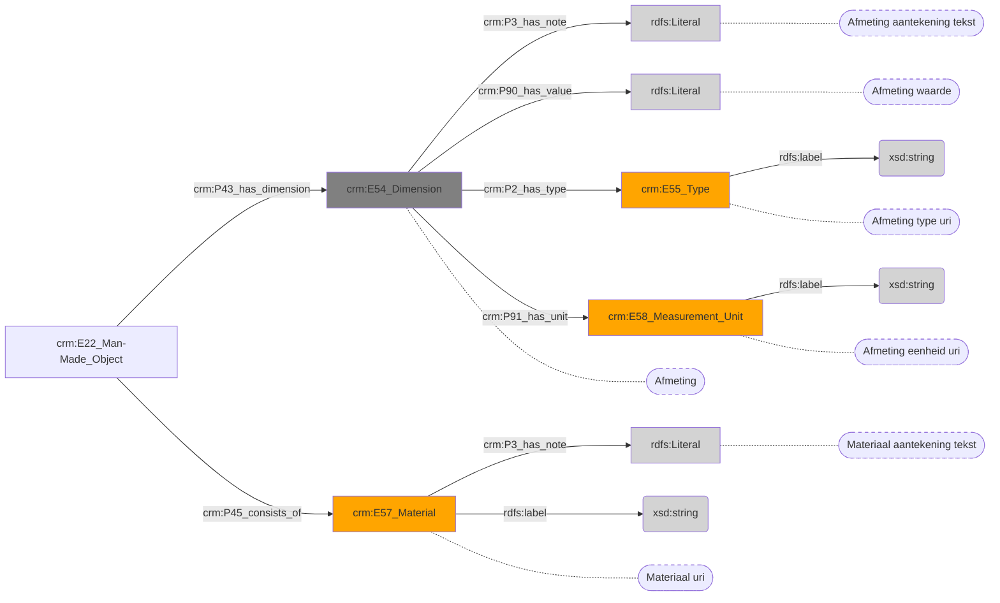

```mermaid
graph LR
59747a84-eda1-11ed-9232-00163e71351b["crm:E54_Dimension"]-->|"crm:P3_has_note"|5974879a-eda1-11ed-9232-00163e71351b(rdfs:Literal)
59747a84-eda1-11ed-9232-00163e71351b["crm:E54_Dimension"]-->|"crm:P90_has_value"|59748326-eda1-11ed-9232-00163e71351b(rdfs:Literal)
59747fc0-eda1-11ed-9232-00163e71351b["crm:E55_Type"]-->|"rdfs:label"|597484a2-eda1-11ed-9232-00163e71351b(xsd:string)
59748196-eda1-11ed-9232-00163e71351b["crm:E58_Measurement_Unit"]-->|"rdfs:label"|5974861e-eda1-11ed-9232-00163e71351b(xsd:string)
7e1bc518-eda1-11ed-a1e6-00163e71351b["crm:E57_Material"]-->|"crm:P3_has_note"|7e1bcbf8-eda1-11ed-a1e6-00163e71351b(rdfs:Literal)
7e1bc518-eda1-11ed-a1e6-00163e71351b["crm:E57_Material"]-->|"rdfs:label"|7e1bce5a-eda1-11ed-a1e6-00163e71351b(xsd:string)
59747a84-eda1-11ed-9232-00163e71351b["crm:E54_Dimension"]-->|"crm:P2_has_type"|59747fc0-eda1-11ed-9232-00163e71351b["crm:E55_Type"]
59747a84-eda1-11ed-9232-00163e71351b["crm:E54_Dimension"]-->|"crm:P91_has_unit"|59748196-eda1-11ed-9232-00163e71351b["crm:E58_Measurement_Unit"]
fa95cea2-dd27-11ed-9655-00163e71351b["crm:E22_Man-Made_Object"]-->|"crm:P43_has_dimension"|59747a84-eda1-11ed-9232-00163e71351b["crm:E54_Dimension"]
fa95cea2-dd27-11ed-9655-00163e71351b["crm:E22_Man-Made_Object"]-->|"crm:P45_consists_of"|7e1bc518-eda1-11ed-a1e6-00163e71351b["crm:E57_Material"]
style 59747fc0-eda1-11ed-9232-00163e71351b_s stroke-dasharray: 5
style 5974879a-eda1-11ed-9232-00163e71351b_s stroke-dasharray: 5
style 59748326-eda1-11ed-9232-00163e71351b_s stroke-dasharray: 5
style 59748196-eda1-11ed-9232-00163e71351b_s stroke-dasharray: 5
style 7e1bcbf8-eda1-11ed-a1e6-00163e71351b_s stroke-dasharray: 5
style 59747a84-eda1-11ed-9232-00163e71351b_s stroke-dasharray: 5
style 7e1bc518-eda1-11ed-a1e6-00163e71351b_s stroke-dasharray: 5
59747fc0-eda1-11ed-9232-00163e71351b["crm:E55_Type"]-.-59747fc0-eda1-11ed-9232-00163e71351b_s(["Afmeting type uri"])
5974879a-eda1-11ed-9232-00163e71351b["rdfs:Literal"]-.-5974879a-eda1-11ed-9232-00163e71351b_s(["Afmeting aantekening tekst"])
59748326-eda1-11ed-9232-00163e71351b["rdfs:Literal"]-.-59748326-eda1-11ed-9232-00163e71351b_s(["Afmeting waarde"])
59748196-eda1-11ed-9232-00163e71351b["crm:E58_Measurement_Unit"]-.-59748196-eda1-11ed-9232-00163e71351b_s(["Afmeting eenheid uri"])
7e1bcbf8-eda1-11ed-a1e6-00163e71351b["rdfs:Literal"]-.-7e1bcbf8-eda1-11ed-a1e6-00163e71351b_s(["Materiaal aantekening tekst"])
59747a84-eda1-11ed-9232-00163e71351b["crm:E54_Dimension"]-.-59747a84-eda1-11ed-9232-00163e71351b_s(["Afmeting"])
7e1bc518-eda1-11ed-a1e6-00163e71351b["crm:E57_Material"]-.-7e1bc518-eda1-11ed-a1e6-00163e71351b_s(["Materiaal uri"])
style 59747a84-eda1-11ed-9232-00163e71351b fill:#808080
style 59747fc0-eda1-11ed-9232-00163e71351b fill:#ffa500
style 59748196-eda1-11ed-9232-00163e71351b fill:#ffa500
style 59748326-eda1-11ed-9232-00163e71351b fill:#D3D3D3
style 597484a2-eda1-11ed-9232-00163e71351b fill:#D3D3D3
style 5974861e-eda1-11ed-9232-00163e71351b fill:#D3D3D3
style 5974879a-eda1-11ed-9232-00163e71351b fill:#D3D3D3
style 7e1bc518-eda1-11ed-a1e6-00163e71351b fill:#ffa500
style 7e1bcbf8-eda1-11ed-a1e6-00163e71351b fill:#D3D3D3
style 7e1bce5a-eda1-11ed-a1e6-00163e71351b fill:#D3D3D3
```
