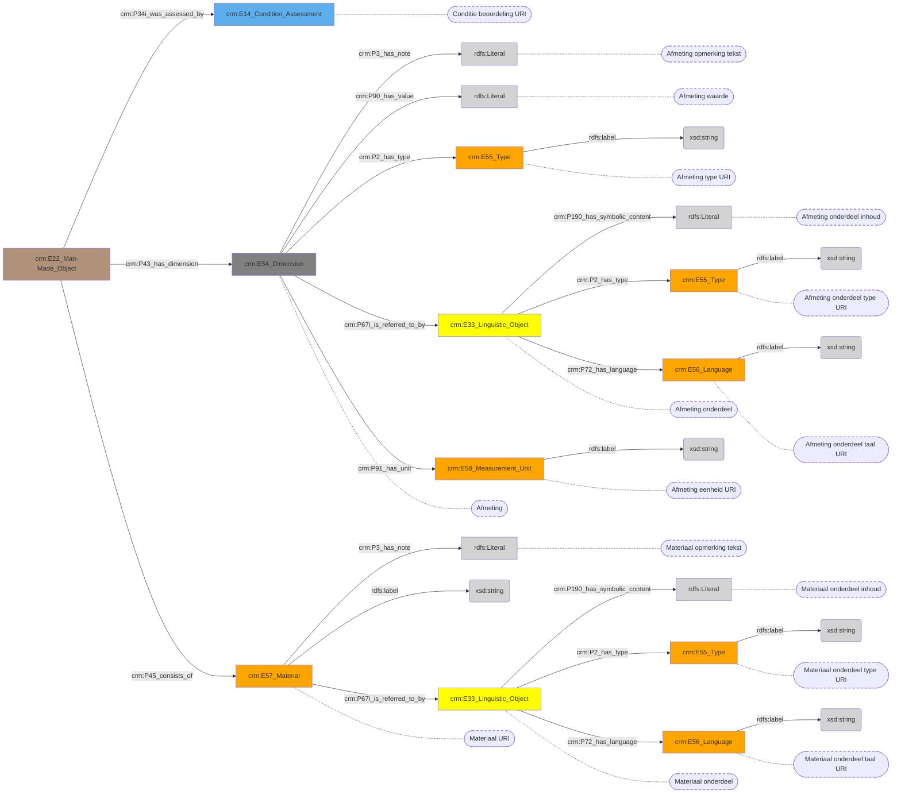

```mermaid
graph LR
59747a84-eda1-11ed-9232-00163e71351b["crm:E54_Dimension"]-->|"crm:P3_has_note"|5974879a-eda1-11ed-9232-00163e71351b(rdfs:Literal)
59747a84-eda1-11ed-9232-00163e71351b["crm:E54_Dimension"]-->|"crm:P90_has_value"|59748326-eda1-11ed-9232-00163e71351b(rdfs:Literal)
59747fc0-eda1-11ed-9232-00163e71351b["crm:E55_Type"]-->|"rdfs:label"|597484a2-eda1-11ed-9232-00163e71351b(xsd:string)
59748196-eda1-11ed-9232-00163e71351b["crm:E58_Measurement_Unit"]-->|"rdfs:label"|5974861e-eda1-11ed-9232-00163e71351b(xsd:string)
7e1bc518-eda1-11ed-a1e6-00163e71351b["crm:E57_Material"]-->|"crm:P3_has_note"|7e1bcbf8-eda1-11ed-a1e6-00163e71351b(rdfs:Literal)
7e1bc518-eda1-11ed-a1e6-00163e71351b["crm:E57_Material"]-->|"rdfs:label"|7e1bce5a-eda1-11ed-a1e6-00163e71351b(xsd:string)
8f134cd4-588a-11ee-974d-00163e71351b["crm:E33_Linguistic_Object"]-->|"crm:P190_has_symbolic_content"|8f1352b0-588a-11ee-974d-00163e71351b(rdfs:Literal)
8f135080-588a-11ee-974d-00163e71351b["crm:E55_Type"]-->|"rdfs:label"|8f135486-588a-11ee-974d-00163e71351b(xsd:string)
8f1351b6-588a-11ee-974d-00163e71351b["crm:E56_Language"]-->|"rdfs:label"|8f135396-588a-11ee-974d-00163e71351b(xsd:string)
d898e09e-588a-11ee-a9ac-00163e71351b["crm:E33_Linguistic_Object"]-->|"crm:P190_has_symbolic_content"|d898e698-588a-11ee-a9ac-00163e71351b(rdfs:Literal)
d898e454-588a-11ee-a9ac-00163e71351b["crm:E55_Type"]-->|"rdfs:label"|d898e86e-588a-11ee-a9ac-00163e71351b(xsd:string)
d898e59e-588a-11ee-a9ac-00163e71351b["crm:E56_Language"]-->|"rdfs:label"|d898e77e-588a-11ee-a9ac-00163e71351b(xsd:string)
59747a84-eda1-11ed-9232-00163e71351b["crm:E54_Dimension"]-->|"crm:P2_has_type"|59747fc0-eda1-11ed-9232-00163e71351b["crm:E55_Type"]
59747a84-eda1-11ed-9232-00163e71351b["crm:E54_Dimension"]-->|"crm:P67i_is_referred_to_by"|d898e09e-588a-11ee-a9ac-00163e71351b["crm:E33_Linguistic_Object"]
59747a84-eda1-11ed-9232-00163e71351b["crm:E54_Dimension"]-->|"crm:P91_has_unit"|59748196-eda1-11ed-9232-00163e71351b["crm:E58_Measurement_Unit"]
7e1bc518-eda1-11ed-a1e6-00163e71351b["crm:E57_Material"]-->|"crm:P67i_is_referred_to_by"|8f134cd4-588a-11ee-974d-00163e71351b["crm:E33_Linguistic_Object"]
8f134cd4-588a-11ee-974d-00163e71351b["crm:E33_Linguistic_Object"]-->|"crm:P2_has_type"|8f135080-588a-11ee-974d-00163e71351b["crm:E55_Type"]
8f134cd4-588a-11ee-974d-00163e71351b["crm:E33_Linguistic_Object"]-->|"crm:P72_has_language"|8f1351b6-588a-11ee-974d-00163e71351b["crm:E56_Language"]
d898e09e-588a-11ee-a9ac-00163e71351b["crm:E33_Linguistic_Object"]-->|"crm:P2_has_type"|d898e454-588a-11ee-a9ac-00163e71351b["crm:E55_Type"]
d898e09e-588a-11ee-a9ac-00163e71351b["crm:E33_Linguistic_Object"]-->|"crm:P72_has_language"|d898e59e-588a-11ee-a9ac-00163e71351b["crm:E56_Language"]
fa95cea2-dd27-11ed-9655-00163e71351b["crm:E22_Man-Made_Object"]-->|"crm:P34i_was_assessed_by"|52aebf5e-62c5-11ee-974d-00163e71351b["crm:E14_Condition_Assessment"]
fa95cea2-dd27-11ed-9655-00163e71351b["crm:E22_Man-Made_Object"]-->|"crm:P43_has_dimension"|59747a84-eda1-11ed-9232-00163e71351b["crm:E54_Dimension"]
fa95cea2-dd27-11ed-9655-00163e71351b["crm:E22_Man-Made_Object"]-->|"crm:P45_consists_of"|7e1bc518-eda1-11ed-a1e6-00163e71351b["crm:E57_Material"]
59747fc0-eda1-11ed-9232-00163e71351b["crm:E55_Type"]-.-59747fc0-eda1-11ed-9232-00163e71351b_s(["Afmeting type URI"])
5974879a-eda1-11ed-9232-00163e71351b["rdfs:Literal"]-.-5974879a-eda1-11ed-9232-00163e71351b_s(["Afmeting opmerking tekst"])
d898e09e-588a-11ee-a9ac-00163e71351b["crm:E33_Linguistic_Object"]-.-d898e09e-588a-11ee-a9ac-00163e71351b_s(["Afmeting onderdeel"])
59748326-eda1-11ed-9232-00163e71351b["rdfs:Literal"]-.-59748326-eda1-11ed-9232-00163e71351b_s(["Afmeting waarde"])
59748196-eda1-11ed-9232-00163e71351b["crm:E58_Measurement_Unit"]-.-59748196-eda1-11ed-9232-00163e71351b_s(["Afmeting eenheid URI"])
7e1bcbf8-eda1-11ed-a1e6-00163e71351b["rdfs:Literal"]-.-7e1bcbf8-eda1-11ed-a1e6-00163e71351b_s(["Materiaal opmerking tekst"])
8f134cd4-588a-11ee-974d-00163e71351b["crm:E33_Linguistic_Object"]-.-8f134cd4-588a-11ee-974d-00163e71351b_s(["Materiaal onderdeel"])
8f1352b0-588a-11ee-974d-00163e71351b["rdfs:Literal"]-.-8f1352b0-588a-11ee-974d-00163e71351b_s(["Materiaal onderdeel inhoud"])
8f135080-588a-11ee-974d-00163e71351b["crm:E55_Type"]-.-8f135080-588a-11ee-974d-00163e71351b_s(["Materiaal onderdeel type URI"])
8f1351b6-588a-11ee-974d-00163e71351b["crm:E56_Language"]-.-8f1351b6-588a-11ee-974d-00163e71351b_s(["Materiaal onderdeel taal URI"])
d898e698-588a-11ee-a9ac-00163e71351b["rdfs:Literal"]-.-d898e698-588a-11ee-a9ac-00163e71351b_s(["Afmeting onderdeel inhoud"])
d898e454-588a-11ee-a9ac-00163e71351b["crm:E55_Type"]-.-d898e454-588a-11ee-a9ac-00163e71351b_s(["Afmeting onderdeel type URI"])
d898e59e-588a-11ee-a9ac-00163e71351b["crm:E56_Language"]-.-d898e59e-588a-11ee-a9ac-00163e71351b_s(["Afmeting onderdeel taal URI"])
52aebf5e-62c5-11ee-974d-00163e71351b["crm:E14_Condition_Assessment"]-.-52aebf5e-62c5-11ee-974d-00163e71351b_s(["Conditie beoordeling URI"])
59747a84-eda1-11ed-9232-00163e71351b["crm:E54_Dimension"]-.-59747a84-eda1-11ed-9232-00163e71351b_s(["Afmeting"])
7e1bc518-eda1-11ed-a1e6-00163e71351b["crm:E57_Material"]-.-7e1bc518-eda1-11ed-a1e6-00163e71351b_s(["Materiaal URI"])
style 59747fc0-eda1-11ed-9232-00163e71351b_s stroke-dasharray: 5
style 5974879a-eda1-11ed-9232-00163e71351b_s stroke-dasharray: 5
style d898e09e-588a-11ee-a9ac-00163e71351b_s stroke-dasharray: 5
style 59748326-eda1-11ed-9232-00163e71351b_s stroke-dasharray: 5
style 59748196-eda1-11ed-9232-00163e71351b_s stroke-dasharray: 5
style 7e1bcbf8-eda1-11ed-a1e6-00163e71351b_s stroke-dasharray: 5
style 8f134cd4-588a-11ee-974d-00163e71351b_s stroke-dasharray: 5
style 8f1352b0-588a-11ee-974d-00163e71351b_s stroke-dasharray: 5
style 8f135080-588a-11ee-974d-00163e71351b_s stroke-dasharray: 5
style 8f1351b6-588a-11ee-974d-00163e71351b_s stroke-dasharray: 5
style d898e698-588a-11ee-a9ac-00163e71351b_s stroke-dasharray: 5
style d898e454-588a-11ee-a9ac-00163e71351b_s stroke-dasharray: 5
style d898e59e-588a-11ee-a9ac-00163e71351b_s stroke-dasharray: 5
style 52aebf5e-62c5-11ee-974d-00163e71351b_s stroke-dasharray: 5
style 59747a84-eda1-11ed-9232-00163e71351b_s stroke-dasharray: 5
style 7e1bc518-eda1-11ed-a1e6-00163e71351b_s stroke-dasharray: 5
style d898e59e-588a-11ee-a9ac-00163e71351b fill:#ffa500
style 5974861e-eda1-11ed-9232-00163e71351b fill:#D3D3D3
style 8f135080-588a-11ee-974d-00163e71351b fill:#ffa500
style 8f134cd4-588a-11ee-974d-00163e71351b fill:#ffff00
style fa95cea2-dd27-11ed-9655-00163e71351b fill:#B0927A
style 59748326-eda1-11ed-9232-00163e71351b fill:#D3D3D3
style 8f1351b6-588a-11ee-974d-00163e71351b fill:#ffa500
style d898e86e-588a-11ee-a9ac-00163e71351b fill:#D3D3D3
style d898e09e-588a-11ee-a9ac-00163e71351b fill:#ffff00
style 52aebf5e-62c5-11ee-974d-00163e71351b fill:#5DAEEC
style d898e454-588a-11ee-a9ac-00163e71351b fill:#ffa500
style 7e1bce5a-eda1-11ed-a1e6-00163e71351b fill:#D3D3D3
style d898e698-588a-11ee-a9ac-00163e71351b fill:#D3D3D3
style 8f135396-588a-11ee-974d-00163e71351b fill:#D3D3D3
style 5974879a-eda1-11ed-9232-00163e71351b fill:#D3D3D3
style 59747a84-eda1-11ed-9232-00163e71351b fill:#808080
style 59748196-eda1-11ed-9232-00163e71351b fill:#ffa500
style 7e1bcbf8-eda1-11ed-a1e6-00163e71351b fill:#D3D3D3
style 8f135486-588a-11ee-974d-00163e71351b fill:#D3D3D3
style 8f1352b0-588a-11ee-974d-00163e71351b fill:#D3D3D3
style d898e77e-588a-11ee-a9ac-00163e71351b fill:#D3D3D3
style 597484a2-eda1-11ed-9232-00163e71351b fill:#D3D3D3
style 59747fc0-eda1-11ed-9232-00163e71351b fill:#ffa500
style 7e1bc518-eda1-11ed-a1e6-00163e71351b fill:#ffa500
```
