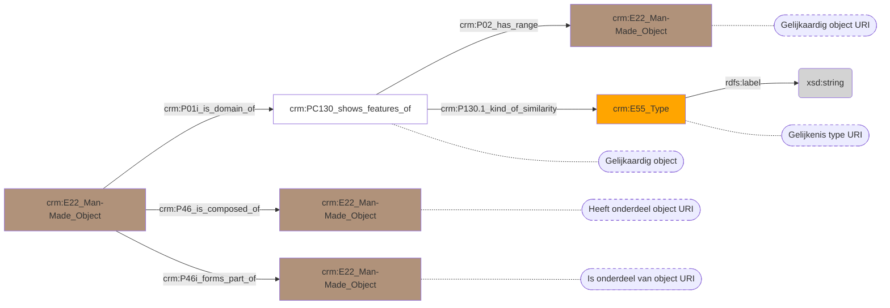

```mermaid
graph LR
e12c2308-1012-11ee-b0c4-00163e71351b["crm:E55_Type"]-->|"rdfs:label"|2dac340c-20bc-11ee-a9ac-00163e71351b(xsd:string)
ede4725e-100c-11ee-a9ac-00163e71351b["crm:PC130_shows_features_of"]-->|"crm:P02_has_range"|bf90198e-1012-11ee-a9ac-00163e71351b["crm:E22_Man-Made_Object"]
ede4725e-100c-11ee-a9ac-00163e71351b["crm:PC130_shows_features_of"]-->|"crm:P130.1_kind_of_similarity"|e12c2308-1012-11ee-b0c4-00163e71351b["crm:E55_Type"]
fa95cea2-dd27-11ed-9655-00163e71351b["crm:E22_Man-Made_Object"]-->|"crm:P01i_is_domain_of"|ede4725e-100c-11ee-a9ac-00163e71351b["crm:PC130_shows_features_of"]
fa95cea2-dd27-11ed-9655-00163e71351b["crm:E22_Man-Made_Object"]-->|"crm:P46_is_composed_of"|261b3b98-45a1-11ee-bc5c-00163e71351b["crm:E22_Man-Made_Object"]
fa95cea2-dd27-11ed-9655-00163e71351b["crm:E22_Man-Made_Object"]-->|"crm:P46i_forms_part_of"|c4cb4c24-45a1-11ee-bc5c-00163e71351b["crm:E22_Man-Made_Object"]
bf90198e-1012-11ee-a9ac-00163e71351b["crm:E22_Man-Made_Object"]-.-bf90198e-1012-11ee-a9ac-00163e71351b_s(["Gelijkaardig object URI"])
e12c2308-1012-11ee-b0c4-00163e71351b["crm:E55_Type"]-.-e12c2308-1012-11ee-b0c4-00163e71351b_s(["Gelijkenis type URI"])
ede4725e-100c-11ee-a9ac-00163e71351b["crm:PC130_shows_features_of"]-.-ede4725e-100c-11ee-a9ac-00163e71351b_s(["Gelijkaardig object"])
261b3b98-45a1-11ee-bc5c-00163e71351b["crm:E22_Man-Made_Object"]-.-261b3b98-45a1-11ee-bc5c-00163e71351b_s(["Heeft onderdeel object URI"])
c4cb4c24-45a1-11ee-bc5c-00163e71351b["crm:E22_Man-Made_Object"]-.-c4cb4c24-45a1-11ee-bc5c-00163e71351b_s(["Is onderdeel van object URI"])
style bf90198e-1012-11ee-a9ac-00163e71351b_s stroke-dasharray: 5
style e12c2308-1012-11ee-b0c4-00163e71351b_s stroke-dasharray: 5
style ede4725e-100c-11ee-a9ac-00163e71351b_s stroke-dasharray: 5
style 261b3b98-45a1-11ee-bc5c-00163e71351b_s stroke-dasharray: 5
style c4cb4c24-45a1-11ee-bc5c-00163e71351b_s stroke-dasharray: 5
style 261b3b98-45a1-11ee-bc5c-00163e71351b fill:#B0927A
style 2dac340c-20bc-11ee-a9ac-00163e71351b fill:#D3D3D3
style bf90198e-1012-11ee-a9ac-00163e71351b fill:#B0927A
style c4cb4c24-45a1-11ee-bc5c-00163e71351b fill:#B0927A
style e12c2308-1012-11ee-b0c4-00163e71351b fill:#ffa500
style ede4725e-100c-11ee-a9ac-00163e71351b fill:#ffffff
style fa95cea2-dd27-11ed-9655-00163e71351b fill:#B0927A
```
