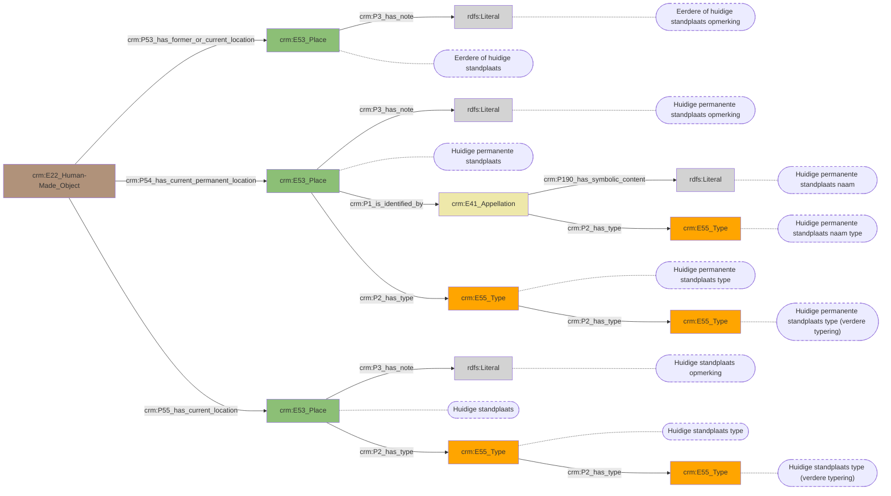

```mermaid
graph LR
style 0f1fd631-11c7-11ef-a3dc-960002548b4f fill:#ffa500
style 2228b397-11c7-11ef-a81c-960002548b4f fill:#ffa500
style 363a94c3-11c7-11ef-8584-960002548b4f fill:#EEE8AA
style 547aab60-11c7-11ef-a70e-960002548b4f fill:#D3D3D3
style 5f44d5de-214b-11ee-b0c4-00163e71351b fill:#ffa500
style 5f44d9bc-214b-11ee-b0c4-00163e71351b fill:#8CBF76
style 5f44e574-214b-11ee-b0c4-00163e71351b fill:#ffa500
style 5f44e678-214b-11ee-b0c4-00163e71351b fill:#D3D3D3
style 66a39e0d-11c6-11ef-9391-960002548b4f fill:#8CBF76
style aea27944-2149-11ee-bc5c-00163e71351b fill:#8CBF76
style aea280f6-2149-11ee-bc5c-00163e71351b fill:#D3D3D3
style b7ef04a1-11c7-11ef-8929-960002548b4f fill:#ffa500
style f8ece1d5-11c7-11ef-a051-960002548b4f fill:#D3D3D3
style fa95cea2-dd27-11ed-9655-00163e71351b fill:#B0927A
363a94c3-11c7-11ef-8584-960002548b4f["crm:E41_Appellation"]-->|"crm:P190_has_symbolic_content"|547aab60-11c7-11ef-a70e-960002548b4f(rdfs:Literal)
5f44d9bc-214b-11ee-b0c4-00163e71351b["crm:E53_Place"]-->|"crm:P3_has_note"|5f44e678-214b-11ee-b0c4-00163e71351b(rdfs:Literal)
66a39e0d-11c6-11ef-9391-960002548b4f["crm:E53_Place"]-->|"crm:P3_has_note"|f8ece1d5-11c7-11ef-a051-960002548b4f(rdfs:Literal)
aea27944-2149-11ee-bc5c-00163e71351b["crm:E53_Place"]-->|"crm:P3_has_note"|aea280f6-2149-11ee-bc5c-00163e71351b(rdfs:Literal)
2228b397-11c7-11ef-a81c-960002548b4f["crm:E55_Type"]-.-2228b397-11c7-11ef-a81c-960002548b4f_s(["Huidige permanente standplaats type (verdere typering)"])
547aab60-11c7-11ef-a70e-960002548b4f["rdfs:Literal"]-.-547aab60-11c7-11ef-a70e-960002548b4f_s(["Huidige permanente standplaats naam"])
b7ef04a1-11c7-11ef-8929-960002548b4f["crm:E55_Type"]-.-b7ef04a1-11c7-11ef-8929-960002548b4f_s(["Huidige permanente standplaats naam type"])
5f44e574-214b-11ee-b0c4-00163e71351b["crm:E55_Type"]-.-5f44e574-214b-11ee-b0c4-00163e71351b_s(["Huidige standplaats type (verdere typering)"])
5f44d5de-214b-11ee-b0c4-00163e71351b["crm:E55_Type"]-.-5f44d5de-214b-11ee-b0c4-00163e71351b_s(["Huidige standplaats type"])
5f44e678-214b-11ee-b0c4-00163e71351b["rdfs:Literal"]-.-5f44e678-214b-11ee-b0c4-00163e71351b_s(["Huidige standplaats opmerking"])
0f1fd631-11c7-11ef-a3dc-960002548b4f["crm:E55_Type"]-.-0f1fd631-11c7-11ef-a3dc-960002548b4f_s(["Huidige permanente standplaats type"])
f8ece1d5-11c7-11ef-a051-960002548b4f["rdfs:Literal"]-.-f8ece1d5-11c7-11ef-a051-960002548b4f_s(["Huidige permanente standplaats opmerking"])
aea280f6-2149-11ee-bc5c-00163e71351b["rdfs:Literal"]-.-aea280f6-2149-11ee-bc5c-00163e71351b_s(["Eerdere of huidige standplaats opmerking"])
aea27944-2149-11ee-bc5c-00163e71351b["crm:E53_Place"]-.-aea27944-2149-11ee-bc5c-00163e71351b_s(["Eerdere of huidige standplaats"])
66a39e0d-11c6-11ef-9391-960002548b4f["crm:E53_Place"]-.-66a39e0d-11c6-11ef-9391-960002548b4f_s(["Huidige permanente standplaats"])
5f44d9bc-214b-11ee-b0c4-00163e71351b["crm:E53_Place"]-.-5f44d9bc-214b-11ee-b0c4-00163e71351b_s(["Huidige standplaats"])
style 2228b397-11c7-11ef-a81c-960002548b4f_s stroke-dasharray: 5
style 547aab60-11c7-11ef-a70e-960002548b4f_s stroke-dasharray: 5
style b7ef04a1-11c7-11ef-8929-960002548b4f_s stroke-dasharray: 5
style 5f44e574-214b-11ee-b0c4-00163e71351b_s stroke-dasharray: 5
style 5f44d5de-214b-11ee-b0c4-00163e71351b_s stroke-dasharray: 5
style 5f44e678-214b-11ee-b0c4-00163e71351b_s stroke-dasharray: 5
style 0f1fd631-11c7-11ef-a3dc-960002548b4f_s stroke-dasharray: 5
style f8ece1d5-11c7-11ef-a051-960002548b4f_s stroke-dasharray: 5
style aea280f6-2149-11ee-bc5c-00163e71351b_s stroke-dasharray: 5
style aea27944-2149-11ee-bc5c-00163e71351b_s stroke-dasharray: 5
style 66a39e0d-11c6-11ef-9391-960002548b4f_s stroke-dasharray: 5
style 5f44d9bc-214b-11ee-b0c4-00163e71351b_s stroke-dasharray: 5
0f1fd631-11c7-11ef-a3dc-960002548b4f["crm:E55_Type"]-->|"crm:P2_has_type"|2228b397-11c7-11ef-a81c-960002548b4f["crm:E55_Type"]
363a94c3-11c7-11ef-8584-960002548b4f["crm:E41_Appellation"]-->|"crm:P2_has_type"|b7ef04a1-11c7-11ef-8929-960002548b4f["crm:E55_Type"]
5f44d5de-214b-11ee-b0c4-00163e71351b["crm:E55_Type"]-->|"crm:P2_has_type"|5f44e574-214b-11ee-b0c4-00163e71351b["crm:E55_Type"]
5f44d9bc-214b-11ee-b0c4-00163e71351b["crm:E53_Place"]-->|"crm:P2_has_type"|5f44d5de-214b-11ee-b0c4-00163e71351b["crm:E55_Type"]
66a39e0d-11c6-11ef-9391-960002548b4f["crm:E53_Place"]-->|"crm:P1_is_identified_by"|363a94c3-11c7-11ef-8584-960002548b4f["crm:E41_Appellation"]
66a39e0d-11c6-11ef-9391-960002548b4f["crm:E53_Place"]-->|"crm:P2_has_type"|0f1fd631-11c7-11ef-a3dc-960002548b4f["crm:E55_Type"]
fa95cea2-dd27-11ed-9655-00163e71351b["crm:E22_Human-Made_Object"]-->|"crm:P53_has_former_or_current_location"|aea27944-2149-11ee-bc5c-00163e71351b["crm:E53_Place"]
fa95cea2-dd27-11ed-9655-00163e71351b["crm:E22_Human-Made_Object"]-->|"crm:P54_has_current_permanent_location"|66a39e0d-11c6-11ef-9391-960002548b4f["crm:E53_Place"]
fa95cea2-dd27-11ed-9655-00163e71351b["crm:E22_Human-Made_Object"]-->|"crm:P55_has_current_location"|5f44d9bc-214b-11ee-b0c4-00163e71351b["crm:E53_Place"]
```
