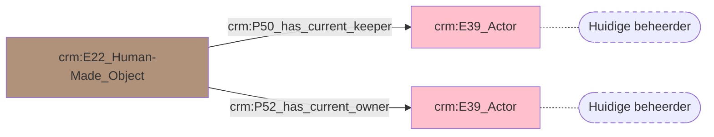

```mermaid
graph LR
style e3f399f0-eda2-11ed-9655-00163e71351b fill:#ffc0cb
style fa955724-dd27-11ed-9655-00163e71351b fill:#ffc0cb
style fa95cea2-dd27-11ed-9655-00163e71351b fill:#B0927A
fa95cea2-dd27-11ed-9655-00163e71351b["crm:E22_Human-Made_Object"]-->|"crm:P50_has_current_keeper"|e3f399f0-eda2-11ed-9655-00163e71351b["crm:E39_Actor"]
fa95cea2-dd27-11ed-9655-00163e71351b["crm:E22_Human-Made_Object"]-->|"crm:P52_has_current_owner"|fa955724-dd27-11ed-9655-00163e71351b["crm:E39_Actor"]
style e3f399f0-eda2-11ed-9655-00163e71351b_s stroke-dasharray: 5
style fa955724-dd27-11ed-9655-00163e71351b_s stroke-dasharray: 5
e3f399f0-eda2-11ed-9655-00163e71351b["crm:E39_Actor"]-.-e3f399f0-eda2-11ed-9655-00163e71351b_s(["Huidige beheerder"])
fa955724-dd27-11ed-9655-00163e71351b["crm:E39_Actor"]-.-fa955724-dd27-11ed-9655-00163e71351b_s(["Huidige beheerder"])
```
