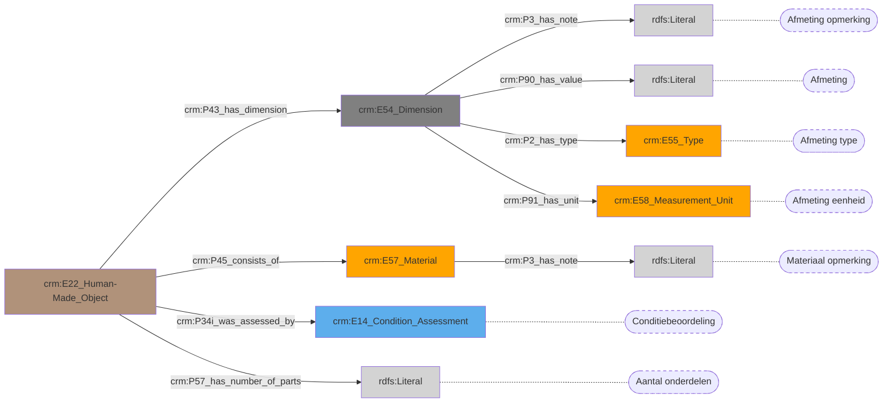

```mermaid
graph LR
style 52aebf5e-62c5-11ee-974d-00163e71351b fill:#5DAEEC
style 59747a84-eda1-11ed-9232-00163e71351b fill:#808080
style 59747fc0-eda1-11ed-9232-00163e71351b fill:#ffa500
style 59748196-eda1-11ed-9232-00163e71351b fill:#ffa500
style 59748326-eda1-11ed-9232-00163e71351b fill:#D3D3D3
style 5974879a-eda1-11ed-9232-00163e71351b fill:#D3D3D3
style 759508af-b08e-11ee-b5a9-960002548b4f fill:#D3D3D3
style 7e1bc518-eda1-11ed-a1e6-00163e71351b fill:#ffa500
style 7e1bcbf8-eda1-11ed-a1e6-00163e71351b fill:#D3D3D3
style fa95cea2-dd27-11ed-9655-00163e71351b fill:#B0927A
59747a84-eda1-11ed-9232-00163e71351b["crm:E54_Dimension"]-->|"crm:P3_has_note"|5974879a-eda1-11ed-9232-00163e71351b(rdfs:Literal)
59747a84-eda1-11ed-9232-00163e71351b["crm:E54_Dimension"]-->|"crm:P90_has_value"|59748326-eda1-11ed-9232-00163e71351b(rdfs:Literal)
7e1bc518-eda1-11ed-a1e6-00163e71351b["crm:E57_Material"]-->|"crm:P3_has_note"|7e1bcbf8-eda1-11ed-a1e6-00163e71351b(rdfs:Literal)
fa95cea2-dd27-11ed-9655-00163e71351b["crm:E22_Human-Made_Object"]-->|"crm:P57_has_number_of_parts"|759508af-b08e-11ee-b5a9-960002548b4f(rdfs:Literal)
style 59747fc0-eda1-11ed-9232-00163e71351b_s stroke-dasharray: 5
style 5974879a-eda1-11ed-9232-00163e71351b_s stroke-dasharray: 5
style 59748326-eda1-11ed-9232-00163e71351b_s stroke-dasharray: 5
style 59748196-eda1-11ed-9232-00163e71351b_s stroke-dasharray: 5
style 7e1bcbf8-eda1-11ed-a1e6-00163e71351b_s stroke-dasharray: 5
style 52aebf5e-62c5-11ee-974d-00163e71351b_s stroke-dasharray: 5
style 759508af-b08e-11ee-b5a9-960002548b4f_s stroke-dasharray: 5
59747fc0-eda1-11ed-9232-00163e71351b["crm:E55_Type"]-.-59747fc0-eda1-11ed-9232-00163e71351b_s(["Afmeting type"])
5974879a-eda1-11ed-9232-00163e71351b["rdfs:Literal"]-.-5974879a-eda1-11ed-9232-00163e71351b_s(["Afmeting opmerking"])
59748326-eda1-11ed-9232-00163e71351b["rdfs:Literal"]-.-59748326-eda1-11ed-9232-00163e71351b_s(["Afmeting"])
59748196-eda1-11ed-9232-00163e71351b["crm:E58_Measurement_Unit"]-.-59748196-eda1-11ed-9232-00163e71351b_s(["Afmeting eenheid"])
7e1bcbf8-eda1-11ed-a1e6-00163e71351b["rdfs:Literal"]-.-7e1bcbf8-eda1-11ed-a1e6-00163e71351b_s(["Materiaal opmerking"])
52aebf5e-62c5-11ee-974d-00163e71351b["crm:E14_Condition_Assessment"]-.-52aebf5e-62c5-11ee-974d-00163e71351b_s(["Conditiebeoordeling"])
759508af-b08e-11ee-b5a9-960002548b4f["rdfs:Literal"]-.-759508af-b08e-11ee-b5a9-960002548b4f_s(["Aantal onderdelen"])
59747a84-eda1-11ed-9232-00163e71351b["crm:E54_Dimension"]-->|"crm:P2_has_type"|59747fc0-eda1-11ed-9232-00163e71351b["crm:E55_Type"]
59747a84-eda1-11ed-9232-00163e71351b["crm:E54_Dimension"]-->|"crm:P91_has_unit"|59748196-eda1-11ed-9232-00163e71351b["crm:E58_Measurement_Unit"]
fa95cea2-dd27-11ed-9655-00163e71351b["crm:E22_Human-Made_Object"]-->|"crm:P34i_was_assessed_by"|52aebf5e-62c5-11ee-974d-00163e71351b["crm:E14_Condition_Assessment"]
fa95cea2-dd27-11ed-9655-00163e71351b["crm:E22_Human-Made_Object"]-->|"crm:P43_has_dimension"|59747a84-eda1-11ed-9232-00163e71351b["crm:E54_Dimension"]
fa95cea2-dd27-11ed-9655-00163e71351b["crm:E22_Human-Made_Object"]-->|"crm:P45_consists_of"|7e1bc518-eda1-11ed-a1e6-00163e71351b["crm:E57_Material"]
```
